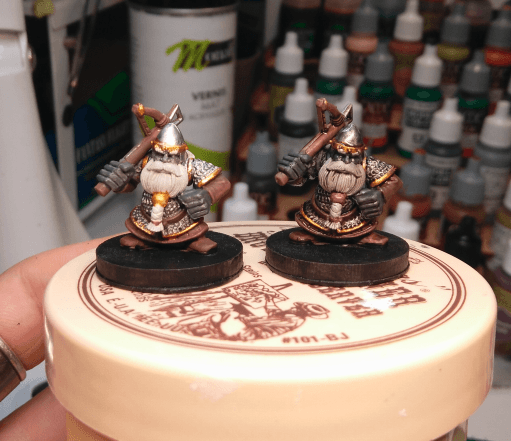
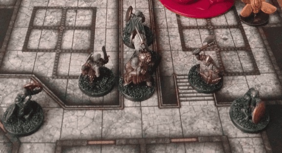

I painted a squad of Duergars (mostly) from the plastic Dwarf sprue from GW. I also added some official Duergar miniatures from Wrath of Ashardalon and a few other dwarves I had lying around.

I really enjoy painting squads of the same monsters together. It allows me to test and improve on a given technique, and also in terms of gameplay I know that I have enough miniatures for a given encounter.

I wanted to take a comparison shot of before and after applying a Wash (I don't remember if it's a Nuln Oil or Strong Tone).

Here are the Duergars in their home, when the PCs intruded.