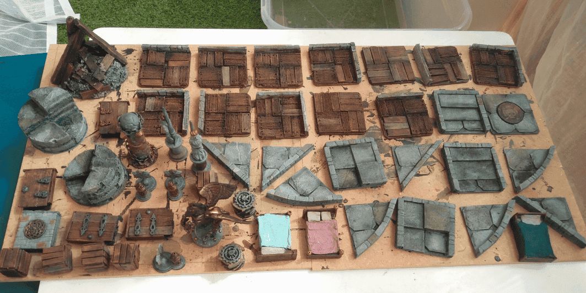
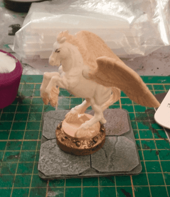
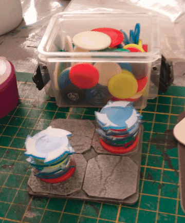
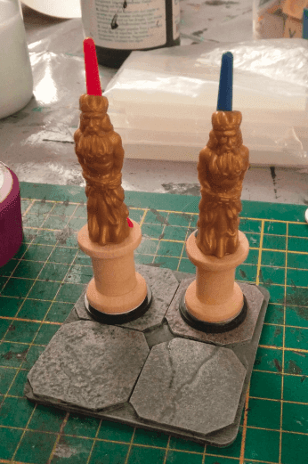
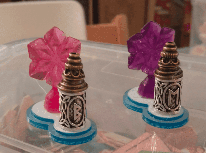
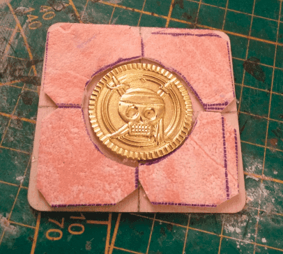
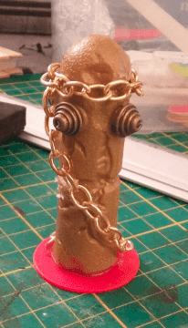
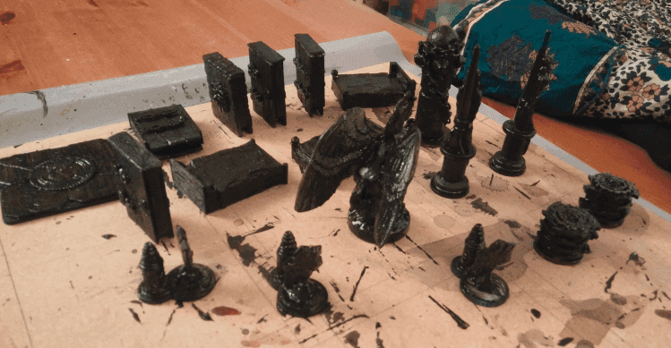
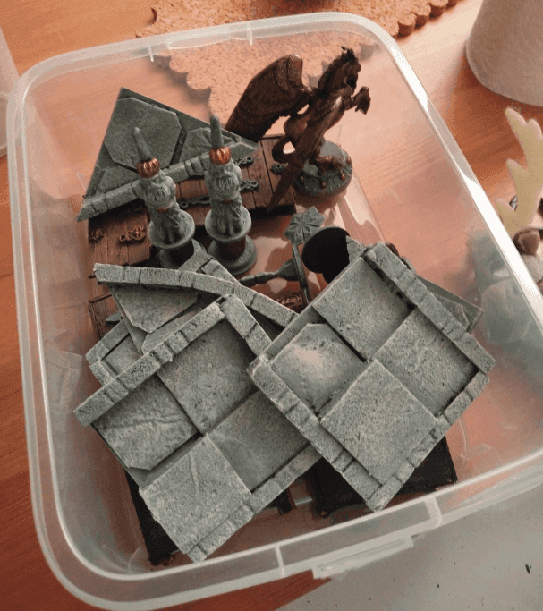

To go with my dungeon tiles, I made a bunch of dungeon dressing pieces. I mostly picked bits of stuff lying around in my bits box, and painted them.

I didn't have a clear idea of what I wanted to build, nor which scenario I would use them, but I wanted generic enough dressing that could be used to improvise a dungeon.

I started with a pegasus plastic toy, glued on a round token to act as a pedestal.

I then glued various tokens I had. I'm not sure which board game they are coming from (I got them in a bag in a garage sale), but I thought they could make a nice trap.

Those were figureheads of two ships I got in another toy. I glued them on a sewing spool to act as a column.

And those are... I'm not sure. I picked another weirdly shaped token as a base, and added some indian/runic beads as well as stuff coming from a Frozen board game. I imagined that once painted they could act as some elaborate tombstone.

And a pirate gold piece to act as a trap.

This, I'm not even sure what it was initially. I think it was supposed to be a broken cannon, that I glued vertically. I added more beads to give it an omninous shape and a chain because why not. This is so weird that I expect my players to wonder what the hell this is.

Traditional coat of black before painting for real.

Those dressing pieces gave me a nice respite from painting all those gray tiles.

