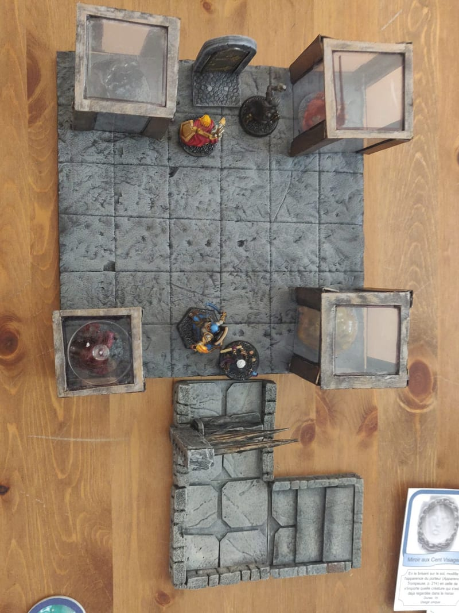
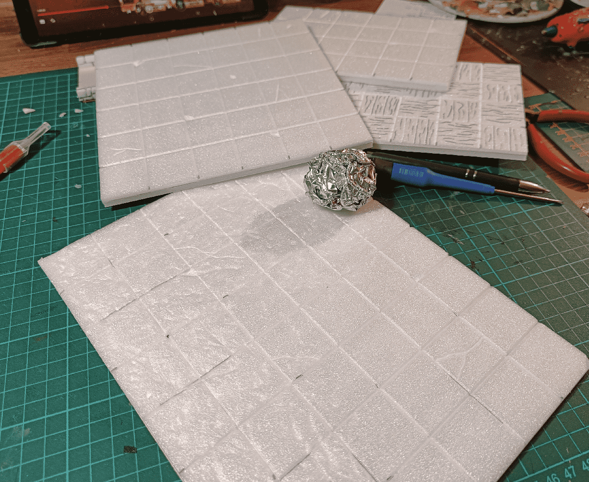
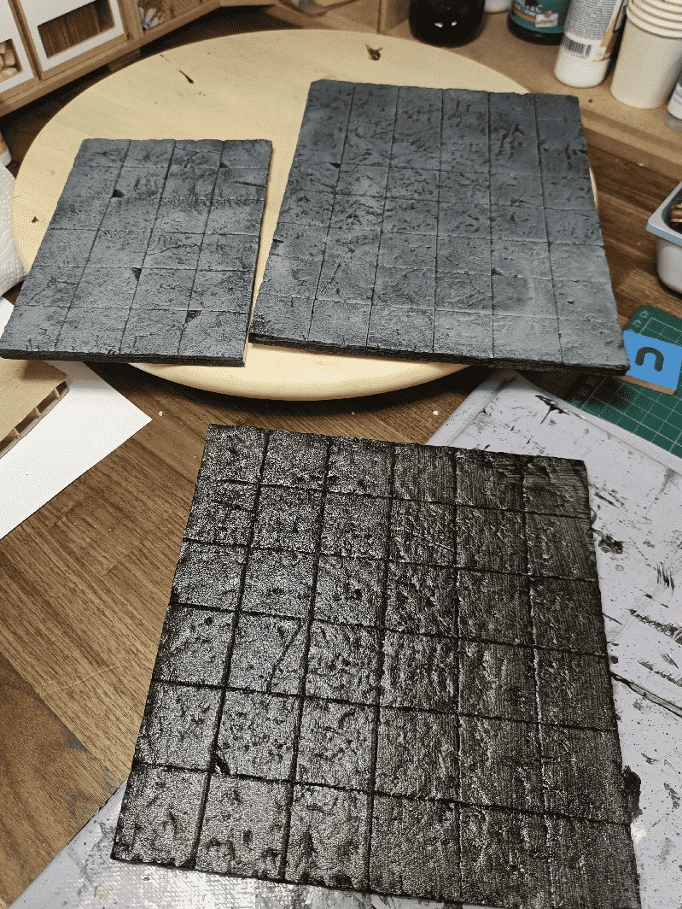
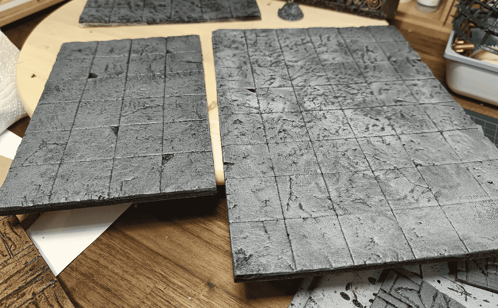
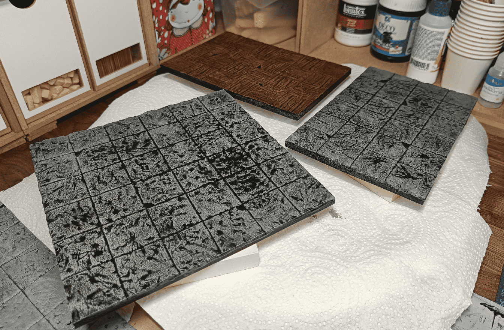
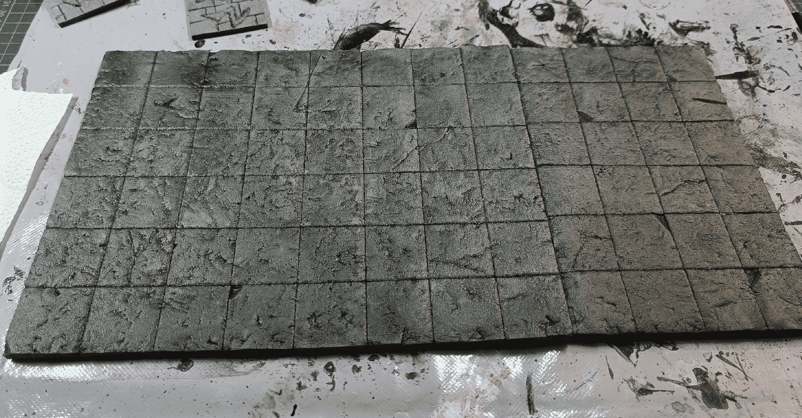
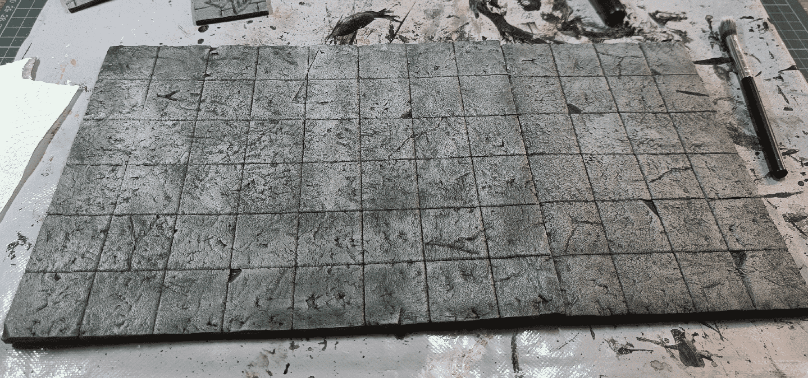

[Dungeon tiles](https://painting.pixelastic.com/dungeonStoneTiles/) are great, but sometimes you need to put one large room on the table, in one go, without having to fidget with 9 moving pieces. In that case, having the the whole 6x6 floor room ready is best.

I start with a fine layer of foam glued on a sheet of foamcore. Many online tutorials talk about the "cheap foamcore from the dollar store, where the top layer peels easily". Well, we don't have dollar stores in France, and all the foamcore I could find had their top layer well glue. So instead I'm adding my own foam layer on top and carve it.

I draw the squares with a pen first, then go over them again with an exacto knife to break the top layer tension. I then go over them a third time with a criterium to widen the grooves. I also cut some random angles, and added random cracks. Finally, I rolled the trusted aluminum foil ball over it to create the stone effect.

Black modpodge layer at the bottom, and some already painted at the top.

First grey overbrush on the left, and lighter grey drybrush added on the right.

The wash added some imperfection, made the stone darker in some places because of where the water stayed.

A last drybrush, made a bit randomly to lighten it a bit.

