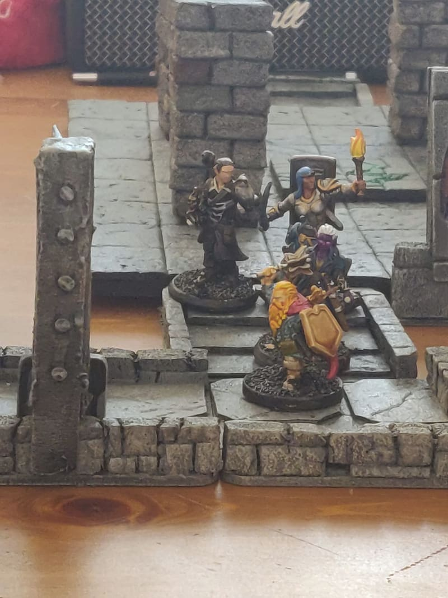

While exploring the dungeon, I could put on the table 2x2 squares to symbolize the corridors and room. This was very versatile and helped in representing the tortuous corridors. This is similar to Dwarven Forge (but way cheaper) and to Wyloch tiles (but without the excruciating cardboard curtting).

I already [have a post](https://painting.pixelastic.com/wylochstyledungeontiles/) where I explain how to make those tiles. This time, I needed to create a bit more, and also to have the wall width to be consistent across all the tiles.

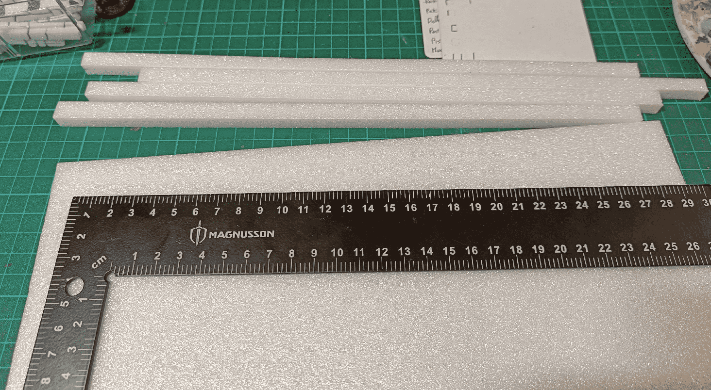

So I started cutting strips of 1cm wide foam.

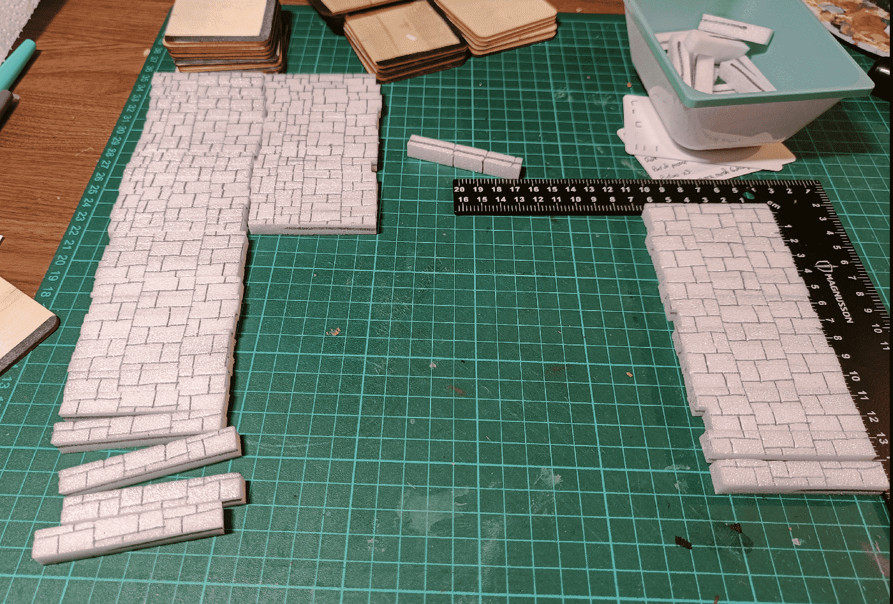

I cut them into smaller strips of about 3.5cm long, and draw a brick pattern on each.

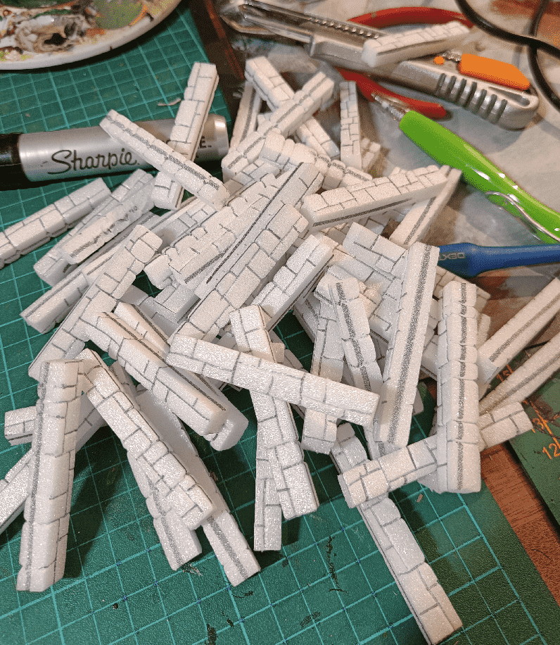

I then setup to carve the brick pattern by creating grooves over the pattern. I used a black sharpie to mark which face was supposed to go up (and I continued the brick pattern on the other side).

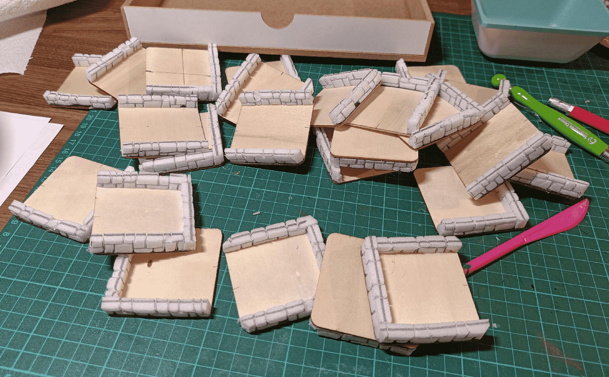

I glued them on my wood planks, and trimmed the parts that were over the edge.

I glued on the texture wall paper tiles.

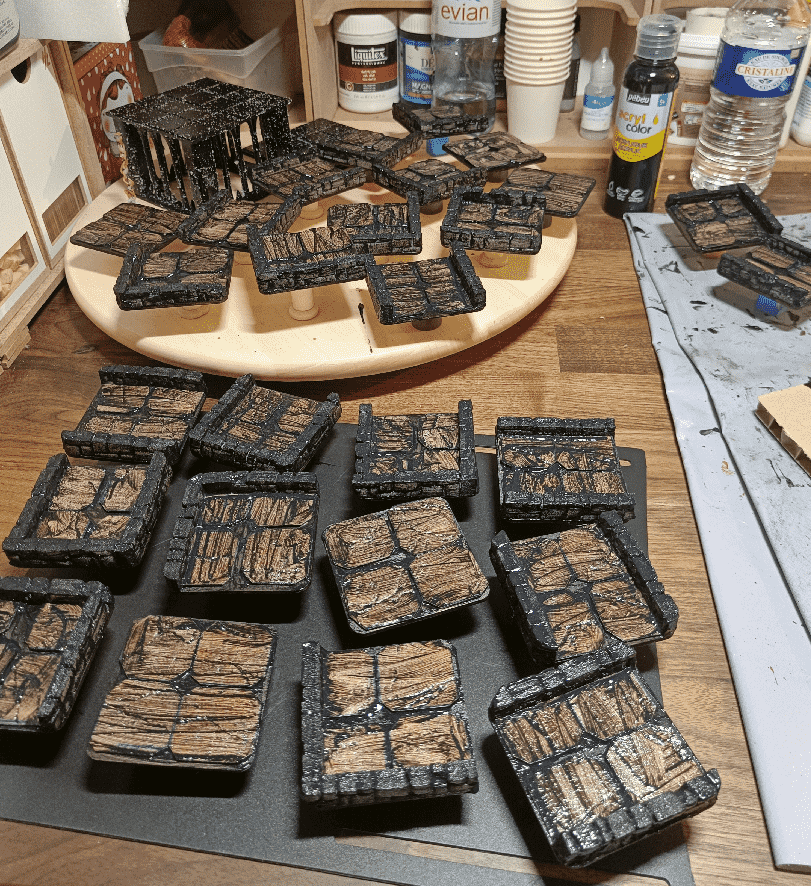

Applied a first coat of black modpodge. My mix was too liquid, and didn't cover much. I had used black china ink instead of black craft paint, which indeed is more black, but also more liquid.

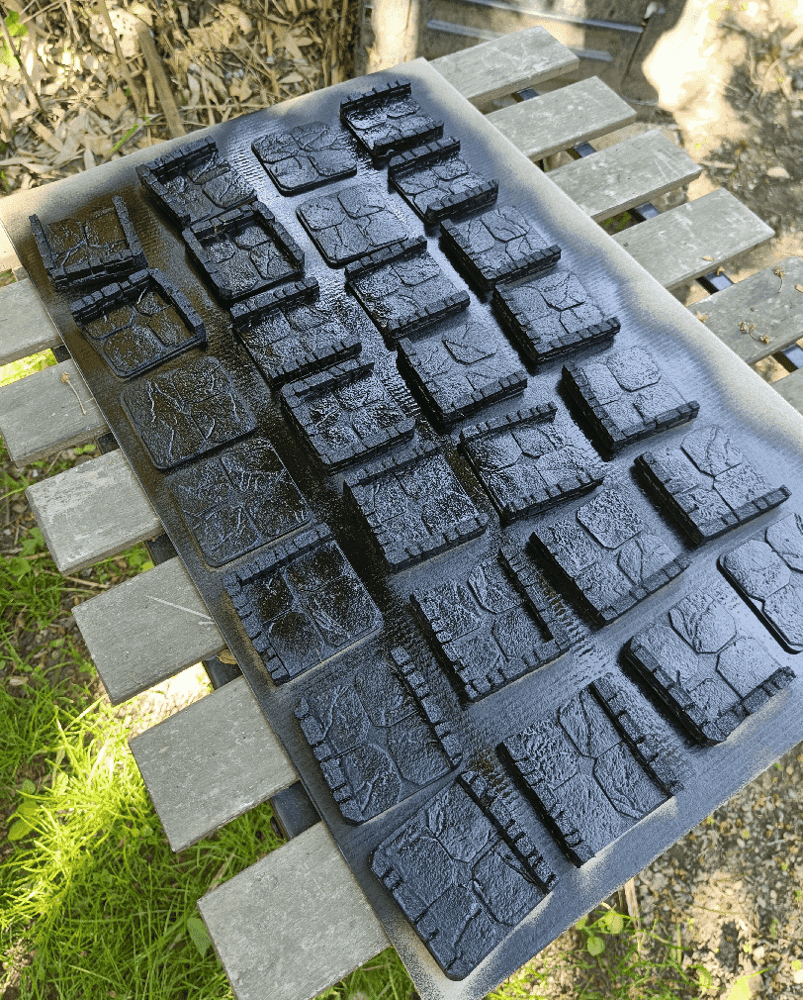

So I ended up spray painting on top.

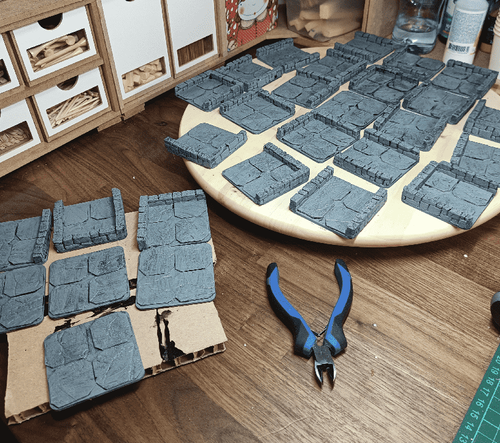

Grey overbrush.

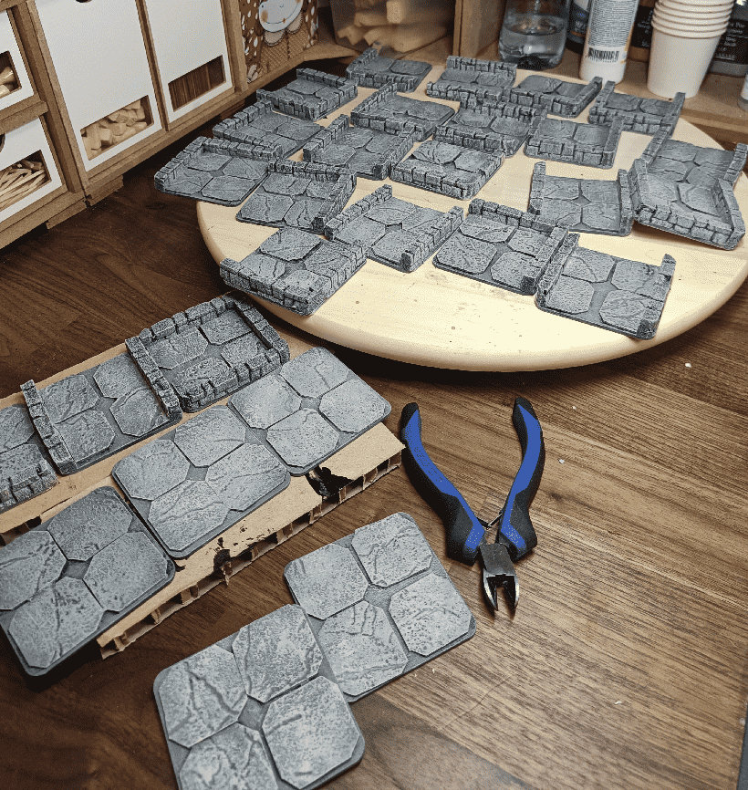

Lighter Grey drybrush

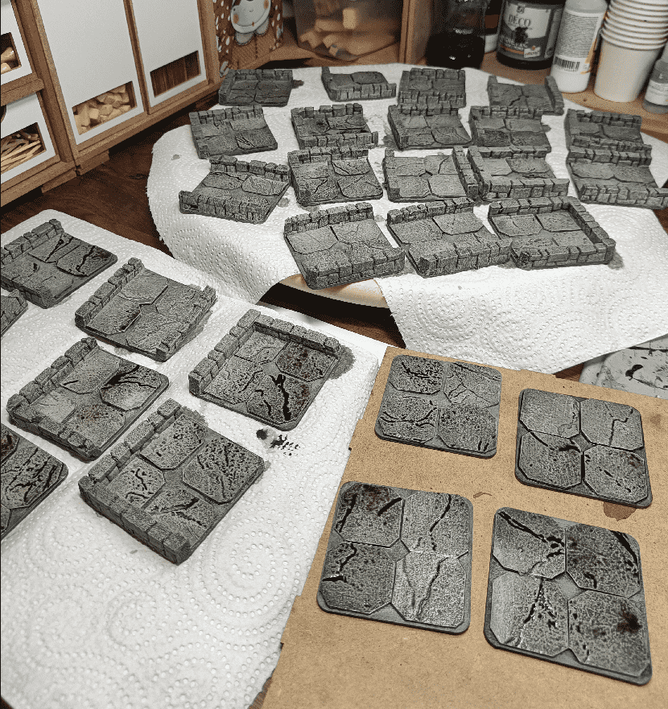

Wash (still drying)

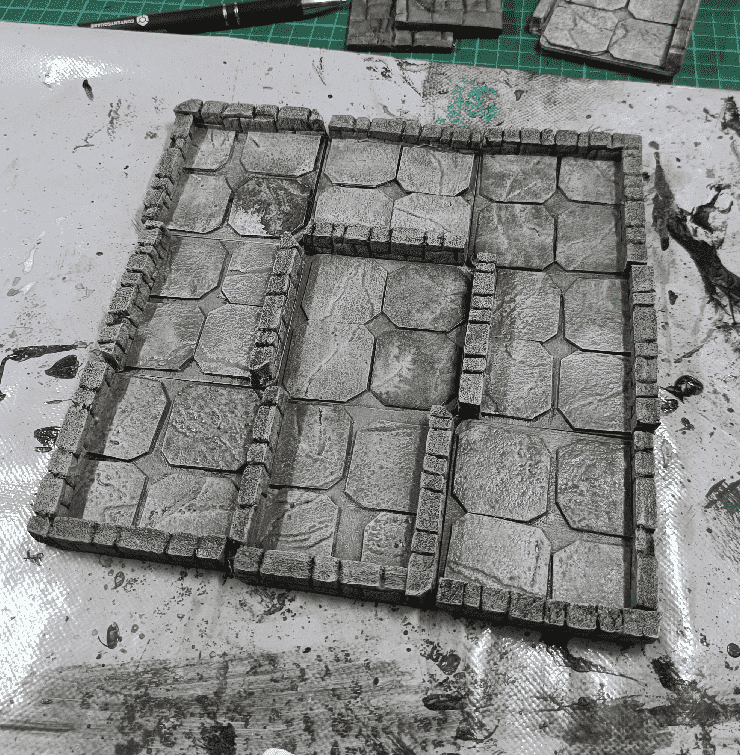

Once dried.

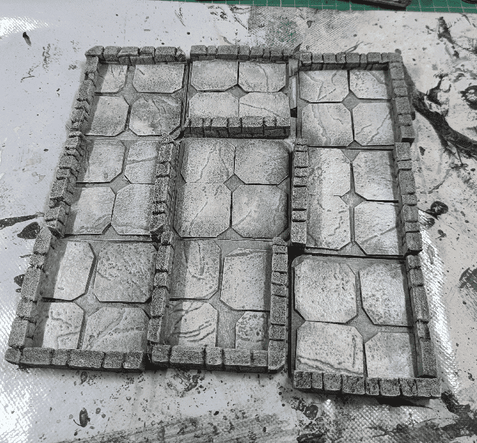

And with a last tan drybrush