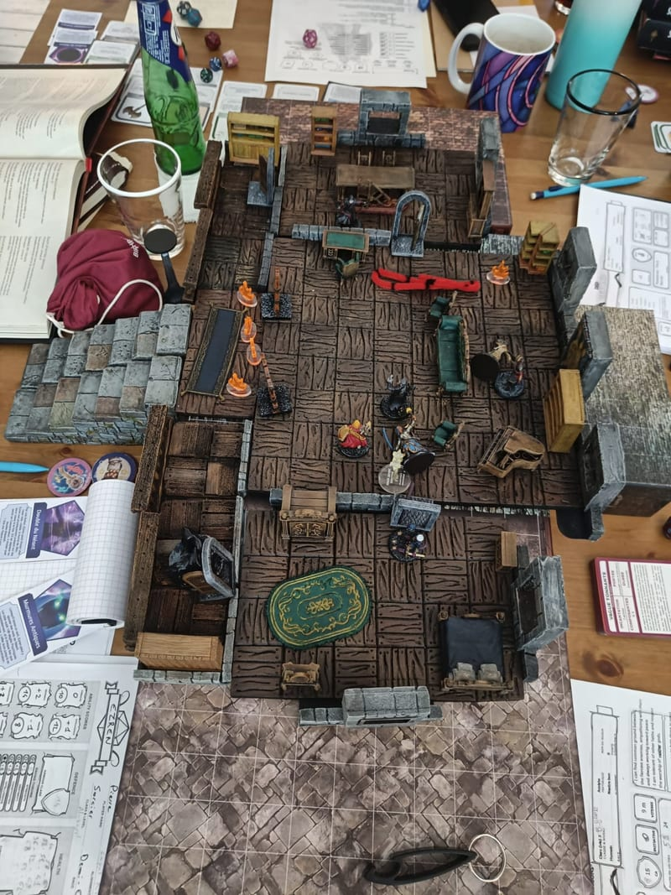
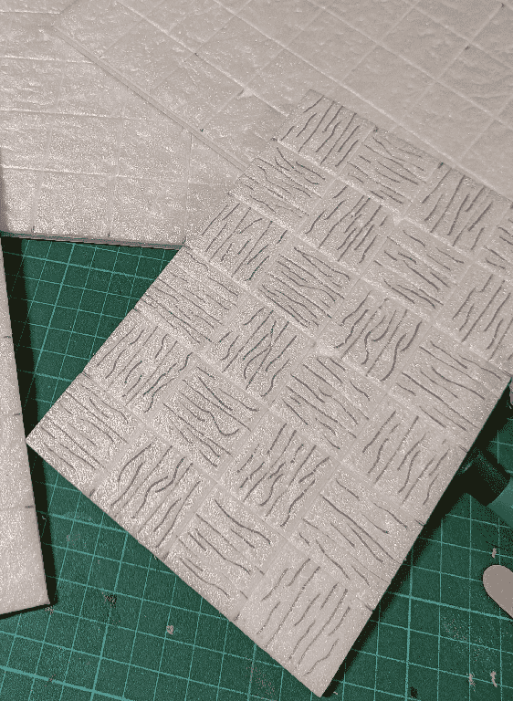
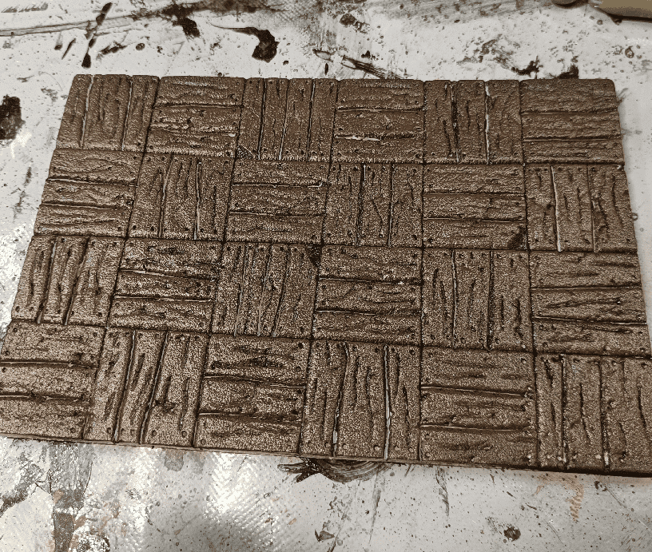
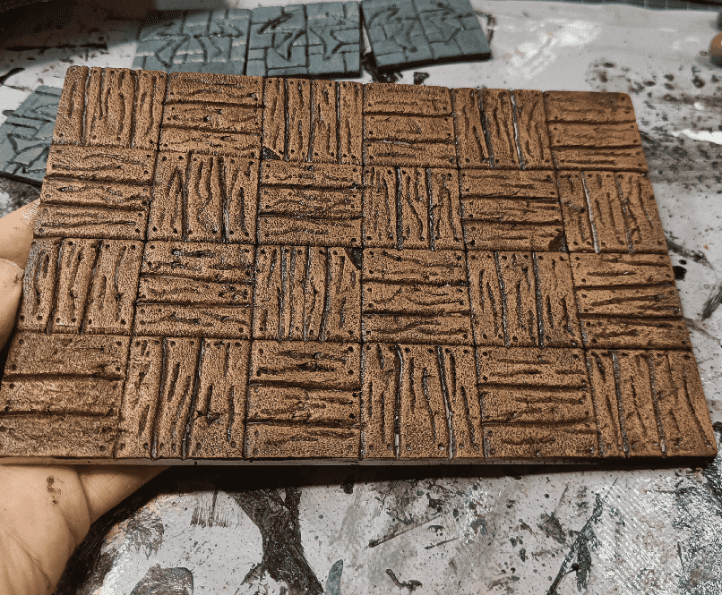
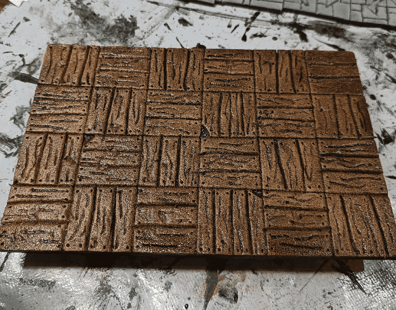

Similar to the [Stone Floors](https://painting.pixelastic.com/dungeonStoneRooms/), you sometimes need to lay some large wooden floors. Here, I needed a way to represent the mansion of the Kaijitsu family, that my players befriended, and where they first encountered their evil twins from an alternate dark future.

Instead of multiple wooden tiles, I opted for full room boards.

I started the boards in a similar fashion that the stone ones. But instead of adding cracks and stone texture, I went with a simple floorboard pattern. Each square is made of three planks, but the alternate order allows for visually distinguish them in play.

For the wood texture, I used a pen and draw squiggles in the direction of the plank, to simulate wood grain. It has a bit of a cartoonish look, but in play it does look like a wooden floor.

Paint scheme starts with a coat of dark brown. You can also see that I added small holes at the top of each plank to symbolize nails.

Lighter brown (almost orange) drybrush.

Black wash.

And a final light orange drybrush, that I forgot to take a picture of.