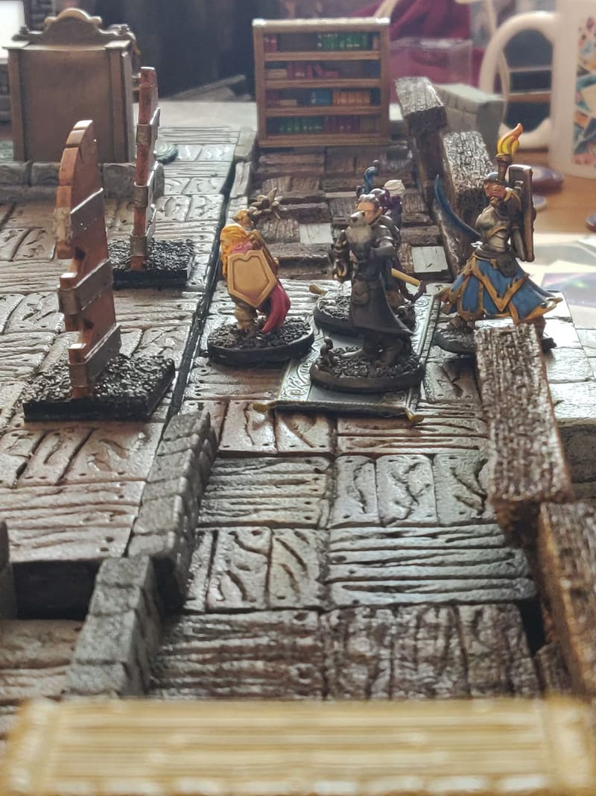

[Large wood floor boards](https://painting.pixelastic.com/dungeonWoodFloors/) are great, but sometimes I need something more modular, a bit like [Dungeon Stone Tiles](https://painting.pixelastic.com/dungeonStoneTiles/). Like here, I needed a way to represent a balcony, so I set up to work on wooden tiles.

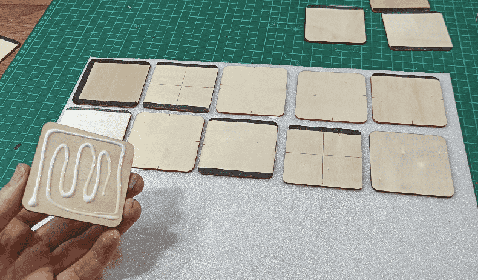

I started by gluing my wood squares to a sheet of foam. I had traced with a sharpie where the wall should go. Gluing the squares to the foam allowed me to perfectly trim them, so they were perfectly squared.

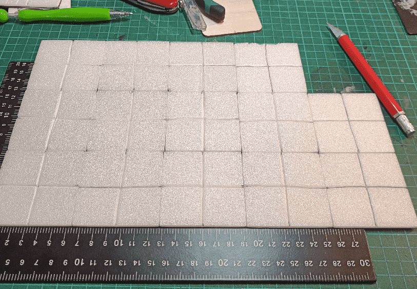

I then carved a cross in it, to separate each movement square.

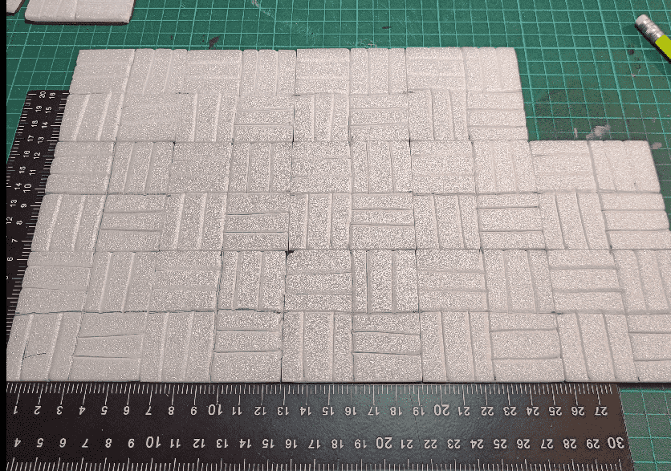

And carved them with planks, alternating the side. I picked that the lower left corner was always vertical, and stick to it for the whole craft, allowing me to arrange them in any shape and always have alternating directions.

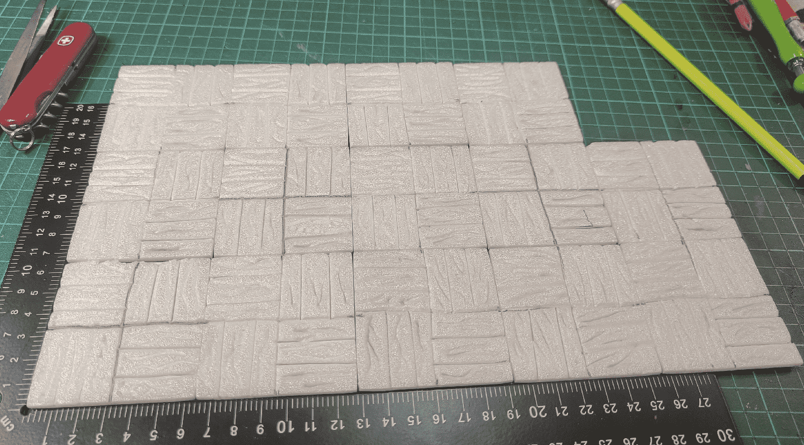

I then manually carved squiggly lines on each plank, to symbolize the wood grain.

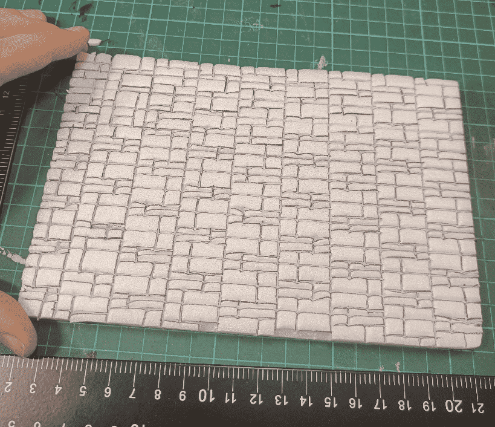

For the walls, this time I was more clever than last time and I carved the brick pattern on the foam sheet **before** cutting it to strips, which makes it way faster.

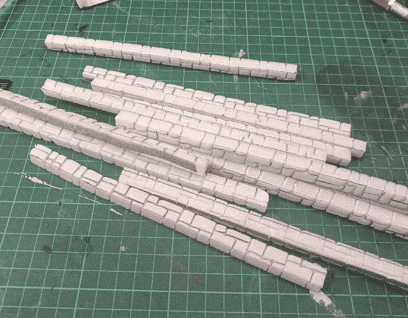

Only then did I cut them into long strips, continuing the brick pattern on the top face.

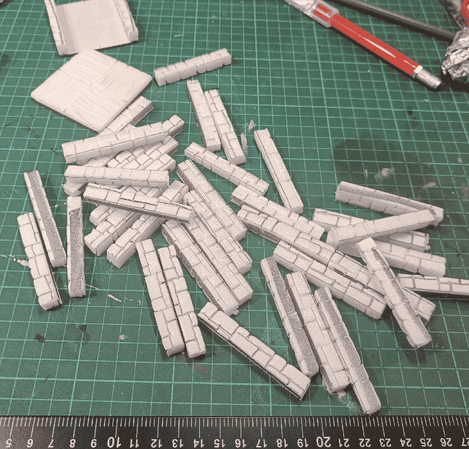

I then cut them into smaller strips, and continued the brick pattern on the sides.

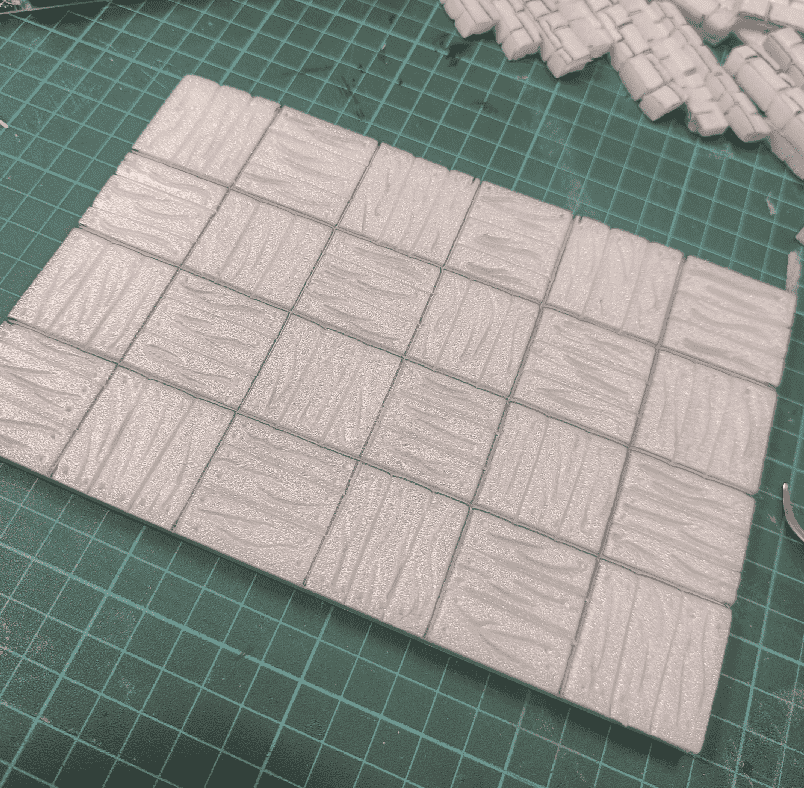

I used a pin to create holes at the top of each plank, to simulate nails.

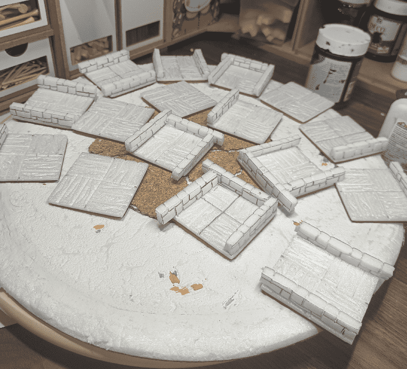

And I started gluing it all together. The walls overflowed on some sides, but I just then had to trim the excess. It's much cleaner than way than trying to cut the wall to size before gluing.

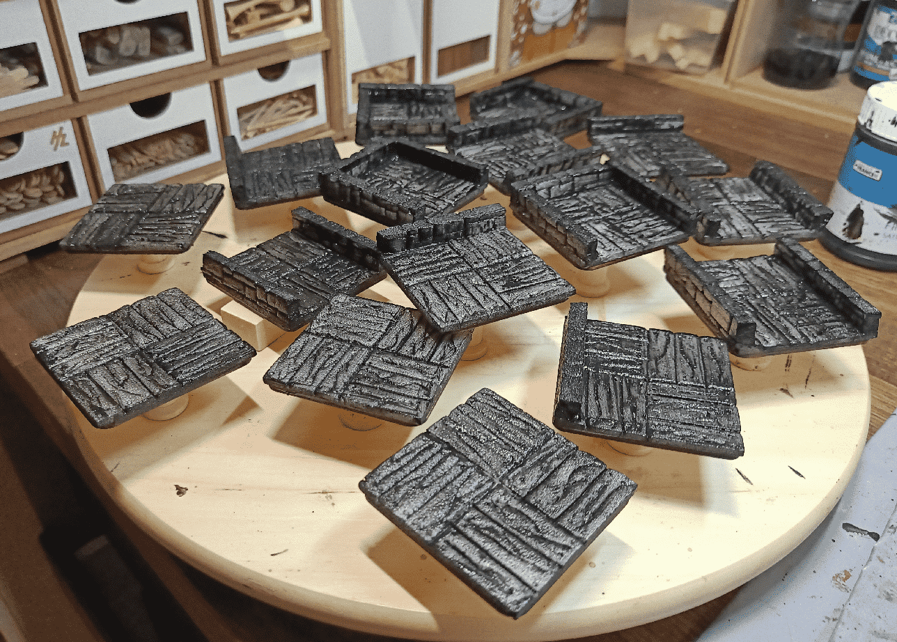

First layer of black modpodge.

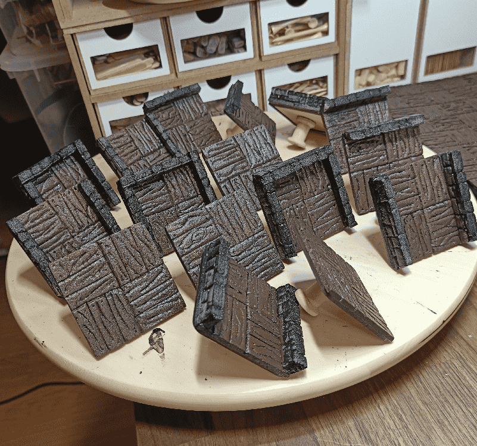

Painting the wood in a dark chocolate brown.

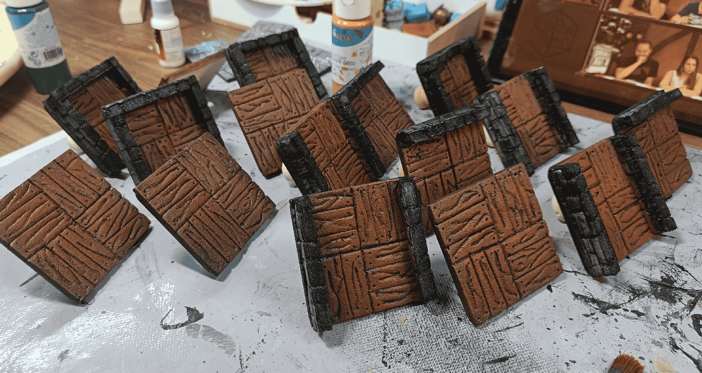

Then a lighter brown drybrush, mostly in the middle. I tried to avoid touching the walls.

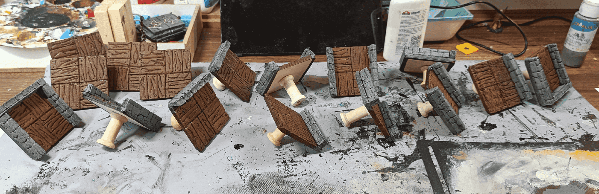

I then painted the walls.

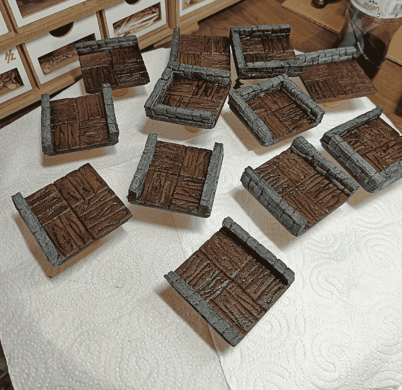

And applied a liberal amount of wash on the pieces.

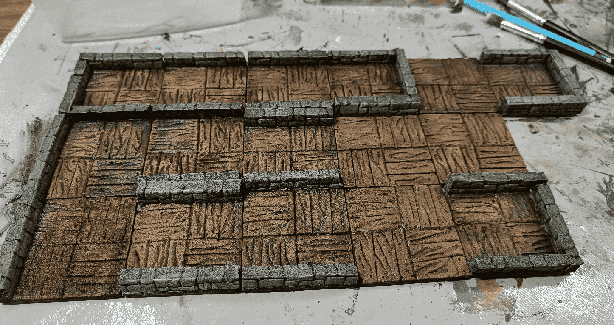

Test fit to see if it works. Looks good enough for me.

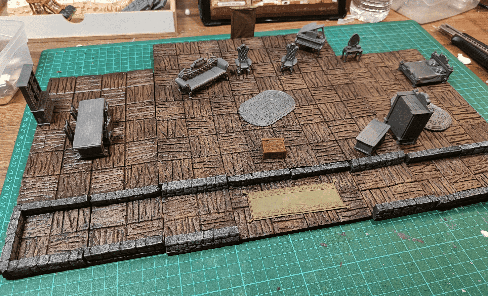

And checking with my larger floor boards. The paint scheme is similar and they blend well together.

