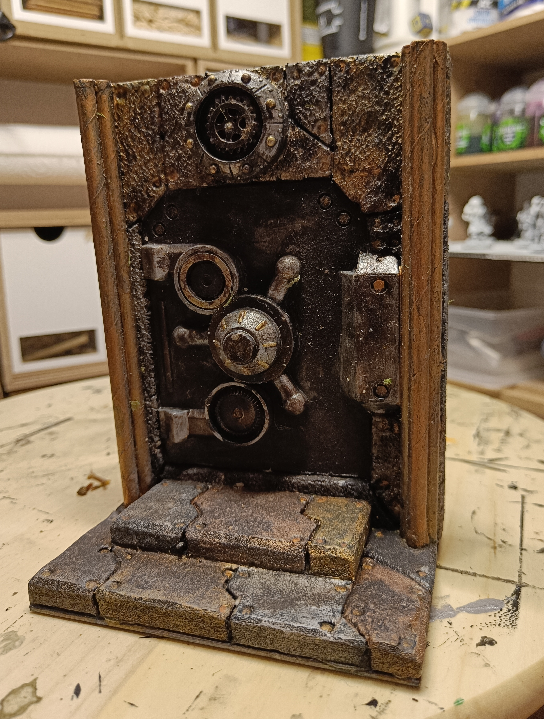

Deep under the city, there is the legendary Vault of the Strongfist, where this whole Dwarven family stored their riches. What traps are hidden on the way, and how is your rogue going to unlock this huge door?

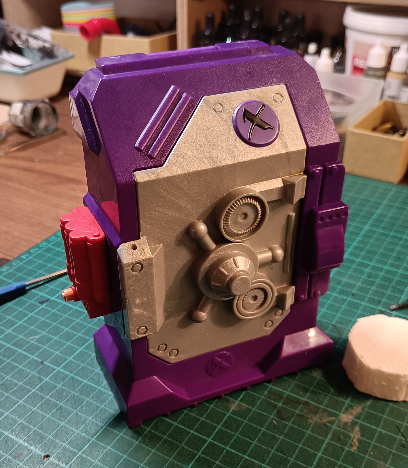

This whole crafted started from an Action Man toy accessory. I think this is supposed to be an explosive contraption.

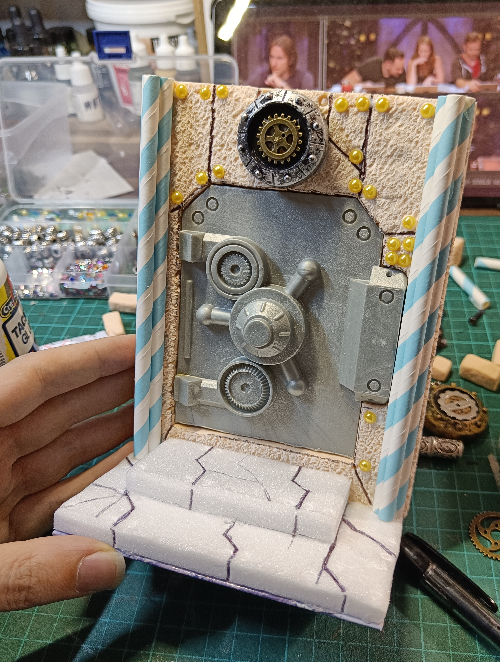

I was only interested in the main door. I put it upside down so the cut corners would be up. I also cut some parts to keep it flat. I then carved its shape in a foam board and glued it inside. I added straw trios to simulate columns on each side, and carved some more steps in another type of foam. I carved irregular shapes on them, to attempt a dwarven look.

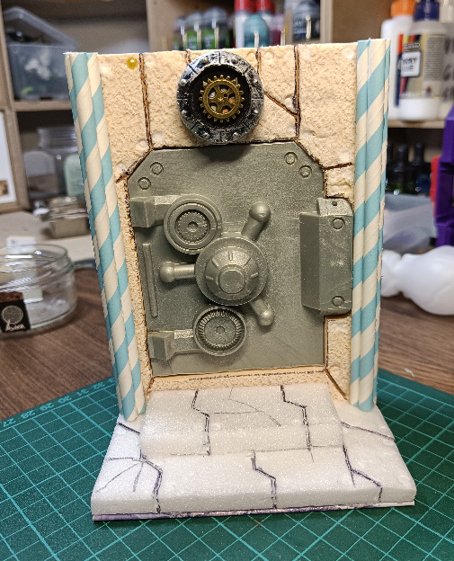

I had also added a lot of rounded shapes to simulate rivets, but it was a bad idea and I didn't like it, so I removed them.

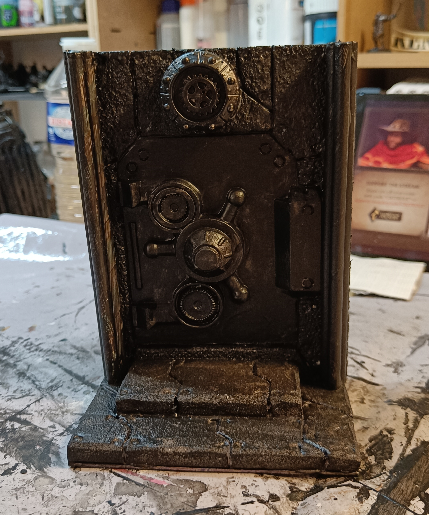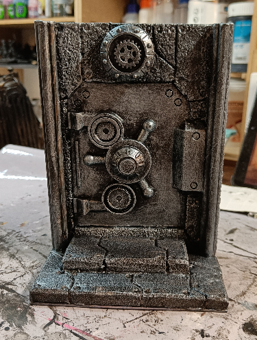

Covered in black for robustness, then a layer of silver.

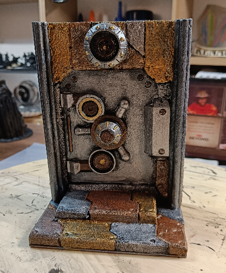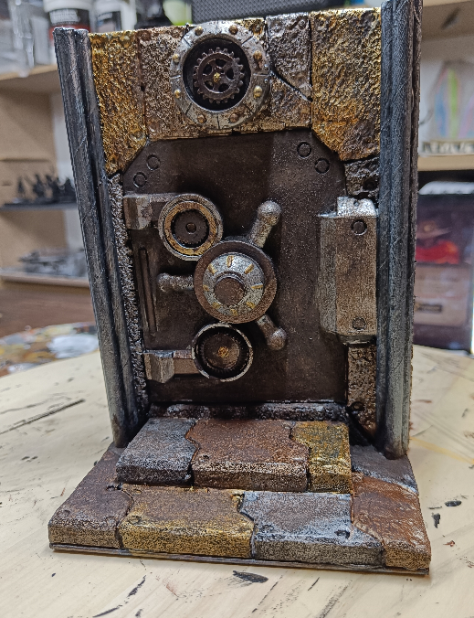

I added more colors to each individual stone, but stayed in the realm of metallic colors. I then added some grime using Typhus Corrosion.

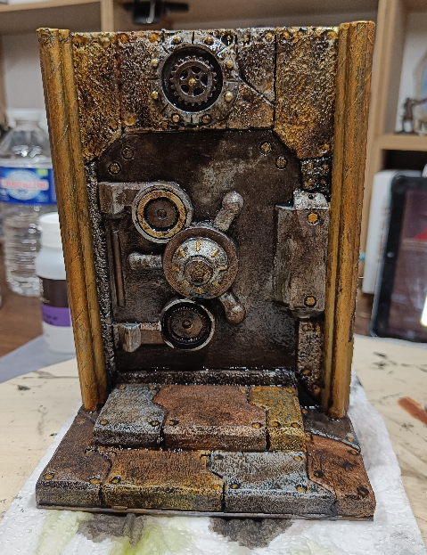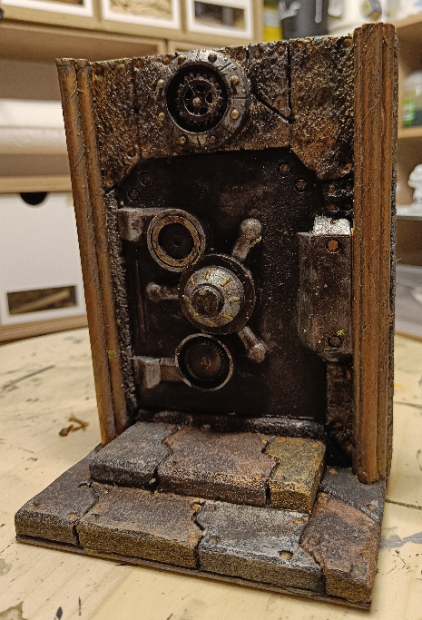

I then applied a dark wash on top, and was very careful not to brush too strongly against the stones. My cheap metallic paints have a tendency to reactivate when mixed with water. Once dry, the effect was... good enough I guess.

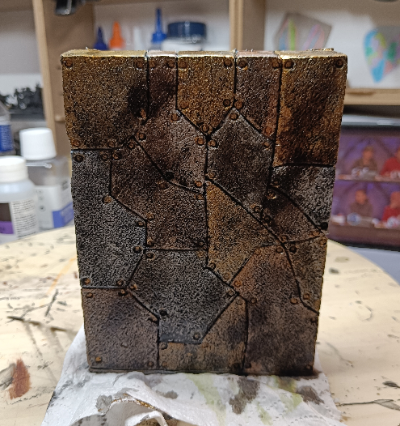

Oh, and let's not forget the backside.

Overall, I'm not very satisfied with this build. It's too chunky and doesn't have much depth.

