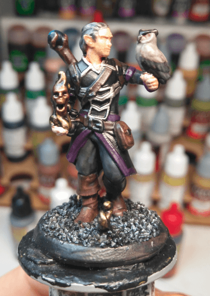
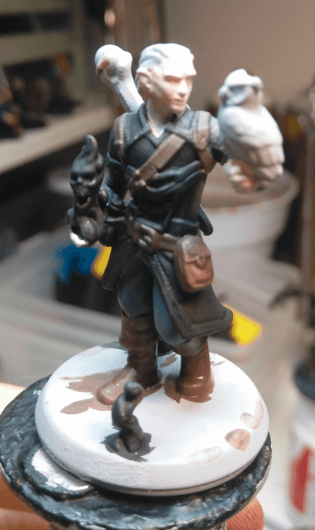

Another custom HeroForge miniature for one of my players. Ezren is a Half-Elf warlock that did a pact with an ancient Runelord and vows to bring her back to life (at least, until their objectives align).

This is one of the in-progress shots. Lots of details on the miniature but I tried to not bring too many different colors. I had a plan on making the main colorscheme black, purple and gold.

I like how the black + purple turned out, it looks like a dominant color scheme. The gold flames and skull works well as well.

The face... not so good. I had to retry it two times because it was horrible. I finally gave up in trying to make eyes and went with a simple wash on flesh color, sorry.