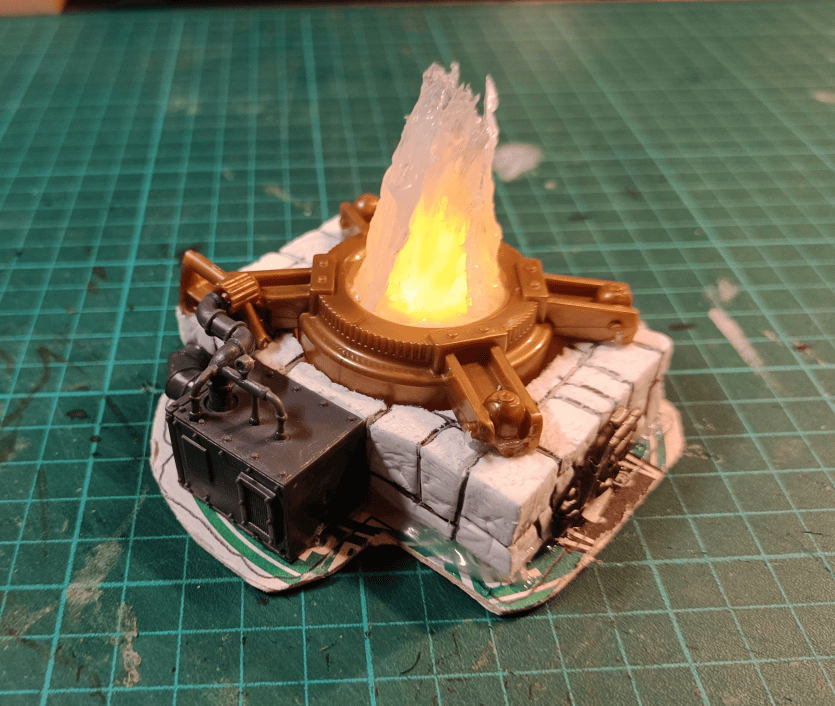

I made this thing and honestly I wasn't even sure what it was supposed to be while I was working on it. It's kind of in the same vein as the furnace and boiler I did recently.

Here's what I did: I took a piece of think foam and carved out a hole in the middle for a fake LED candle. Put everything on a cardboard base with a coaster. Cut a hole underneath so I could reach the switch to turn the candle on and off.

Then I grabbed some random parts from my bits box. That big orange piece you see is super low quality plastic that literally crumbles every time I touch it. I salvaged it from some flea market game I can't even remember the name of.

The piece on the side is from Mantic Crate scenery. It's normally for WWII skirmish games, but since I do fantasy, I just laid it on its side and lined up the pipe so it fits into the pipe of the other plastic part.

For the flame effects, I used hot glue gun glue and built it up around the plastic flame that was already on the fake candle.

I've got a photo of the finished piece that I'll share in another post soon!