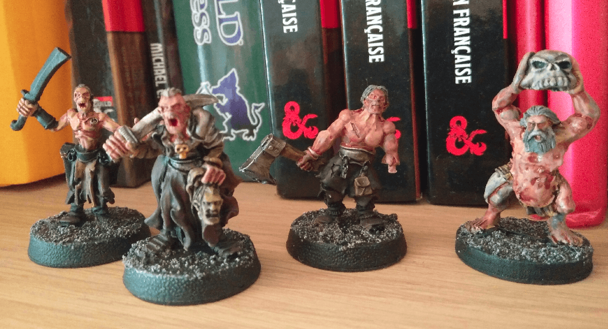
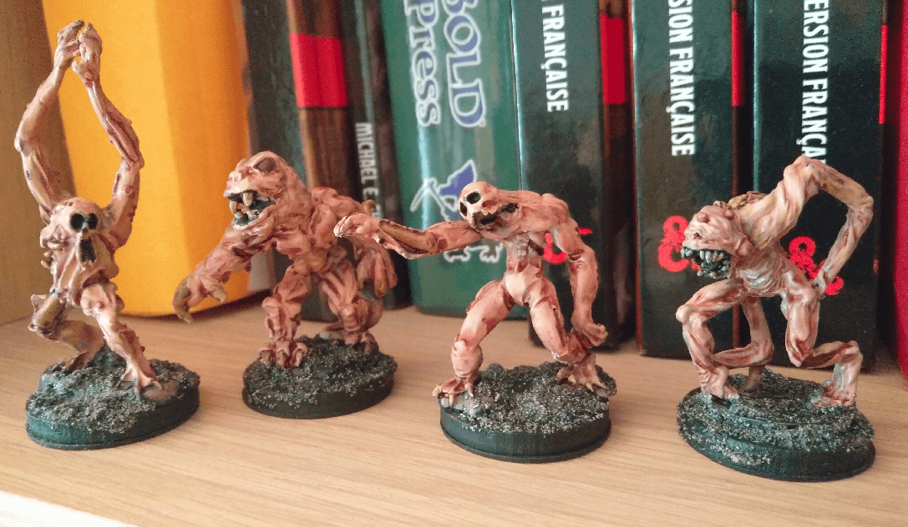
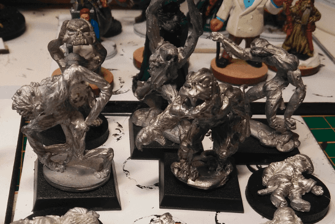
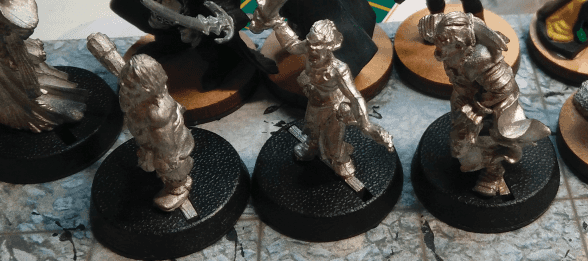
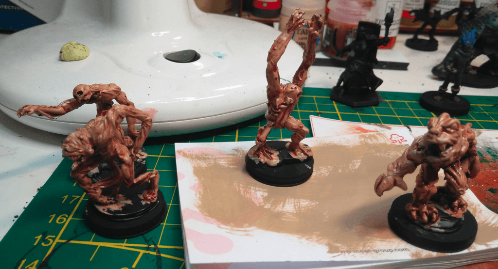

I gathered a bunch of minis that might pass for ghouls. Emaciated humans or mutated humanoid and painted them with pale flesh with a red wash on top. Some of them actually turned out pretty scary.

Some of the sculpts are very weird looking, and the sculpting is pretty rough. You can actually see the sculpt marks here and there, like it was done by an amateur.

Because of that I thought I should paint them in a pretty horrible colorscheme, something that would be lenient on the appendices not being perfectly proportionate.

I did a quick and dirty flesh dry brush, followed by a red wash, and I finally picked up some details, like the black eye sockets or yellow teeth