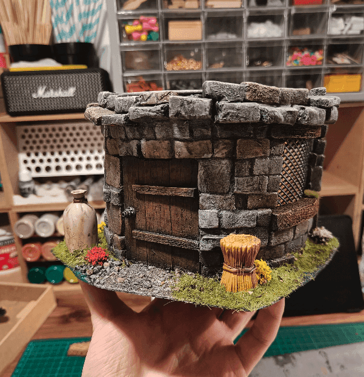

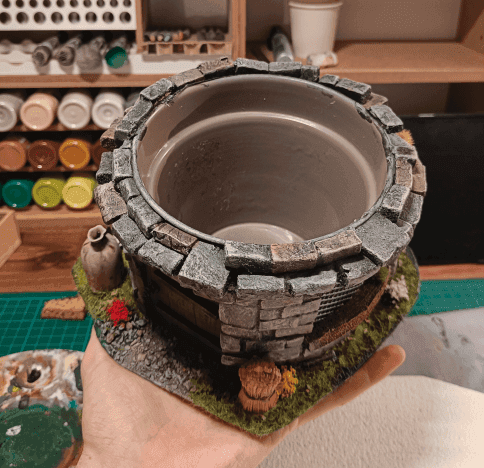

I pimped an old metal flower pot into a nice little house.

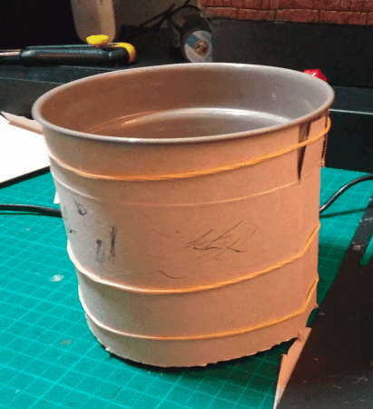

I started by gluing some cardboard around the flower pot, because it wasn't all straight from top to bottom.

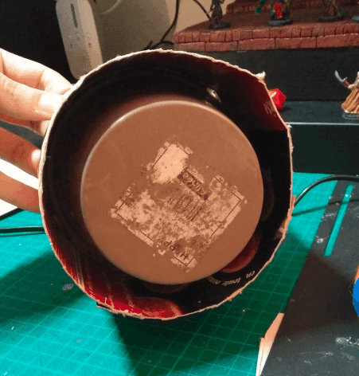

As you can see, the top is larger than the base, so the cardboard helps in getting straight(er) walls.

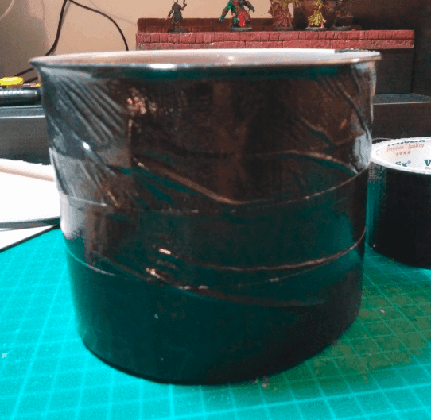

I then covered the cardboard with hardened black tape, to add an additional layer of stiffness, but also to protect the cardboard. I'm going to use a lot of glue, paint and water and I didn't want my "walls" to disintegrate.

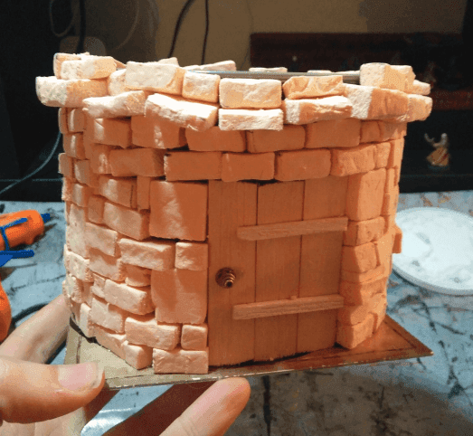

I then glued it on a piece of cardboard, and glued foam bricks all around it. The door is made of ice cream sticks, and the handle is a small jewelry bead.

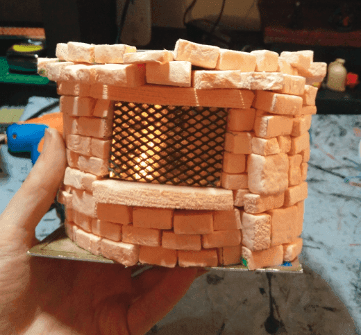

For the window I used golden paper and plastic mesh.

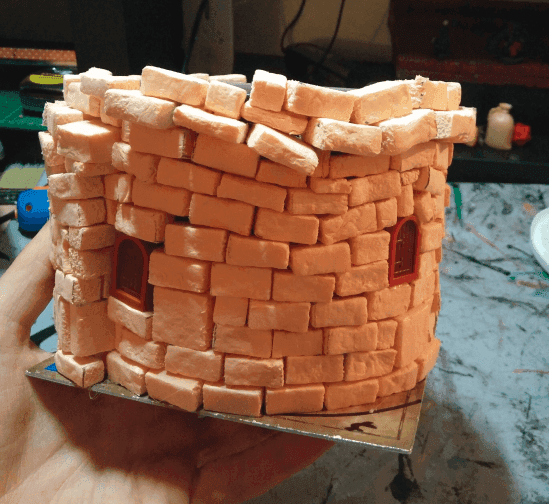

I also added some small Lego windows.

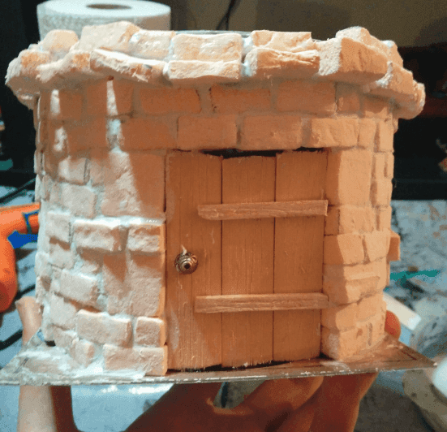

I then added some filling paste in the space between the bricks.

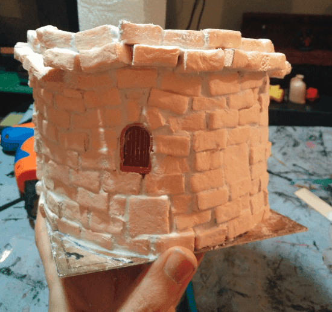

I did it by adding the paste on roughly 20% of the wall, then spreading it as much as I could over the holes. Using a wet brush, I would spread it even further, to cover any gap. Finally, I would use paper towels to wipe the excess off, so the paste only stays in the gaps, and does not cover the brick faces.

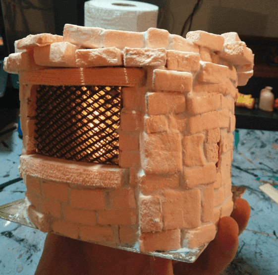

Doing it all over the house is long, but it looks so much better once painted compared to just glued bricks. It also makes the piece slightly heavier, which is always good, as to not accidentally knock if off.

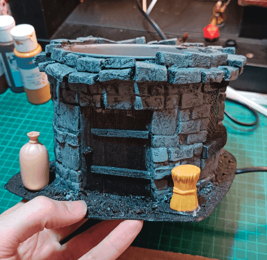

First layer of gray overbrush. I used Playmobil toys to spice up the front porch.

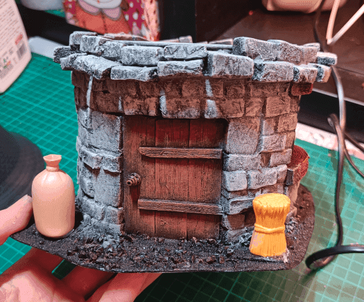

Second, lighter, layer and door.

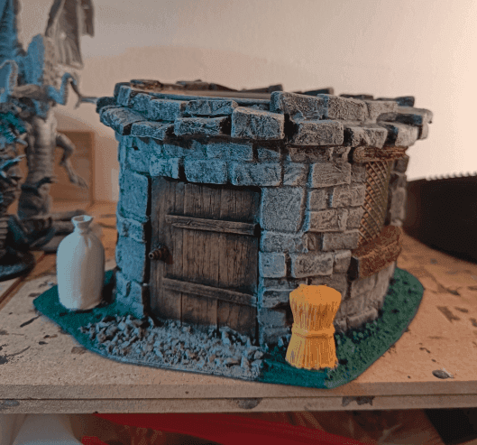

More layers and the floor.

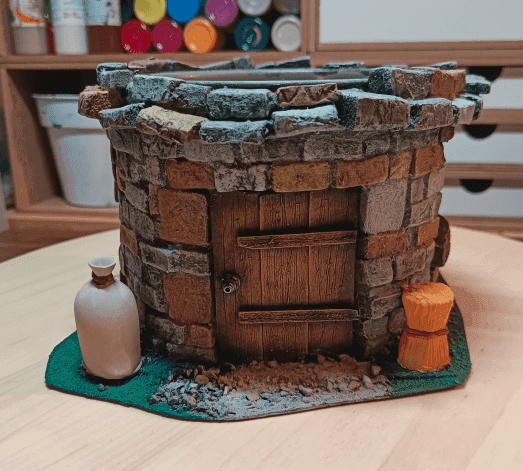

Painting individual stones with diluted paint of various earthy colors for variation.

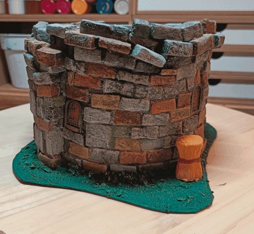

Doing it all around.

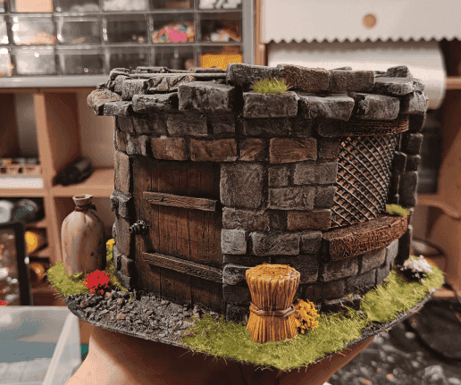

Final black wash on top, and adding some flocking and flowers.

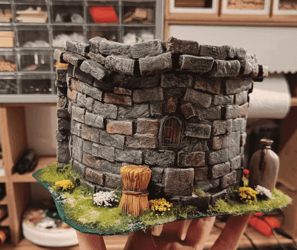

View from behind.

