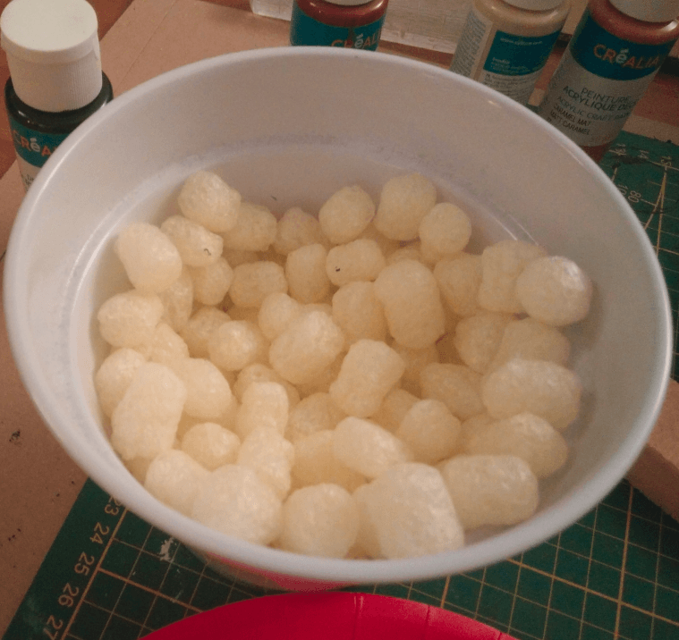
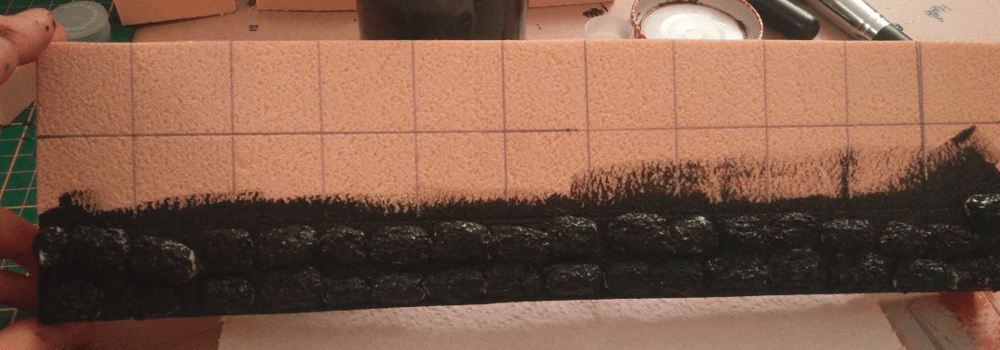
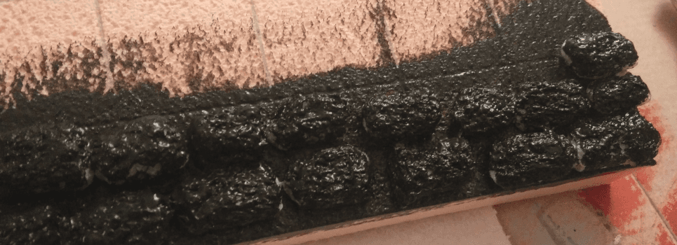

An order I made arrived packages in those little foam bubble. As they are almost rectangular in shape and with a rough texture I thought I could try to use them for brick walls.

So I coated a piece of foam with the mod podge / black ink mixture and glued them on it. I liked the way it looked like a rough stone wall.

Unfortunately, those little "bricks" react to water by shrinking. And even if there isn't much water in the mod podge, it still shrank them. They shrank so much that the game between the rocks was clearly visible and it didn't look like a wall at all.

So, this was a failed experiment. Still, what I learned is that I can use a few of them to add on an otherwise simple flat wall to add some interesting bits.