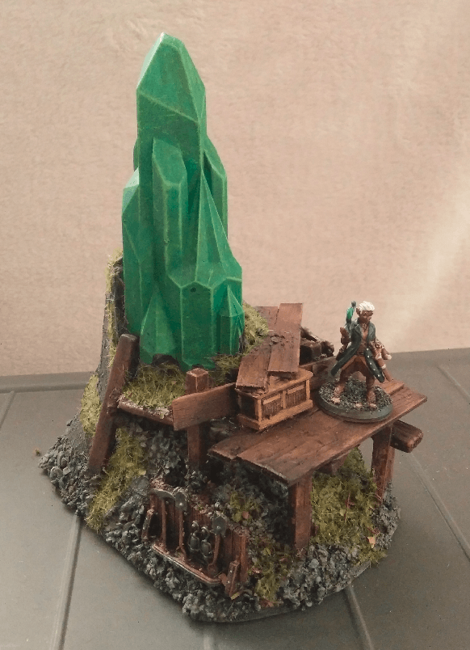

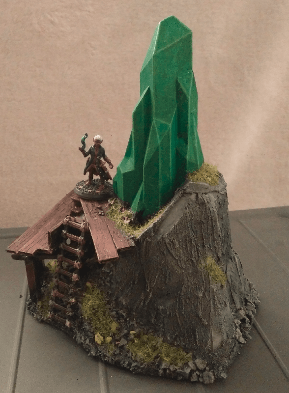

This is an excavation site for a large shard of Wyrdstone/Emerald.

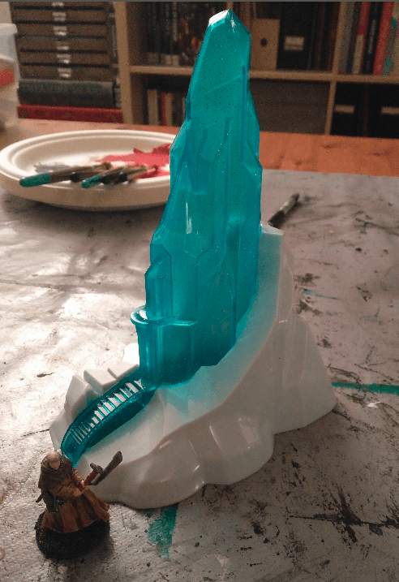

This all started with this Frozen toy found for 1€ in a second hand shop. At a different scale from originally intended, I thought it would make a nice Warpstone/Wyrdstone marker.

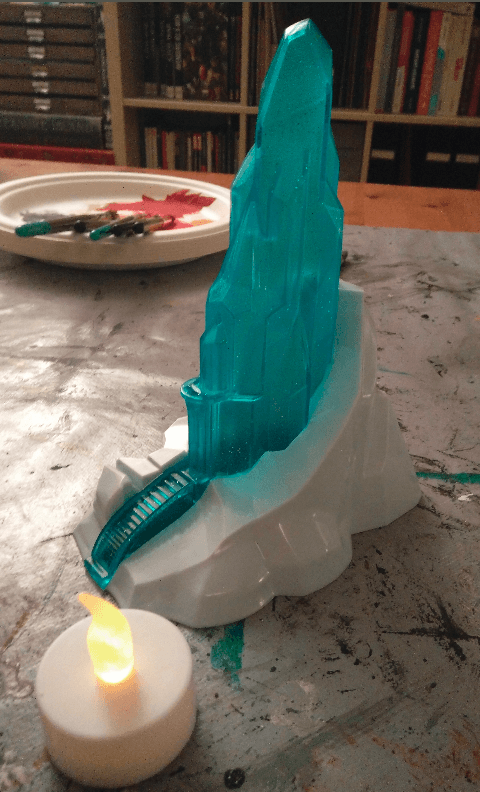

It's also hollow and translucent, so I thought I could fit a little light inside and have the flickering effect make it look like the stone was pulsating.

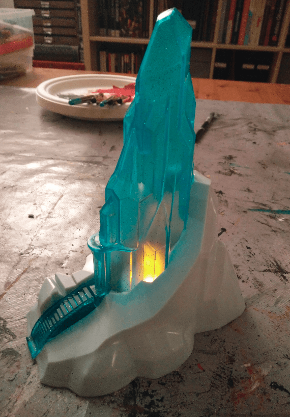

My initial test looked promising, the only issue was: "how would I be able to keep the translucent effect but turning it green instead of blue?"

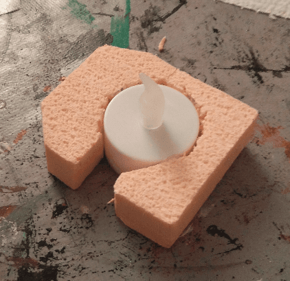

I cut some foam to the shape of the bottom part and fitted a light inside. Not pretty, but it's also not meant to be visible.

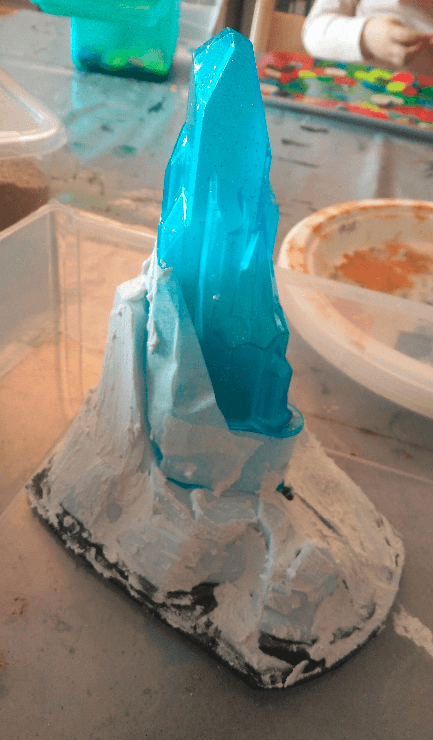

I protected the base of the shard with some tape and applied filling paste on the base, to give it a more rugged look than the smooth plastic it was.

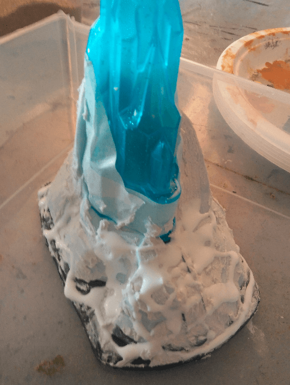

Once dried I applied a fair amount of wood glue...

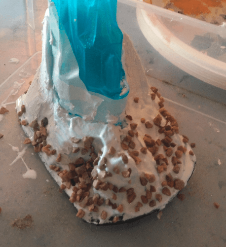

...and sprinkled various sizes of gravel...

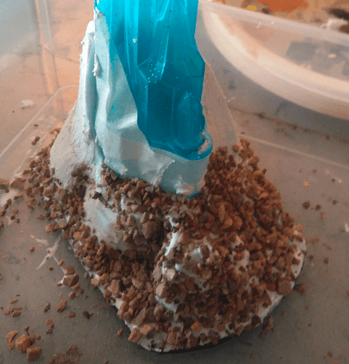

...pebbles...

...and sand. I then let it dry.

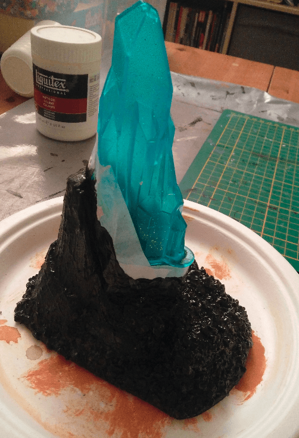

And applied a coat of black mod podge to act as a base for the paint, as well as really fit the gravels/pebbles/stones in place.

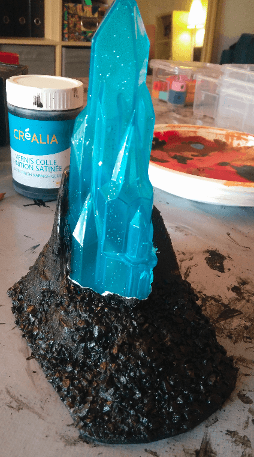

I could then remove the tape.

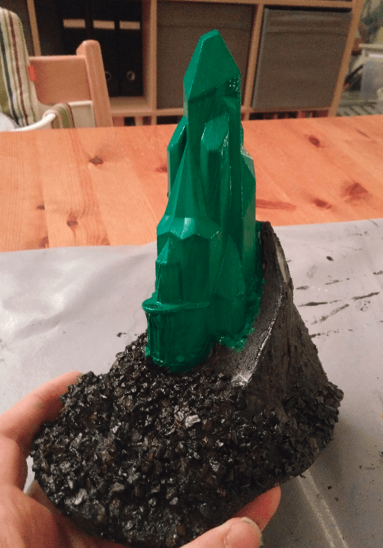

And start painting.

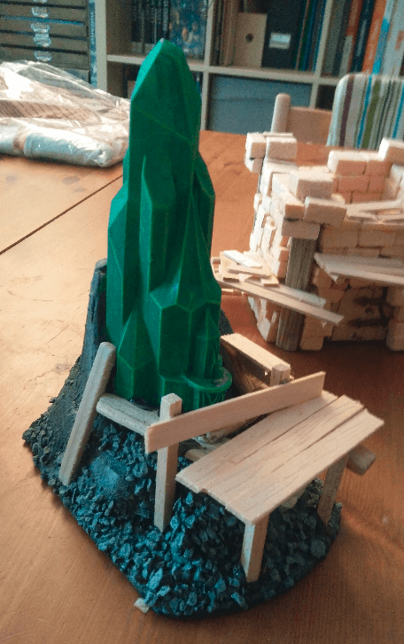

I then did a drybrush of a lighter green on the stone. In order to hide the parts that were definitely not on the right scale (the entrance door and stairs), I decided to cover them with some makeshift scaffold built from balsa wood and ice cream sticks.

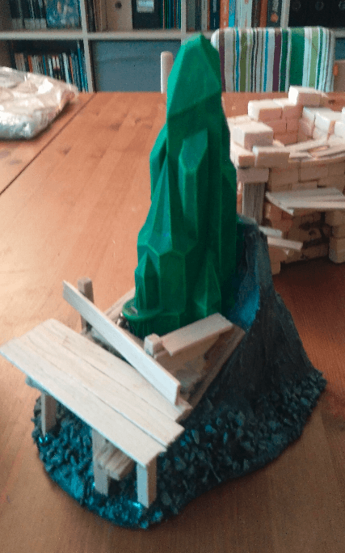

I now had the idea of turning it into some excavation site, where a team had already started getting this large piece of green stone from the earth and still had their scaffold and tools around.

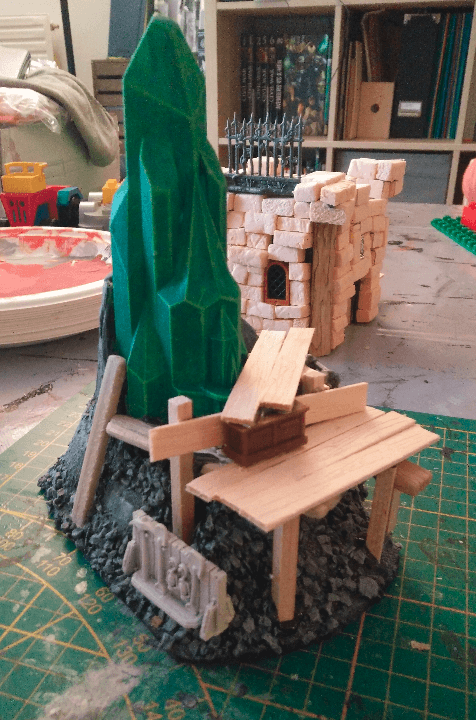

I added a few details like this rack of tools and chest (coming from a Mantic kickstarter).

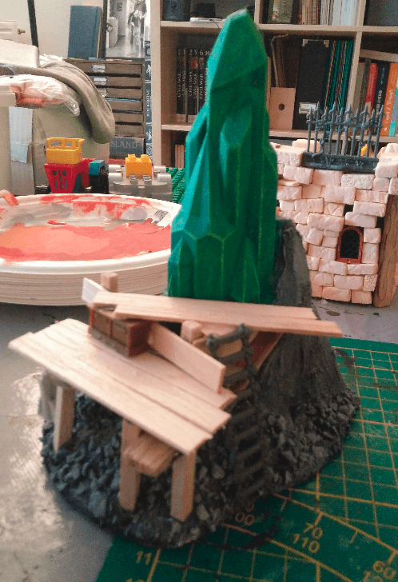

And a ladder on the other side. At this point I must say that I usually base coat and paint the whole terrain at once when crafting, but here I knew that it would be hard to paint the stone underneath the scaffold if I built everything at once, so I built it in two steps.

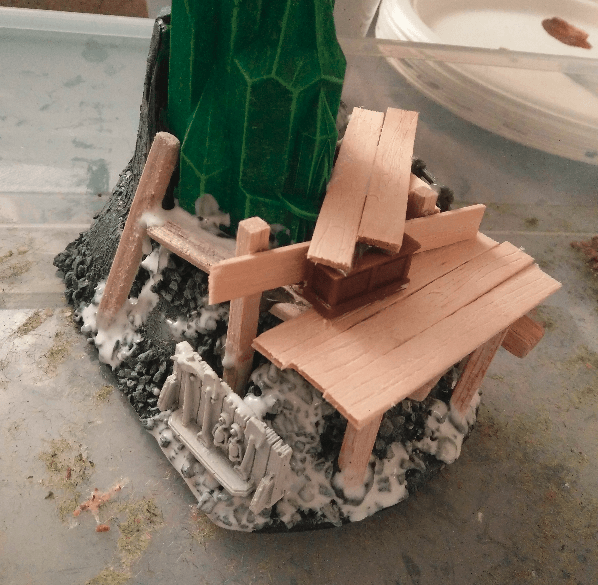

Covered the feet of my scaffold with more white glue again.

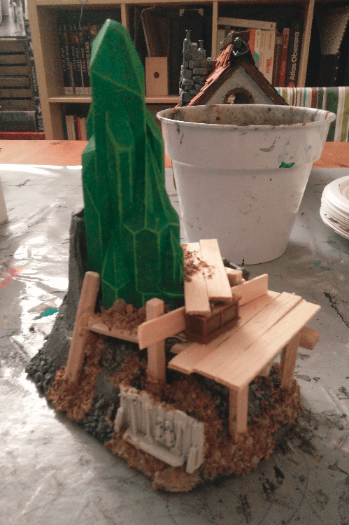

To add even more stone rubbles, to better merge together the various layer of the build. I'm learning to not be afraid of adding more and more layers of details, even if it means going back over something I previously painted.

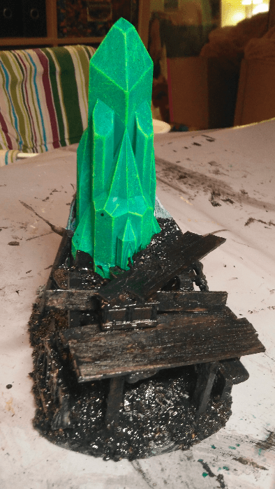

And painting again in black mod podge the new addition (I painted a bit on the actual stone, oops).

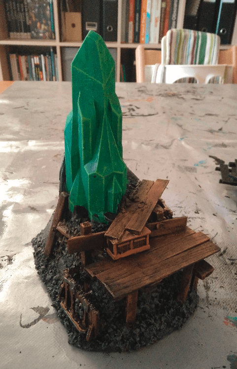

Then painting the wood with the usual three brown drybrushes, from darker to lighter.

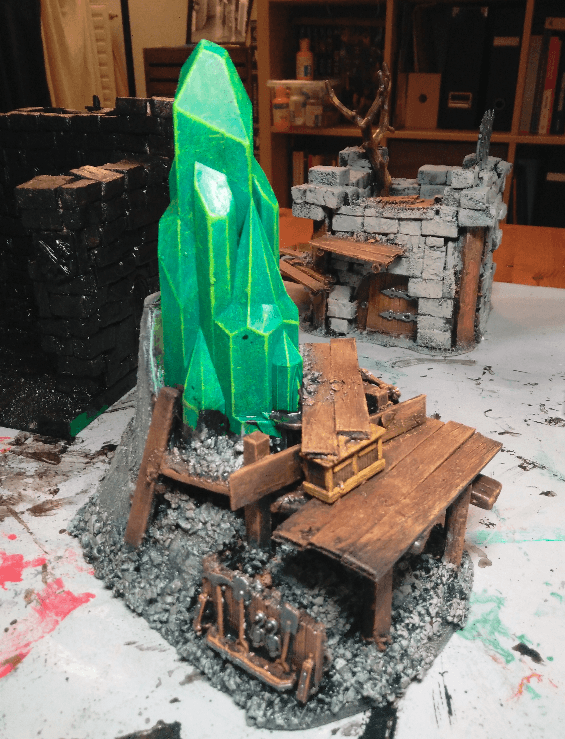

Another shot under a brighter light. As you can see, I completely abandoned the idea of having the candlelight pop through the crystal. My paint if pretty opaque, so you really need to have complete darkness in the room to barely see the light inside.

And finished with a little bit of flocking to cover the parts where I painted over the crystal or couldn't paint properly.

And the final glamor shots!