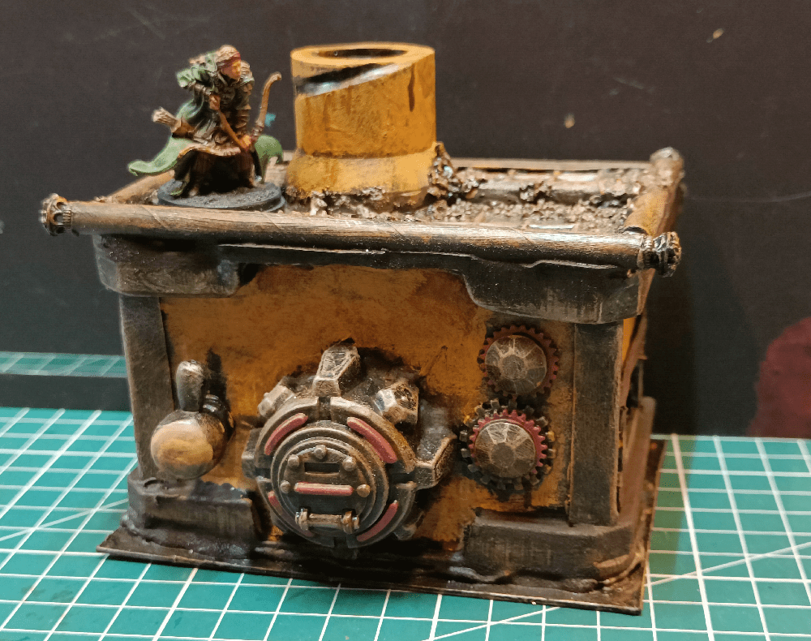
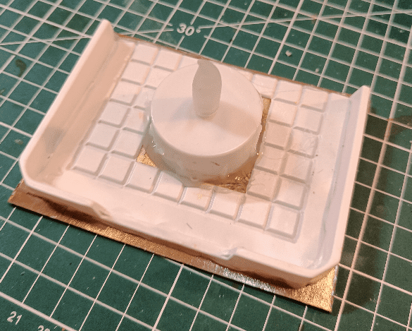
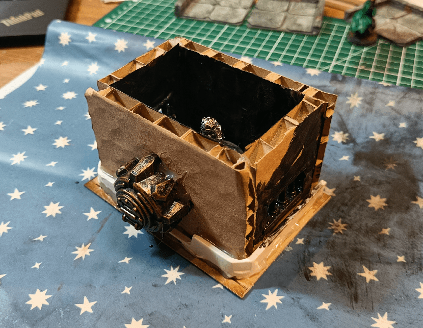
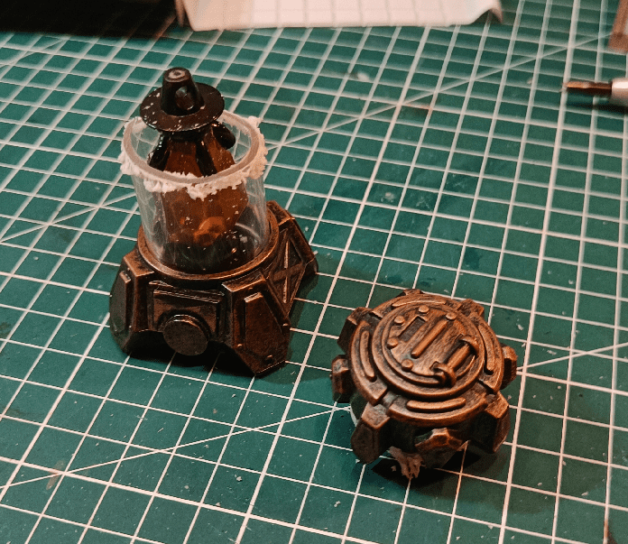
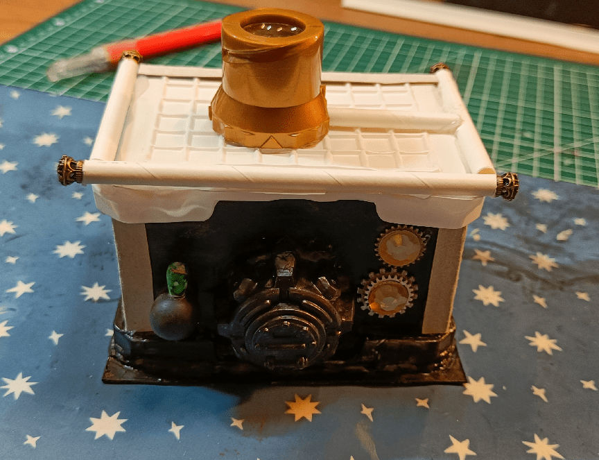
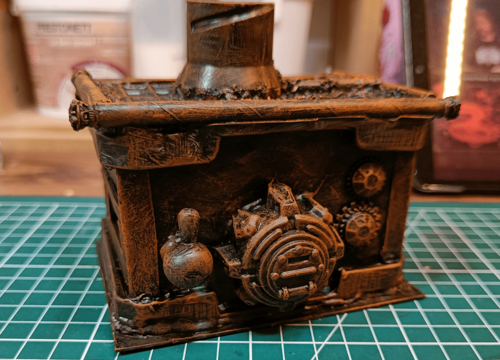
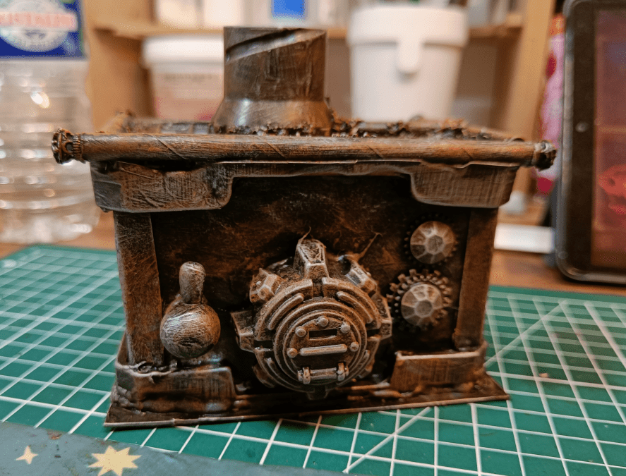
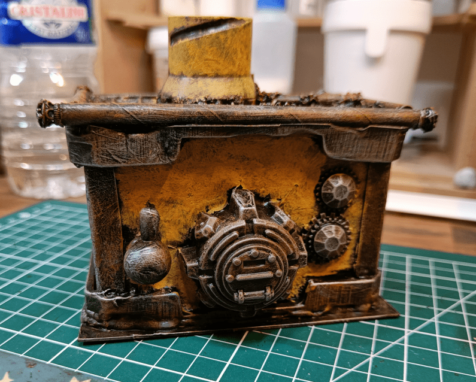
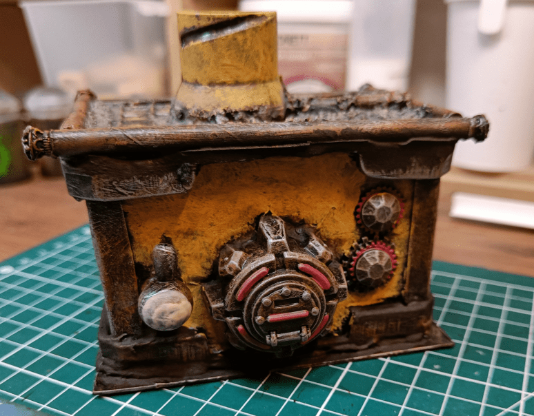
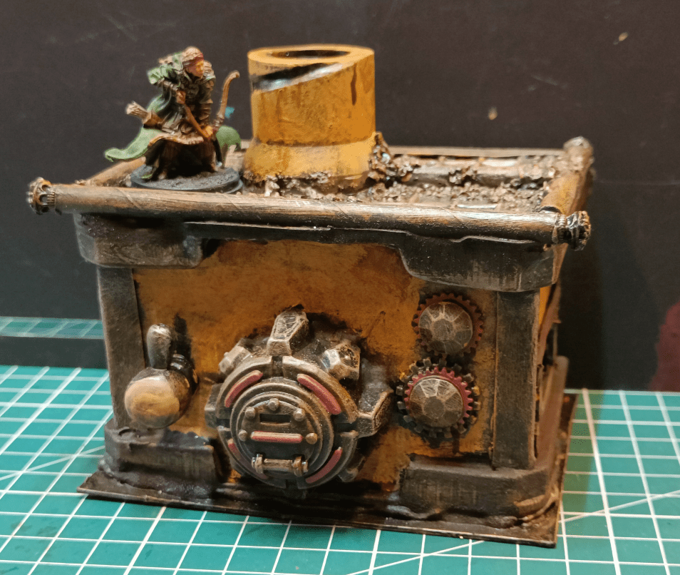

I made this to represent a "furnace", supposed to be abandoned in the basement of an old building. To be honest, I have no idea what a furnace is actually supposed to look like, especially in a fantasy medieval world (bordering on Lovecraftian Victorian style).

So, I started with what I had. I knew I needed a base, and something to produce light, so I started with that. 

I had those plastic boxes sheets (they were previously holding frozen chocolate cakes) that I had been saving because of their little tiling pattern. I used one once for build some ruined house, but this time I was more interested in the ledge running around it.

I glued Ikea wrapping cardboard sheets to make walls, and decorated with some bits vaguely evocating steampunk technology.

The front cover is coming from a Skylander toy.

Damn those Skylander toys are hard to break. There is no screw to unscrew, and the plastic is very hard, so I had to cut it with a Dremmel saw.

I then added more stuff and a roof. The roof is a similar frozen cake wrapping. The rails around the roof are straws, decorated with jewelry beads on the ends. The rest are just various beads, plastic gems and steampunk cogs.

I did a drybrush of Riza Rust on top of the black primer. I don't really see how Riza Rust (an official Games Workshop Effect paint) is any different from any orange. Next time I should try with a simpler orange, to see if there is any difference.

Then a lighter silver drybrush on top. The idea was to let the rust effect visible in all recessed areas, while having the original metal shining through on the edges.

I added some yellow on the large flat areas to break the monotony. Yellow is going to be an important color in the scenario I plan to use that furnace in, so I thought it would help having some here already.

I dabbed the paint on the surface instead of brushing it, and didn't go all the way to the edges, letting some rust show through, so simulate flaked paint. Not sure if the effect is working or not.

Adding some red, to highlight some details.

I ended it with a brown wash on everything, then some rust streaks with diluted brown paint here and there.