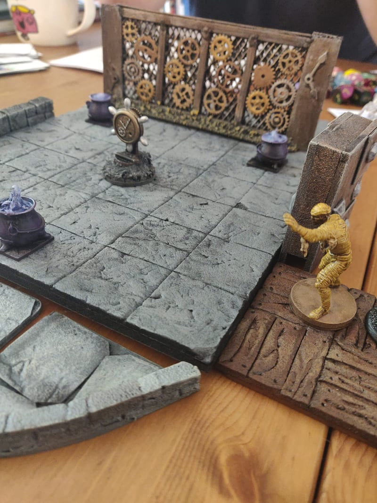
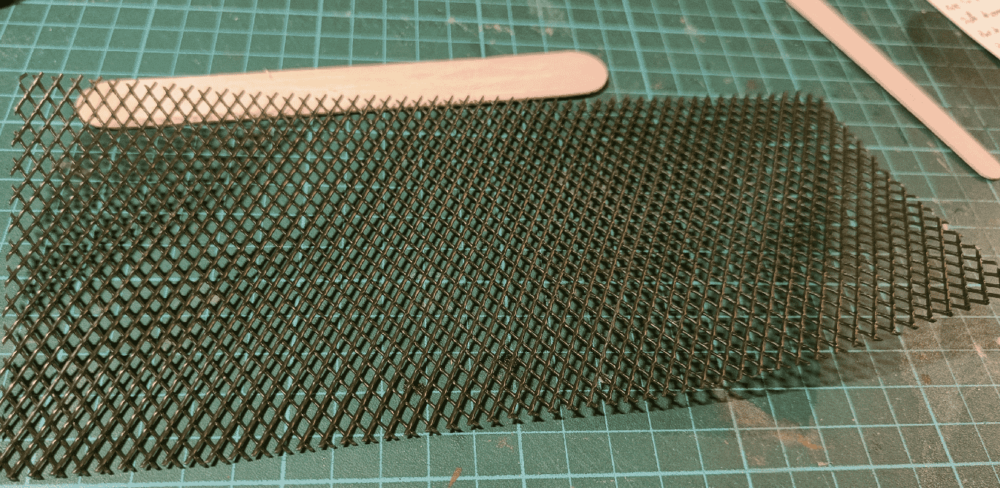
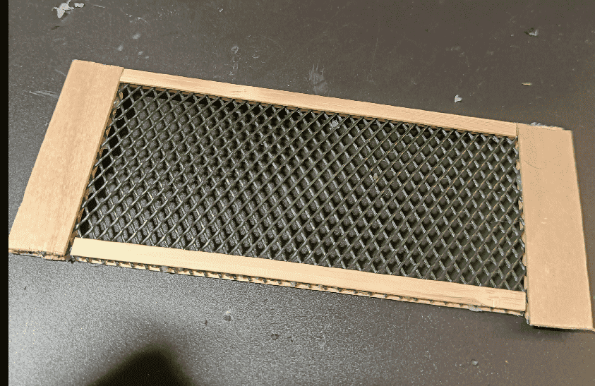
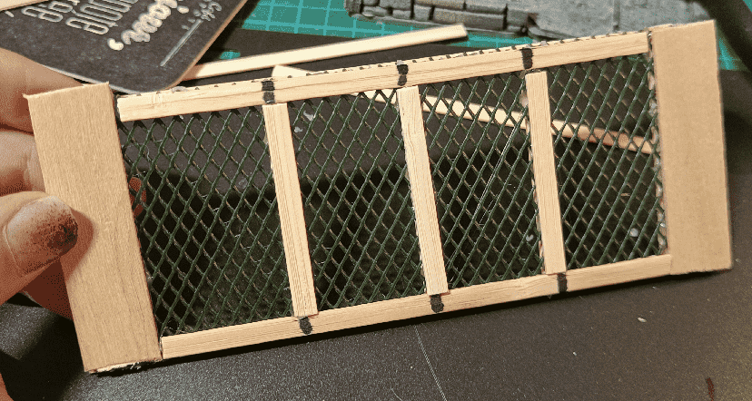
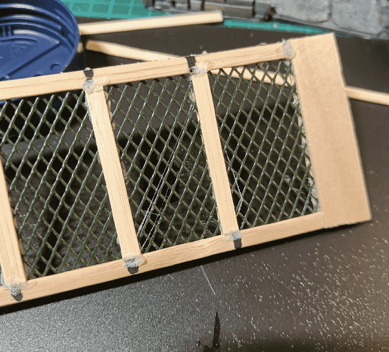
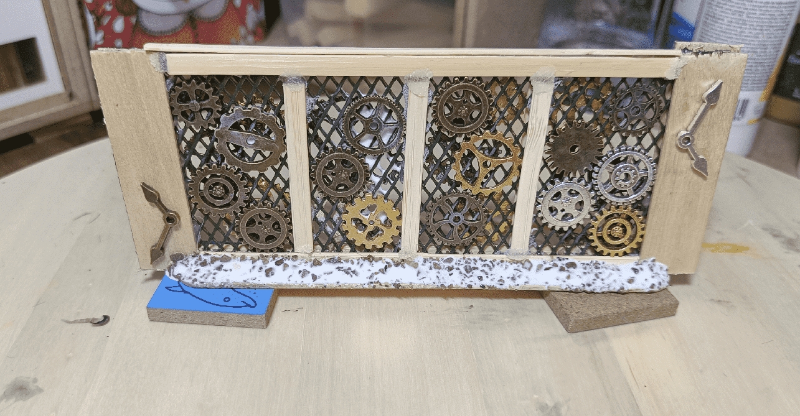
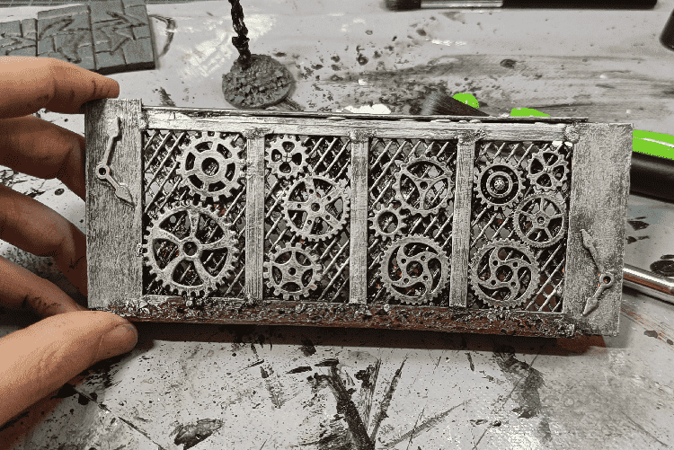
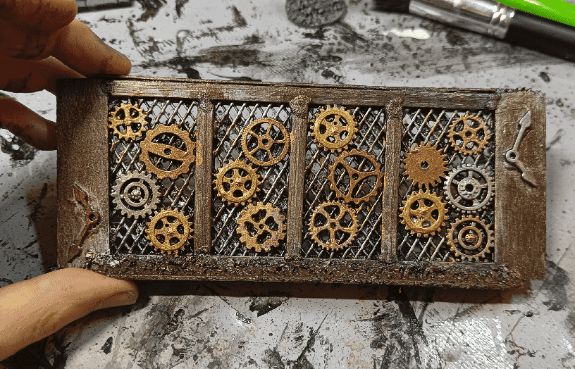

In one of the last rooms of the dungeon, players entered a room full of moving gears, with a ship help in the center, and a wall made of moving gears at the back. Behind the wall they heard sounds, but before they could explore it, one of them turned the helm and they all got transported back in time, at the entrance of the dungeon.

The base of the wall is made of plastic "chicken" mesh.

I glued ice cream sticks in a rectangular frame on it, on both sides, and trimmed out any remaining part.

I added some vertical separation on top.

To hide the separation between the sticks, I put some superglue and sprinkled it with baking soda, to both strengthen the bond, but also make it look like old rusty parts.

I glued steampunk decorations on the mesh, as well as on the frame. I also added a heavy dose of gravel on the base, to force it upright. The mesh is flexible, and it was distorting my frame, so I need something very heavy to put it in place and prevent it from falling forward.

First silver overbrush on a black priming.

Copper drybrush on the frame, and picking individual cogs in various metalic colors.

The last step was to add a black wash and let it dry.