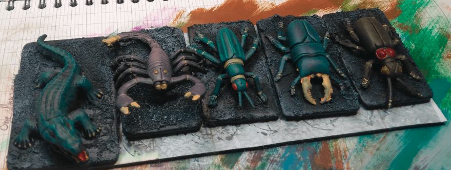
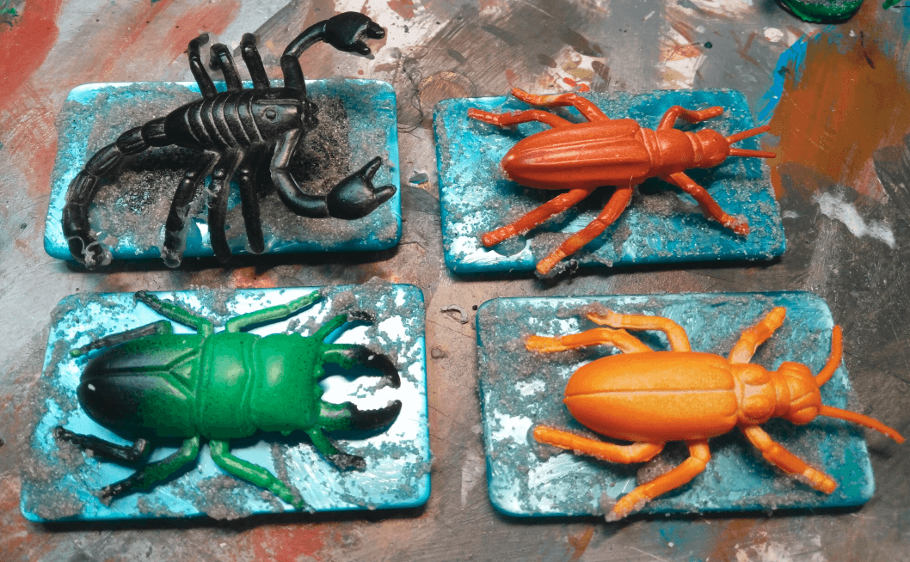

Giant bugs from cheap plastic toys. And a crocodile thrown in the mix as well. I think it's a Kinder toy.

I think I should have made the crocodile lighter. I'm happy with the bugs, mostly, but if I had to redo them I would use a darker version of the main color of their shell to paint the articulation instead of the bone color I used. Also, I would find another color for their claws and teeth as well, it does not work so well here.

Otherwise I like the way the shells seem to have a slight sheen.

Here they are right before priming. I glued them to poker money markers using a glue gun. This allowed me to warp some of their limbs in place. I also applied some textured paste on the base at this stage so it would get primed as well.