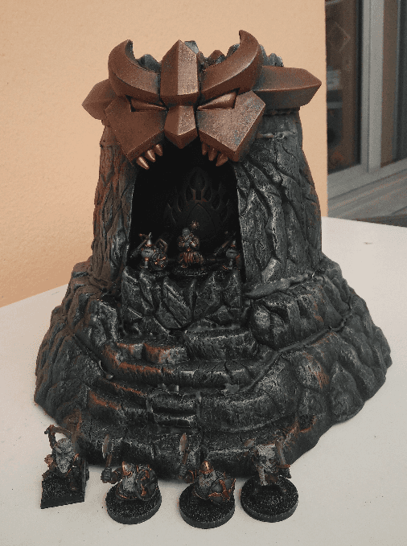
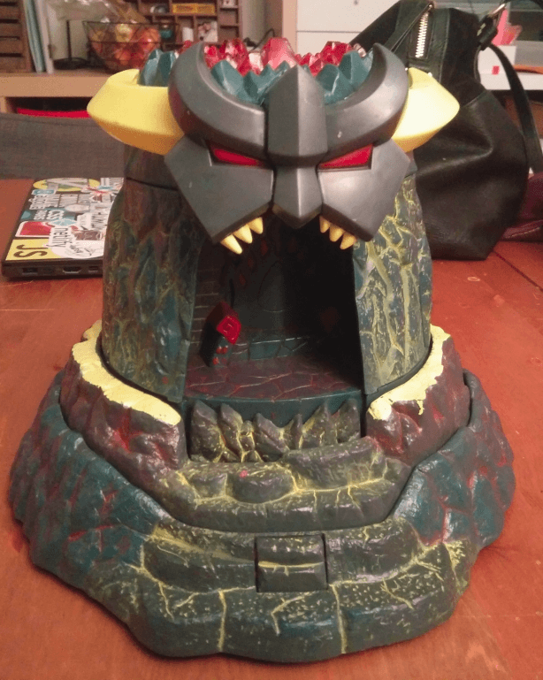
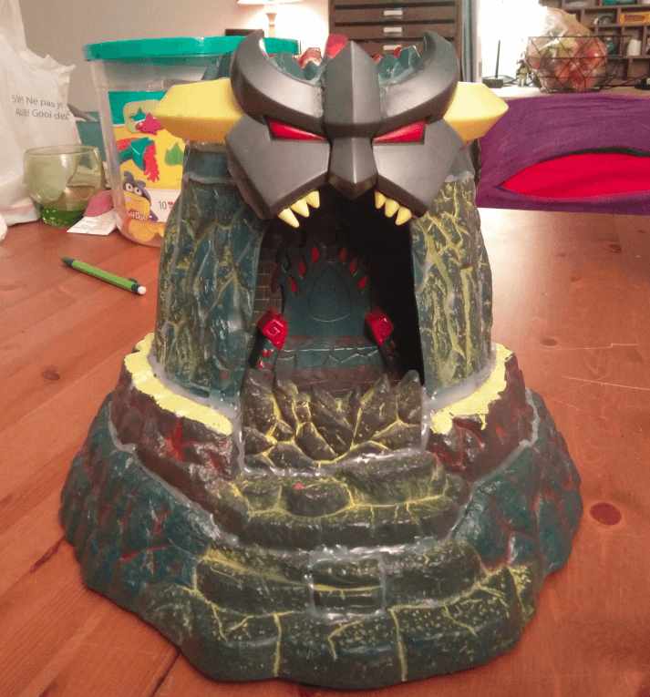
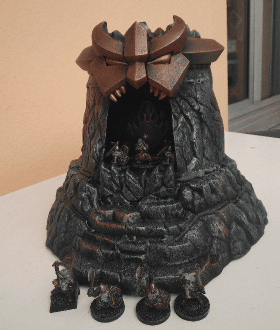
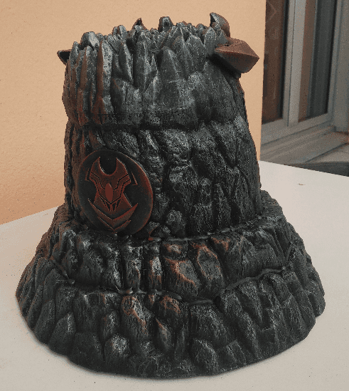
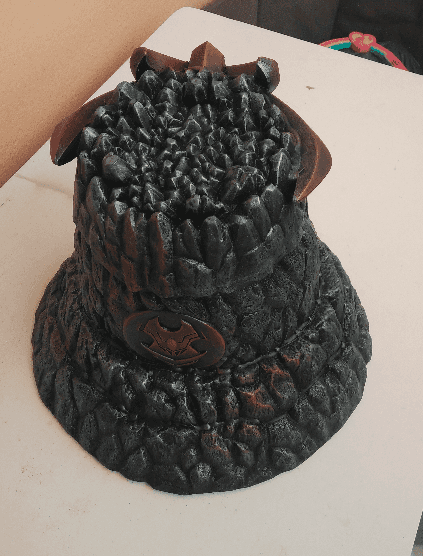

This is the original toy I bought. There is some mecanism inside that make it change height when you press it.

First step was to open it and deactivate the mechanism, then glue all the parts together so it would stay in the most elevated position.

Were I to repaint it again, I think I would try something more daring and attemps some lava effect in the cracks of the wall and a fire effect in the eyes of the metallic face. In its current state it looks too much like a stone structure while I could have it be a more prominent piece.