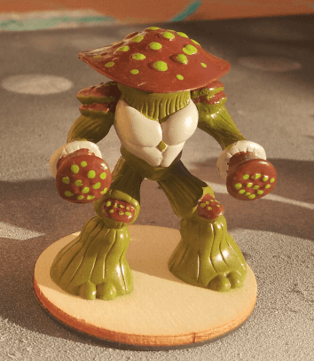

I had a bunch of mushroom Gormiti miniatures, so I decided to paint them. I like painting squads of 6-8 minis at the same time. I find it allows me to test new things and adjust my technique with several tries on various minis. Also, it's much faster to paint in batch of similar miniatures than one at a time.

Here is a close up of the main mini. I have five of them, and wanted to paint them in similar colorschemes, but with different top colors.

I only had of those, but I find they actually have a better pose.