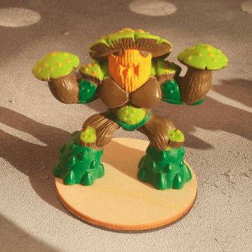

I had a bunch of mushroom Gormiti miniatures, so I decided to paint them. I like painting squads of 6-8 minis at the same time. I find it allows me to test new things and adjust my technique with several tries on various minis. Also, it's much faster to paint in batch of similar miniatures than one at a time.

Here is a close up of the main mini. I have five of them, and wanted to paint them in similar colorschemes, but with different top colors.

I only had of those, but I find they actually have a better pose.

Here they are after black priming and some color added. I started with a dry brush of a beige color, then added some green here and there. 

I started by adding green on the body (as you can see in the back), but it looked too much like a swim suit so for the others I only put green on the feet.

I then painted the mushroom tops with various colors (blue, red, purple) and had the dots painted yellow. Then I tried adding a green wash on it, but it turned them way too green, so I used the trusted Agrax Earthshade instead.

Top view for the various colors. The red works the best, but I wanted some different colors to differentiate them in battle.

