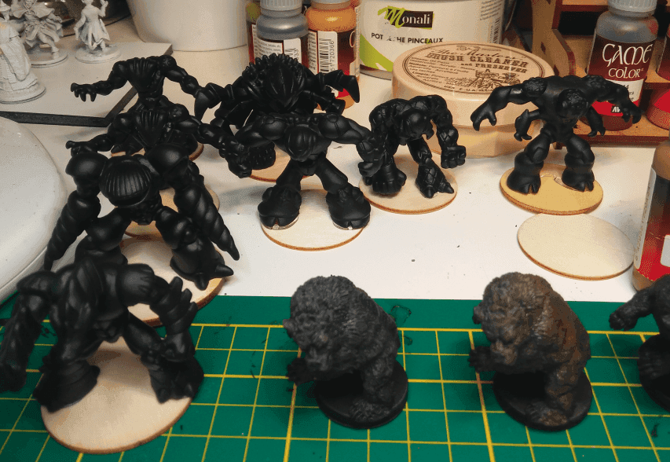
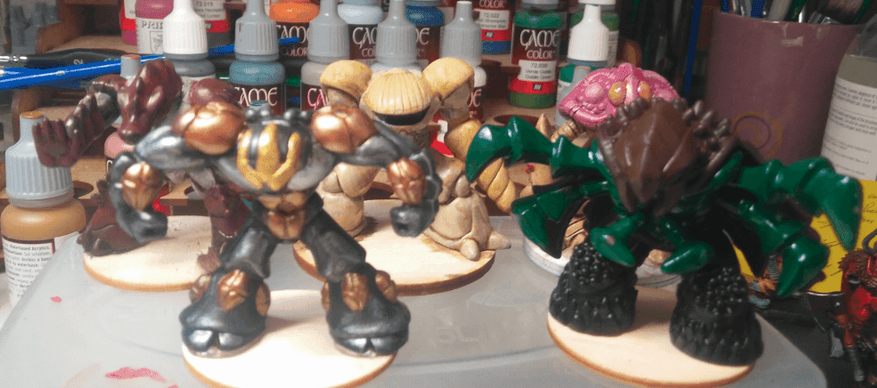

I bought a bag full of Gormiti plastic toys in a garage sale, so I could practice painting on them.

I like Gormiti toys because they are fairly large, so you don't need to be very precise in your painting. Also, they look like any generic monster so you can go pretty wild on the color scheme. And finally, they are very cheap, so I don't feel bad about trying stuff that don't work.

Here is how a few of them look now. The hard part of painting them once base coated is figure out what they are supposed to be: metal unit, big insect, weird demon, etc?

I went with a big metal unit for the first one and tried some OSL on it, but it didn't work out that much.

For the second I went all big insect. In the background you can see a shell elemental which I'm pretty proud of. This is a very original miniature and it turned out pretty great; I'll surely dump that on my players at some point.

The last one is some kind of draconic creature, but to be honest I wasn't really inspired by it, so it's pretty bland.