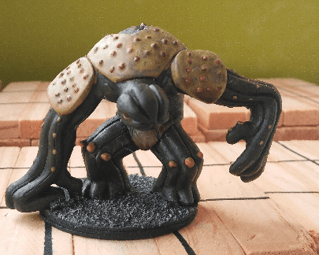

I turned a Gormiti miniature into what could pass as a Shambling Mound. I'm not totally happy with how it turned out, I think it's lacking something.

Below is the original miniature. I wasn't exactly sure what the shouldpads were supposed to be, but based on the arms and legs I was pretty sure it was some kind of tree creature.

I think I could have painted it as some kind of Cthulhuesque thing as well, but I already have a bunch of those from the Mansions of Madness boardgame, so I'd rather diversify my monsters.

The same one after priming and some green added.