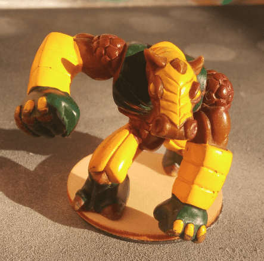
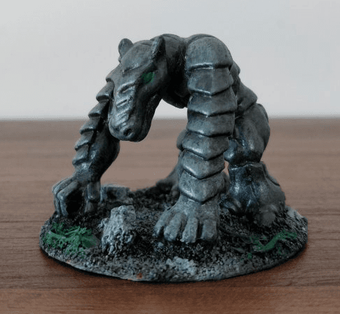

Here are a bunch of Gormiti miniatures I have started working on (glueing on a base, maybe even basecoat), but still haven't figured out what to do with them.

## The horse-faced thing

I don't know what this is, honestly. I saw someone [repainted a similar miniature into a gorgon](https://forum.reapermini.com/index.php?/topic/87673-some-more-gormiti-repaints/):

Maybe I could do that, but I don't find Gorgons very interesting monsters to fight so I don't really need such a mini.