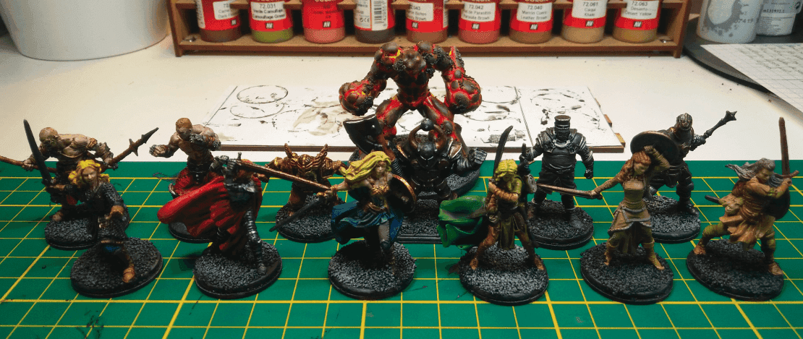
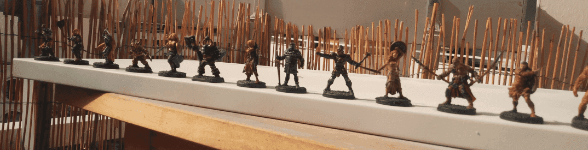

This is a group shot of what I was working on at that time. I picked up a few of the female miniatures from Zombicide Green Horde as well as some men.

The thing in the back is an attempt at making a lava elemental out of a Gormiti miniature. It didn't came out as well as I initially imagined.

Painting the armored Wolverine and Iron Man was fun. You only need two metallic colors and a Nuln Oil Wash to make them look good (enough). In retrospect, I should have added one other flashy color to some of their equipment pieces to make them pop more.

The Wonderwoman mini came out well, but I should have used another color for her dress, as it's too similar to the cloak color. Same goes for the woman in red. Both her clothes and cloak are red, and the kinda blend together. I think I tried some highlights on them, but as they felt too naive and broad I repainted on top. I should have kept them.

For the other women, I tried to stay with simple, neutral, colors and I think they came out ok and could work as generic fighters.

And a shot right before the varnishing.

