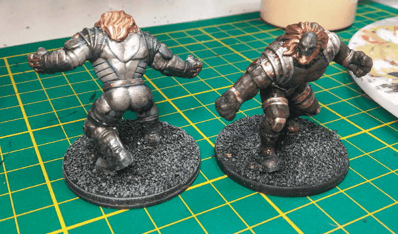

I made a couple of Iron Golems (or whatever other metallic construct) from a [cheap Heroclix miniature](https://www.trollandtoad.com/heroclix/the-flash-booster-set-singles/girder-014-the-flash-booster-set-dc-heroclix/1063068):

I had just bought a bunch of metallic paints and I wanted to try them out, so I painted them with various shades of silver and bronze.

I then applied Nuln Oil on it, which is the secret weapon to have metal look good. I also tried some Nihilakh Oxide on it, but it was my first try using it and I'm not sure it worked really well.

What I learned is:

- For metals, you don't need to apply the paint everywhere like you would do with another color. A rough drybrush works as well and might look ever better
- The Nuln Oil will tone down the colors, so the various shades of silver won't be that different. I would rather keep only one shade in my future minis, but use a light or dark one depending if I want the mini to look dark or not.

Overall, I'm satisfied with the result; I think they look great, they were cheap to do, and I learned about my paints.