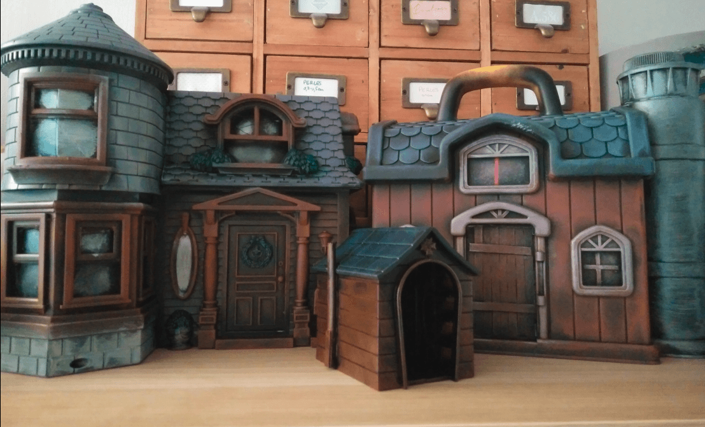

I bought some cheap toy house to see if I could make them look better with a cheap paint job.

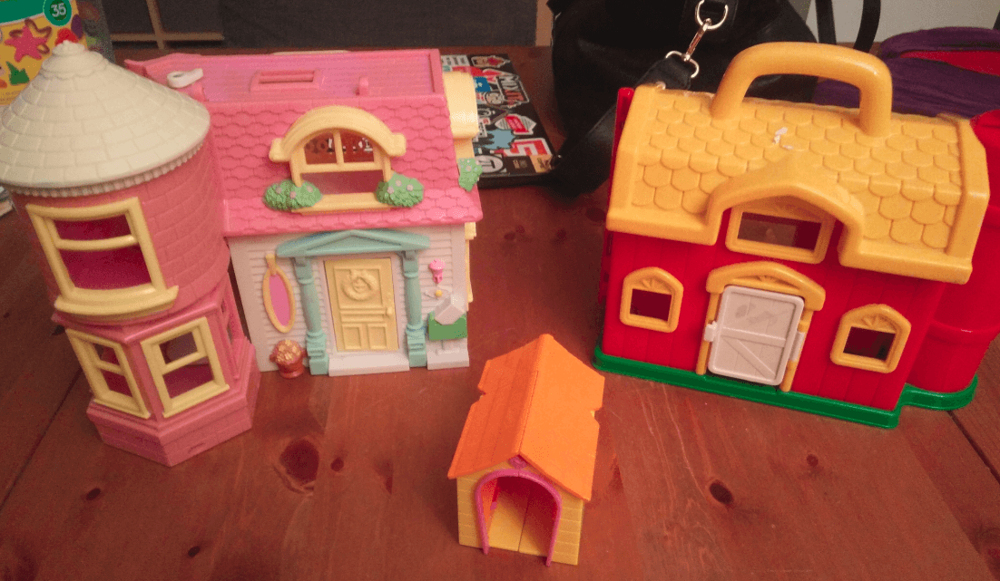

Above are the three houses when I bought them. They were about 1€ each (the small one was for free).

## Overview

I knew they would not be the right scale for my miniatures, but I wanted to see if I could make them look good with a quick paint job using cheap paints. I'd rather practice on cheap toys like this first.

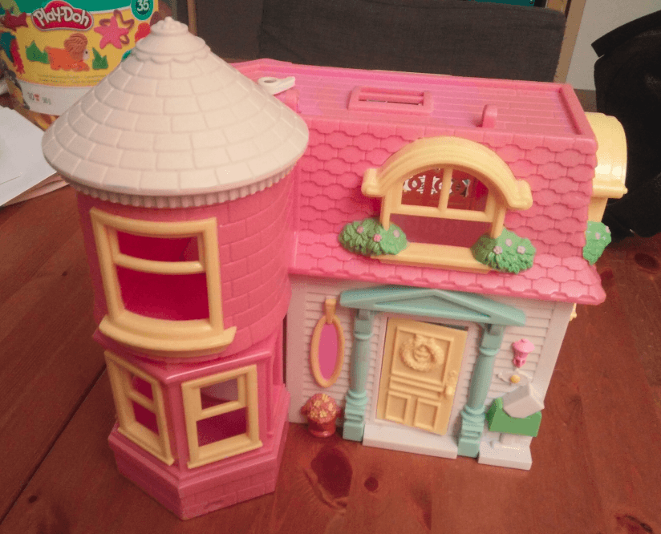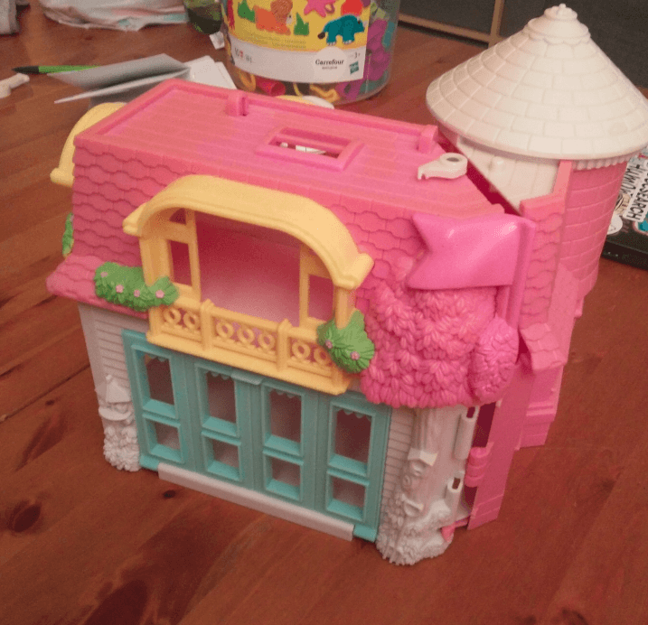

Closer look on the Hello Kitty one. Lots of details on the porch, but unfortunately not a the right scale.

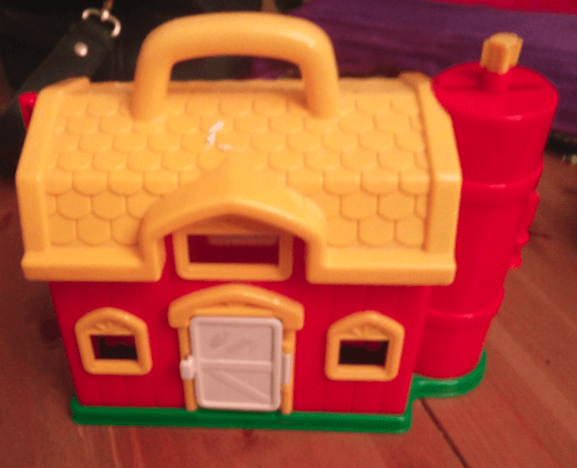

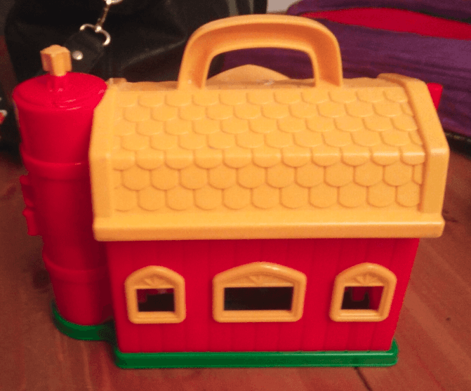

And the other one. Way less details here. 

## Closing windows

First thing to do is to close all the windows. I had a bunch of plastic poker money counter lying around so I glued them across all windows.

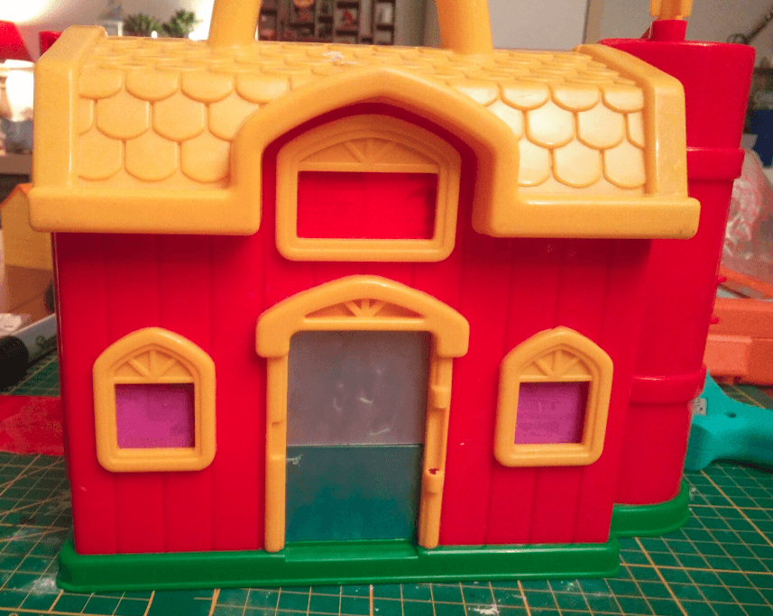

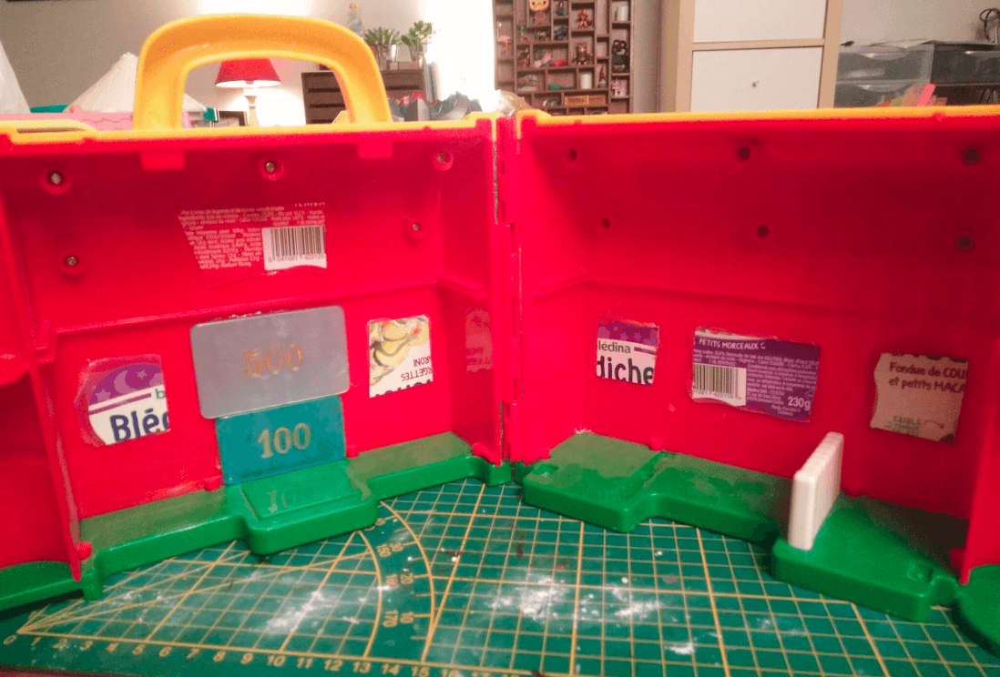

For smaller windows I used some plastic.

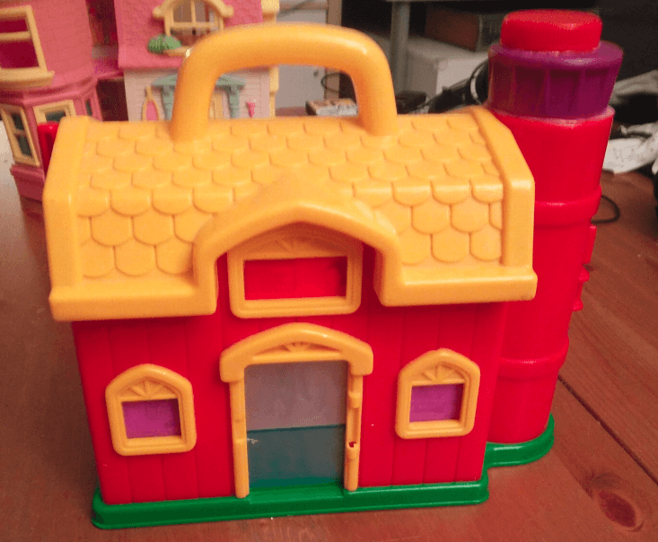

I also added two bottle caps on the tower on the right to hide the plastic bit jutting from it, and hoping to turn it into a chimney.

I should have spend more time adjusting it so it sits in the center, though. I should also have removed the handle but I didn't have the right tool to cut that, and it was just for practice anyway.

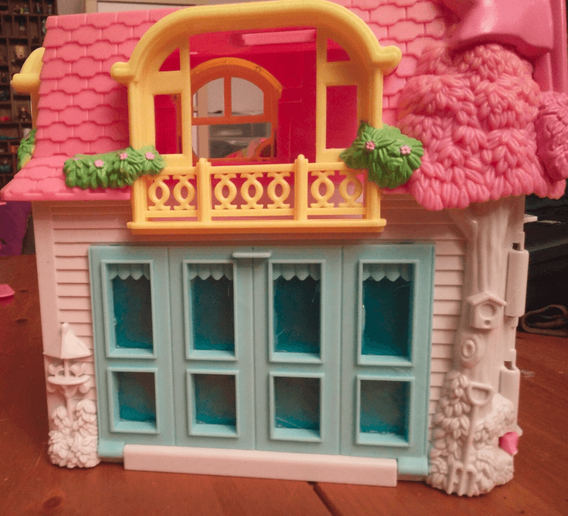

Same job went for the Hello Kitty one, blocking the windows.

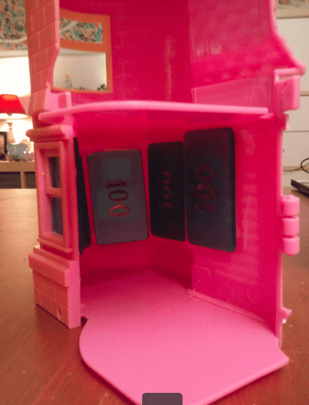

This was actually harder as the space is much tighter here. Also, gluing thick plastic like I did wasn't a good idea, I should have used thin plastic everywhere, it would have been easier to glue. Lesson learned.

## Priming

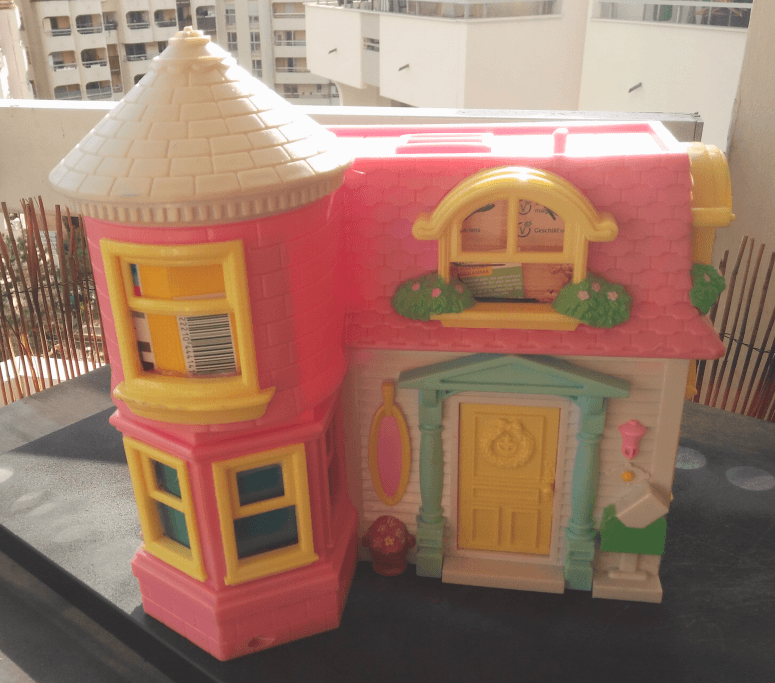

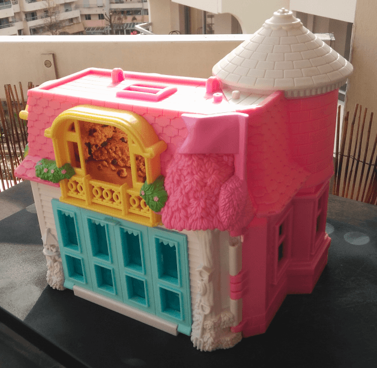

With all windows blocked, ready for priming on a beautiful sunny day.

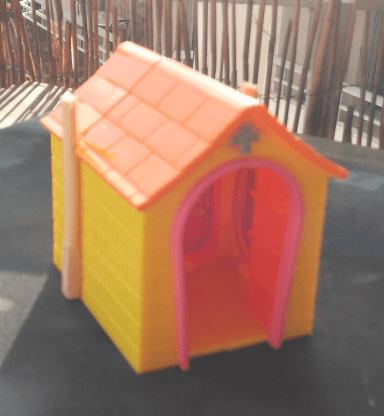

For the small one, I simply added a Sigmar sign on top, and some chopsticks on the side.

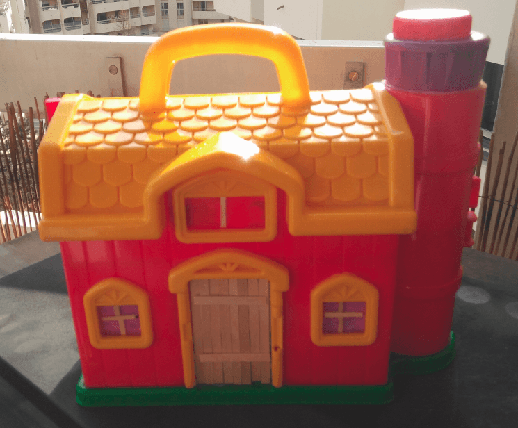

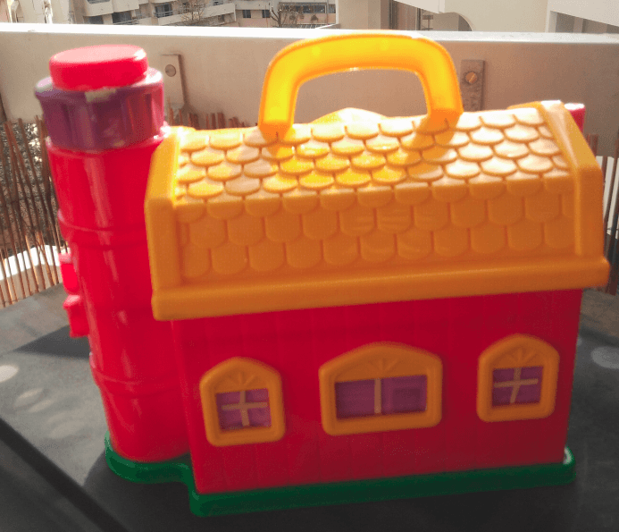

For this one, I also added some wooden coffee stirrer on the door to make it look like a wooden door.

## Painting

I don't have pictures of the painting process, but here is what I did. 

After priming black, I dry brushed a brown on the wooden walls with a very large make up brush. Because the brush was so large, I couldn't get into the angled recesses which gave the houses a dark look.

I did something similar with the roofs, metal unis and stone walls. Then, I picked a smaller brush and dry brushed green on any greenery.

And that's it.