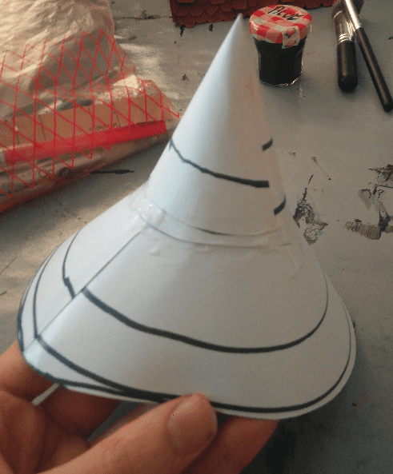

This is a crooked mage tower made from a cardboard Whiskey packaging. The build is definitely not my best, but it gave me the opportunity to practice.

It all started with the packaging of an Irish Whiskey bottle I found. I cut it in three parts at an angle and glued the parts back, but slightly rotating them, giving them this crooked look.

I didn't want to cover the whole tower in cardboard bricks as it would have been too time consuming and instead tried to give the illusion of stone by adding only a few bricks here and there. For that I used foam bubbles (used to protect stuff during shipping) and glued them with black paint and mod podge. Those foam bubbles react to water and shrink, so I had to not apply too much glue because even the tiny amount of water in the glue made them shrink.

Here is the tower covered with those strange stones.

I then covered the rest of the tower with filling paste using my fingers, then with some paper towel to dab it on the paste, giving this texture effect. I let it dry overnight, and then sanded it to remove the pointy bits.

I then started working on the roof by cutting some circles in a sheet of paper, and rolling them as cones, then stacking them together; once again, to give a crooked effect to the roof.

Once I found the right angle for them, I glued them in place.

Black first coat, grey drybrush and some additional brown and green drybrushes. I tried to do some variation on the otherwise uniform grey texture, but the final effect is not as realistic that what I had in mind.

Added a black wash to try to improve the overall look.

And finished it with some blue shingles and flocking. I tried to do some kind of vine with the flocking. I also realized that I totally forgot to add any doors or windows to the tower. It was a quick build, but maybe a bit too quick.

I did this build mostly to test and try techniques, without really having a plan in mind.