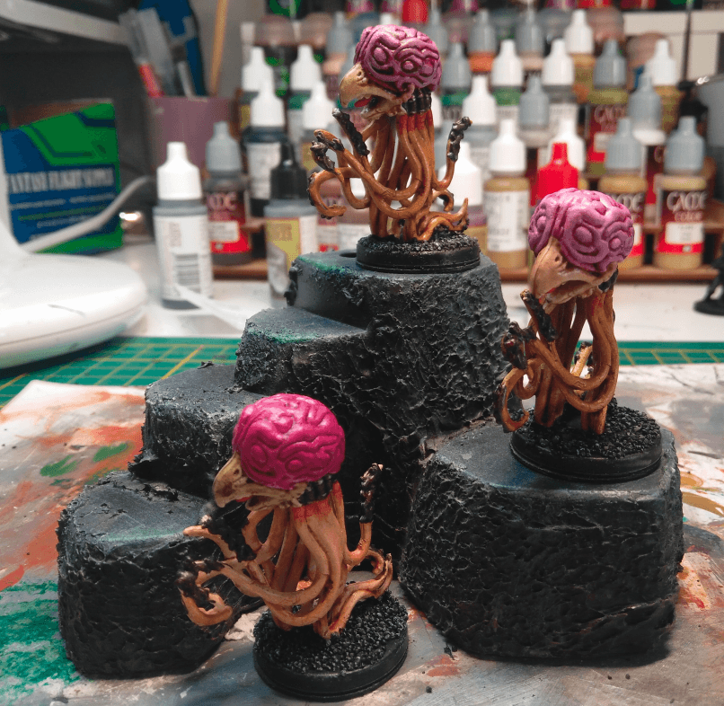
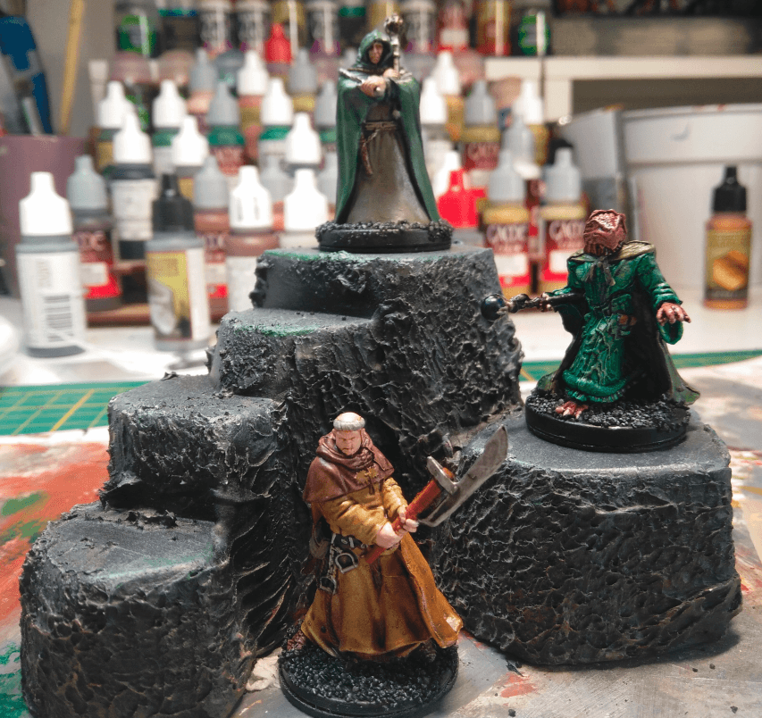
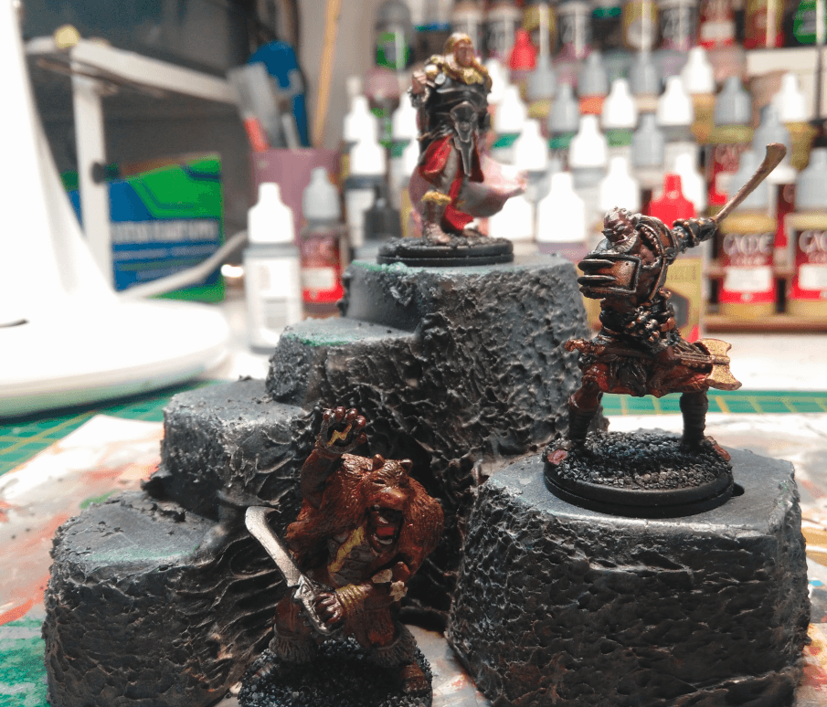
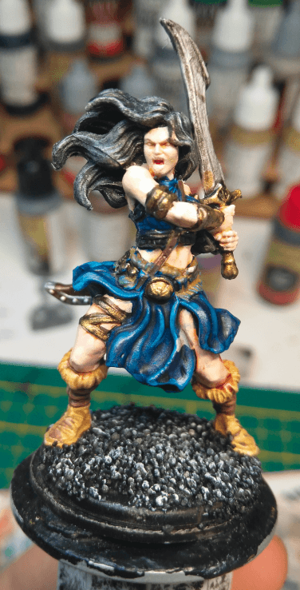
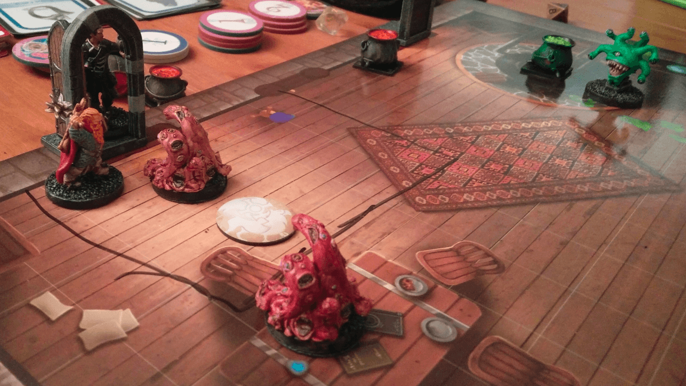

Here are some of the miniatures I painted this month, with no peculiar order.

## Grells

This are Grells from the Wrath of Ashardalon board game. I found a second hand box of that game where many tiles and rules were missing but all miniatures were there.

I tried three different brain texture, the pink with deep blood red in recess is the one that works the best (top) I'd say. I also tried some rust and ragged effect on the metal parts, but it's hard to see.

Overall the minis are a pain to paint as it's pretty hard to reach the inside of the tentacles below them.

## Priests

Some priest types. The Dragonkind was used in my campaign as an evil rival trying to bind a Void Dragon to his will. The PCs managed to defeat him and bound the Dragon to one of them instead. The top one as been used several times already as a generic cultist. Haven't used the bottom one yet.

## Warriors and Orcs

The human on the top is a failure. I'm not sure what I was trying to do with his cape but it ended up as a pinkish red. I still haven't mastered how to paint capes, I'll need more practice.

The two red orcs work pretty well though. I needed some strong orcs for a final encounter, so I decided to have them red instead of green. I also painted their skin with drybrush on black priming instead. It gives them a very detailed and strong look that I dig.

The bottom druid miniature was pretty complex to paint. The sculpt itself has a number of issues that you don't see until you start painting (like having no elbow for example) and some parts of the skin/cloth/fur mingle with no clear delimitation.

## Barbarian Kyra

Kyra, our Cleric didn't had a custom HeroForge mini, so I painted the mini she had been using since we started the campaign. Not a very accurate representation of our plate-mail cleric, but it works well.

I tried highlight for one of the first time and it turned out ok. The belt... not so much. Not sure what happened there nor if I fixed that later.

## Gibbering Mouthers and Spectator

Other miniatures from Wrath of Ashardalon. I was really happy to buy that game because they are great monsters to fight but it's pretty hard to find a miniature for them outside of the official D&D range.

I tried two color scheme here, one flesh and one more red. I think the fleshy one turned out better.

Dhax, the Spectator in the background was also very interesting to paint. Mostly because I could use the Deep Green from Vallejo Model Color line which is like the best green I ever saw. Dhax also turned into an interesting opponent NPC, trying to cut a deal with the PCs. And his ability to reflect spells back to the caster proved really interesting when Lem tried to charm him.