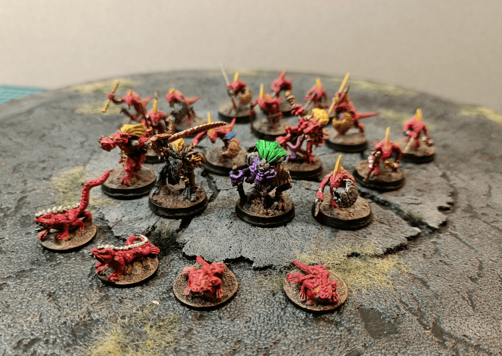
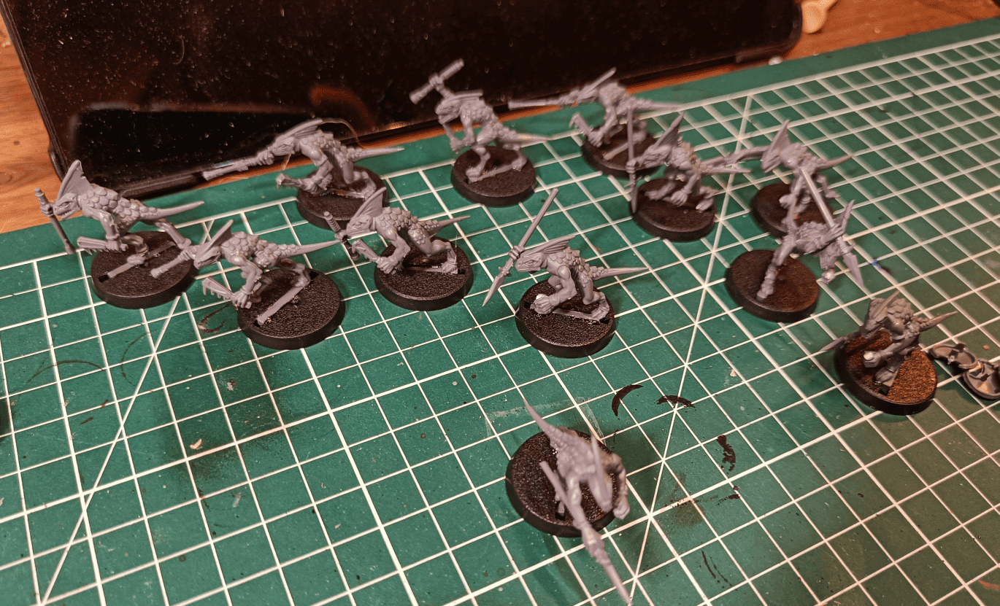
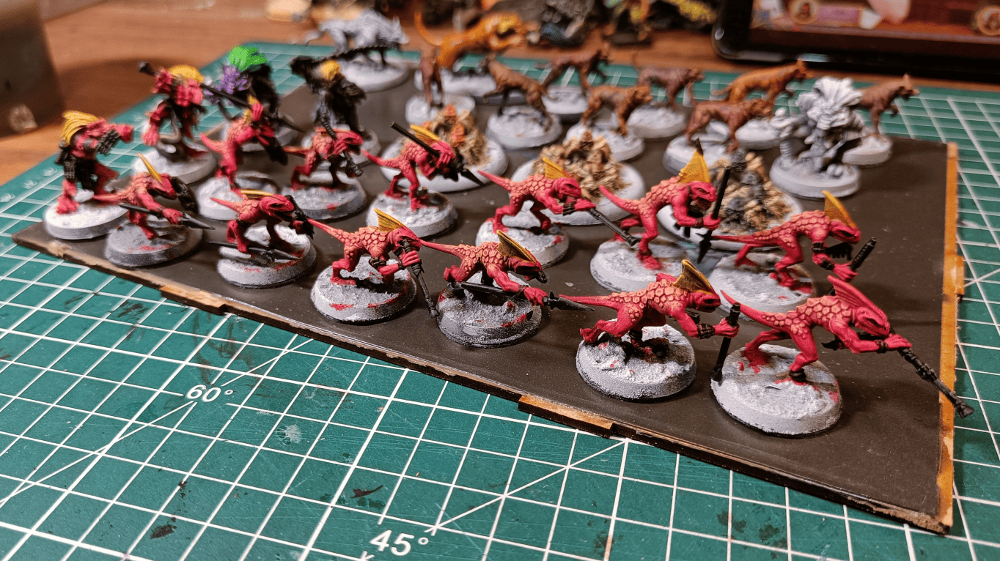
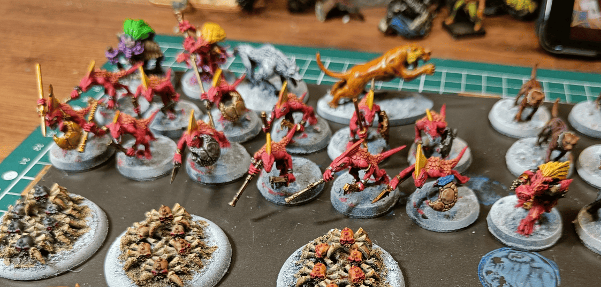
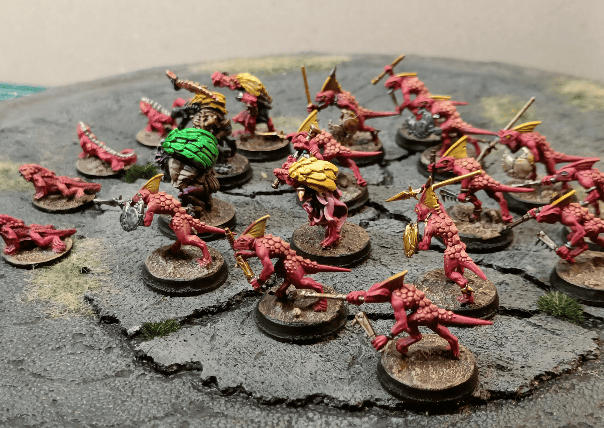
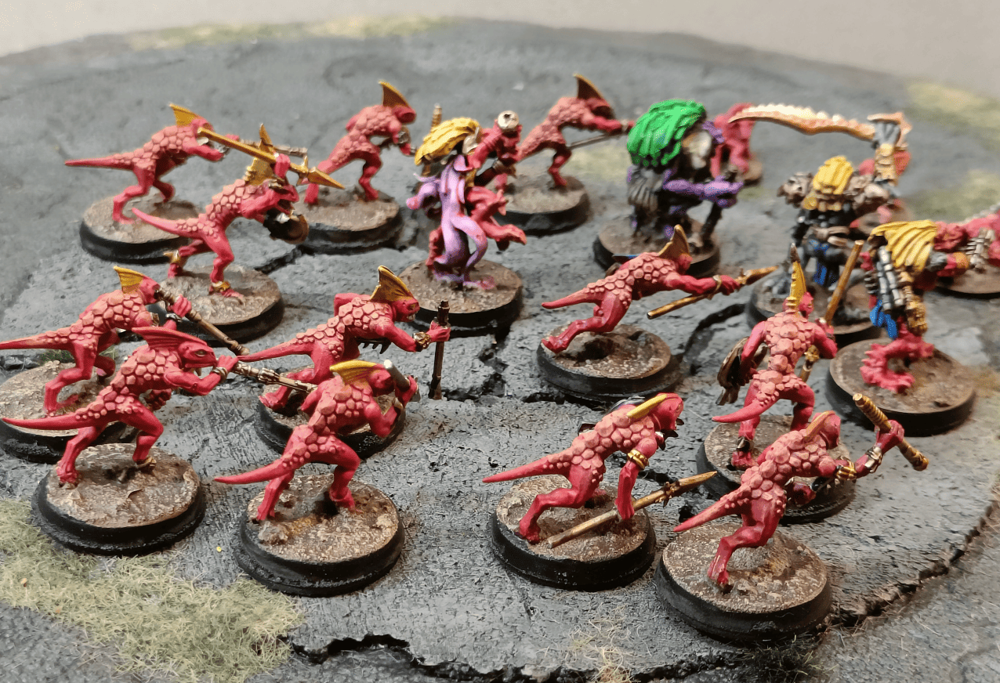

Here's a group of kobolds I painted for when we were playing Kingmaker. At one point, right at the beginning, there's the possibility of going into two different dungeons. One is a kobold dungeon and the other is more of a gremlin type dungeon. 

I didn't really have any kobold miniatures. The one I had was the basic Reaper Bones one, but they're really tiny. So what I did was use skink miniatures from Games Workshop. I assembled enough of them and painted them red to make myself a unit of kobolds. 

For the special characters, the shamans and the captains of the kobold unit, I used Heroclix miniatures that I painted either in the same types of colors, or with entirely different colors to make them stand out from the others. 

And as a little pet, I used lizards from an old sprue, an old Games Workshop blister of lizardmen from the 90s, that I still had from when I was doing a lizardmen army.

I started by applying an almost complete coat of red speedpaint (I think it's poppy red) and then I applied a slightly orange dry brush on the scales on top, very light. It doesn't matter if it overflows a little bit. I painted the crest in yellow. Then I covered all the metallic parts in black to add metallic paint on top later.

For the weapons, I tried to vary the different types of metals a little bit, mostly because I wanted to test what I could do with speedpaints. My technique was to start with a first layer of silver and then add different speedpaint colors on top to tint that silver with different things. With certain colors, it makes bronze, with others, it makes different types of metal. I found that it worked quite well for them. 

I don't remember exactly which color corresponded to which version, but I tried to mark it on my paint pots. I wrote a small M with a marker to remind myself what they do for metal that looks good so I can try it again later.

Obviously, as is often the case in campaigns, my players never actually made it to this dungeon. They were heading that way, but along the way they got jumped by a kobold patrol that really messed them up and scared them pretty badly. So they decided to put off exploring the dungeon and come back later. But then the adventure took them in completely different directions, and they just never ended up going back there.