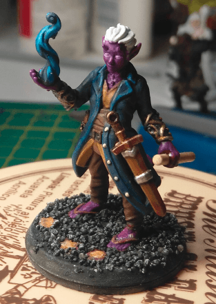
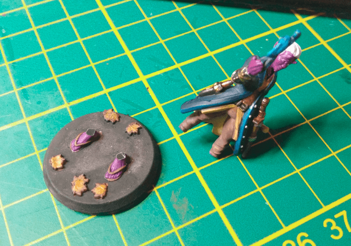

This is Lem, the Warlock/Bard Tieffelin (but usually goes disguised as a gnome child).

This is a HeroForge miniature and a joy to paint. It's detailed enough to you can have some fun, but it's proportioned in such a way that you also have a lot of room to test things.

I'm happy with the results. I used my tried and true techniques here, but also tried something special with the flame. It turned out ok, even if I think I should have made it brighter somehow. I also tried edge highlight on the coat. It doesn't show much, but at least it's not horrible.

I had a little accident while painting it. The paint I used for the base stuck to my paiting handle during the night, and the next day when I tried to remove it, the base stay stucked and the miniature broke at the ankle. A bit of super-glue later and it's fixed.

