In my game, Lord Deverin is an important NPC that has been wrongly accused and sent to jail. The jail itself is actually an underground cavern filled with horrible creatures where a cage is lowered. So, I need to build such a cage.

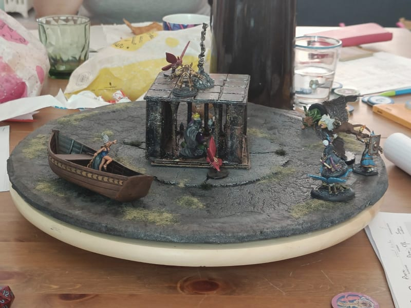

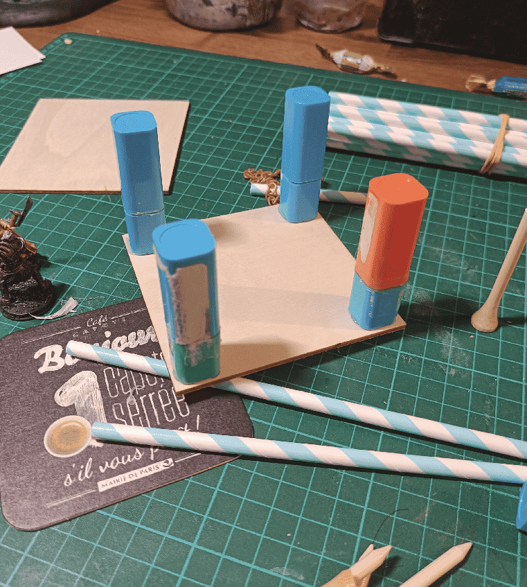

The base structure is made with a 10cm x 10cm wood plank (I ordered them in bulk at some point), with plastic tubes as corner pillars.

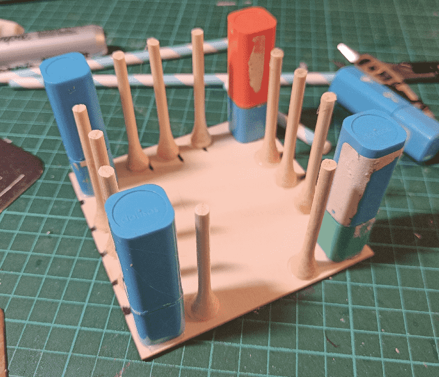

The bars are made of out bamboo golf tees with their pointy head cut of. I kept the heads and glued them on the floor, between the bars.

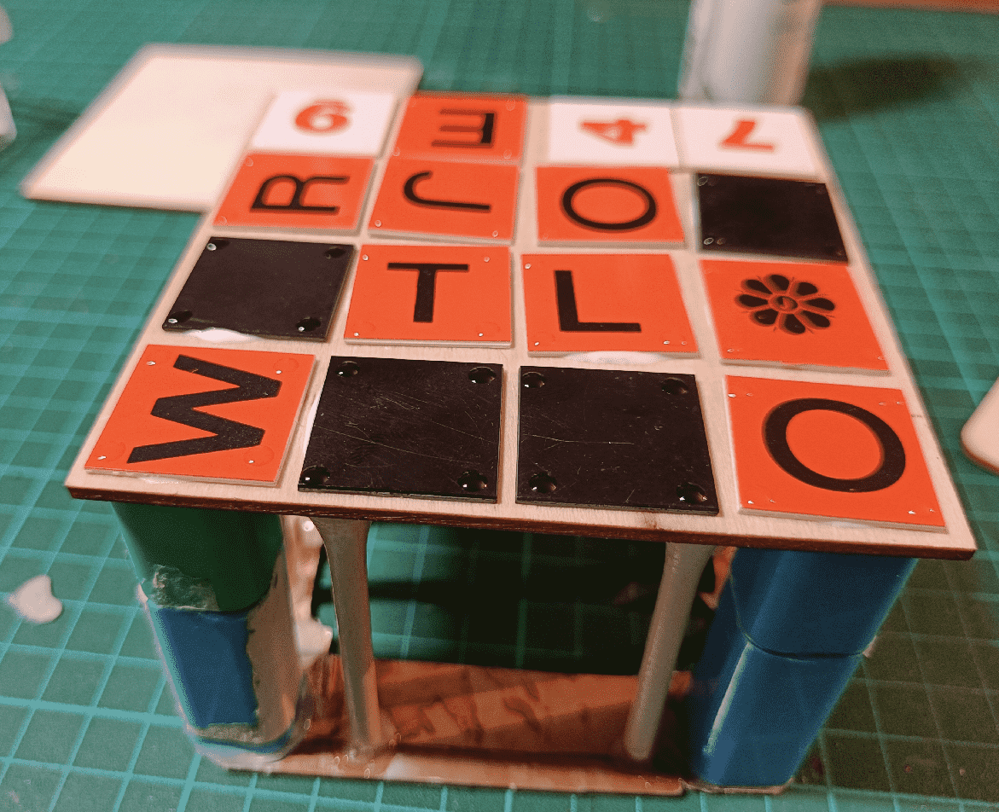

The top is another such wood plank, covered with plastic squares. I tried to put a dip of glue in each square corner to act as some kind of rivet, but the glue didn't keep its shape and formed more like a blob.

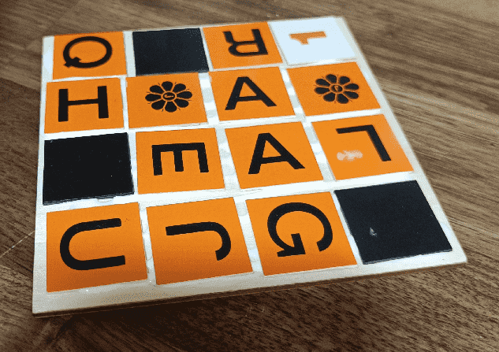

The cage floor is made out of the same materials, but I kept them separate to be able to open the cage to put miniatures inside.

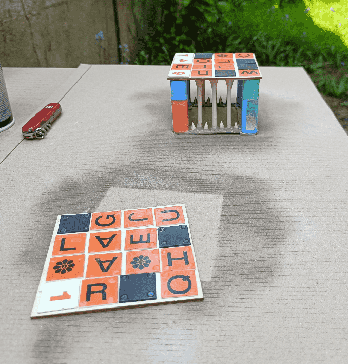

I then used a textured spray (used for polished glass) to add some texture to it. Not sure it worked well or not.

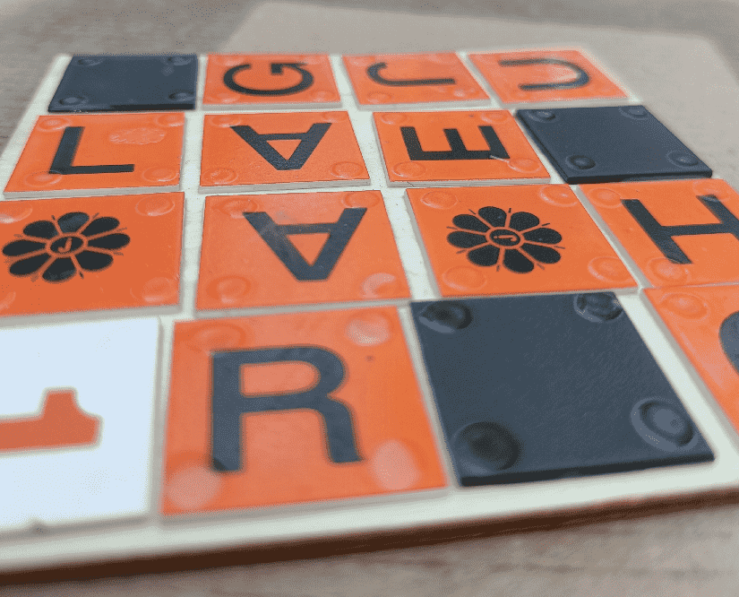

This added a matted texture to it.

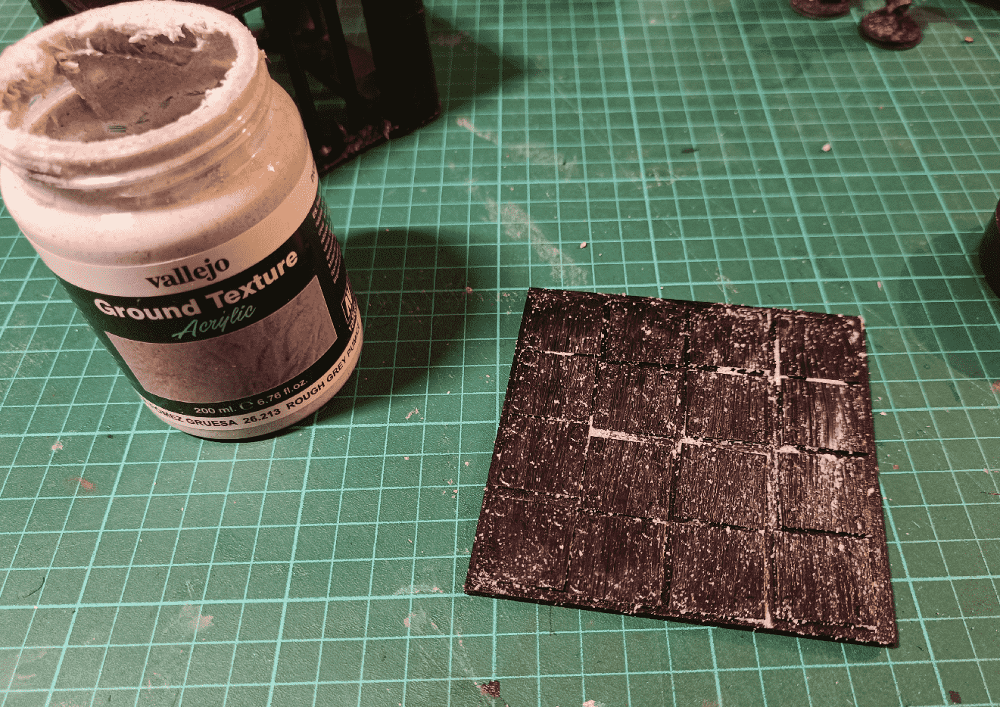

I didn't find the texture grain big enough, so I added some Vallejo Ground Texture to it, to create small rocks, like old rust.

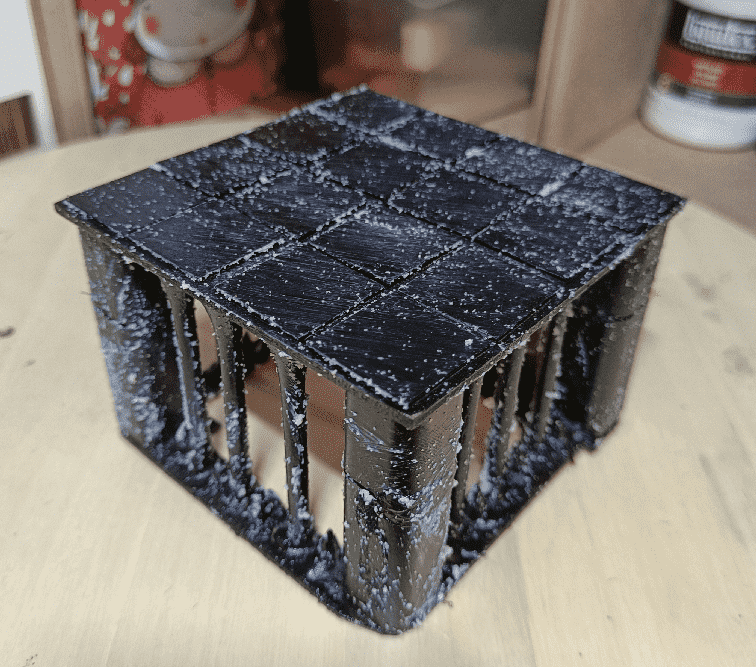

And applied the same treatment to the whole piece. I should have added this texture before the black priming though.

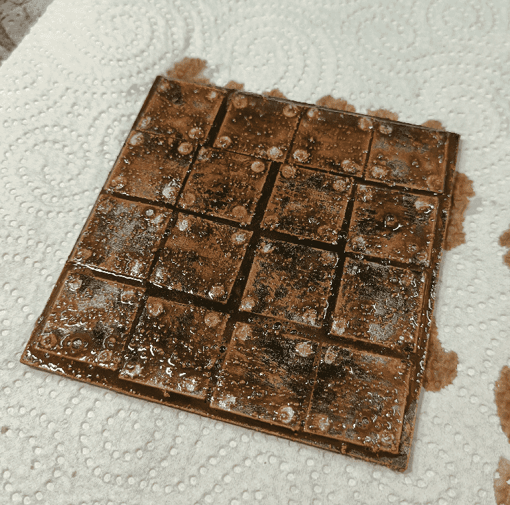

Started painting, with a silver overbrush, then a brown coarse drybrush and a sepia wash.

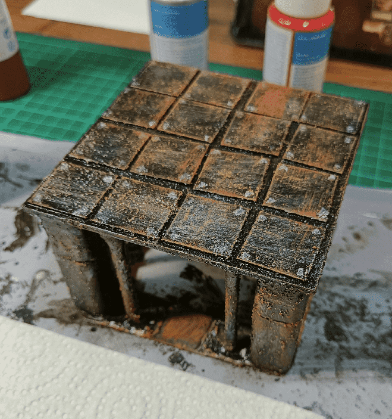

I added some more yellowish stamps, and painted the rivets in silver.

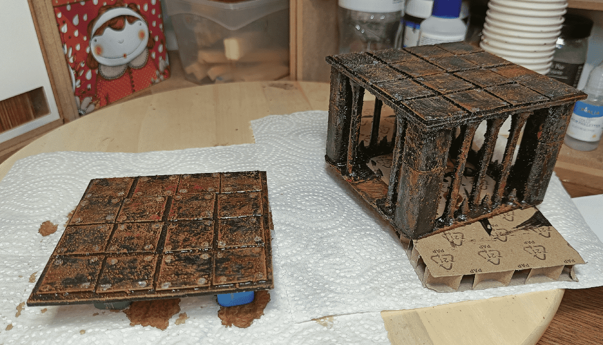

And here the final result, drying. It does the job, it conveys the old rusty look I was looking for but is still very rough. I need to practice on my rust effects.

## The chain

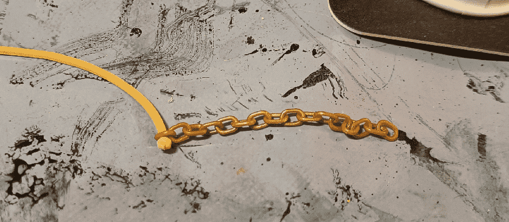

For the top chain, I found a plastic chain in an old toy. I added a bit of rope at the end and dipped it in glue, hoping it would solidify it in place. Didn't work.

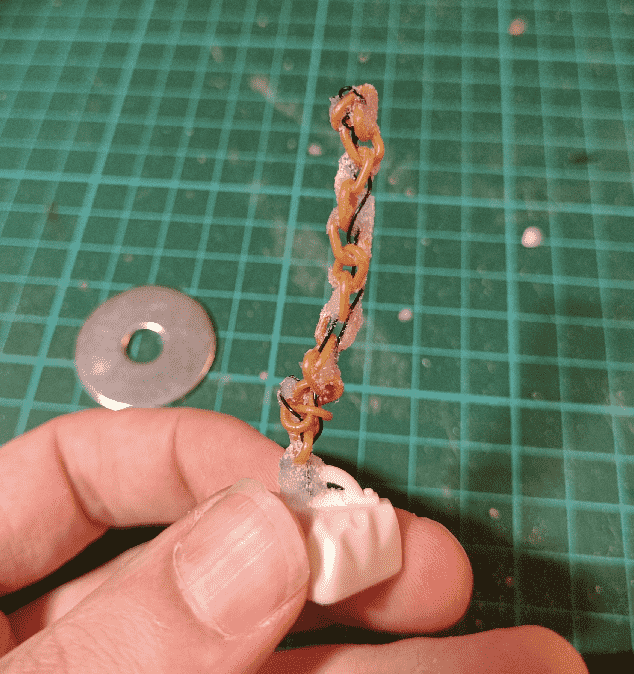

So I wrapped a small metal wire in it, covered it in the same texture I used on the cage, and attached it to a fake plastic rock. I glued it all on a washer for weight.

