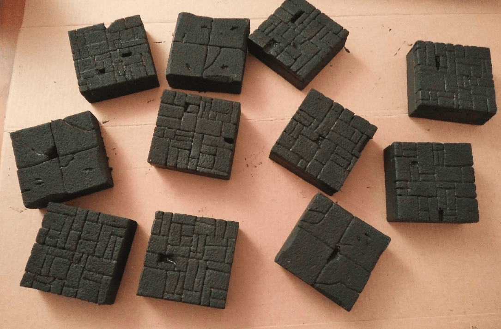
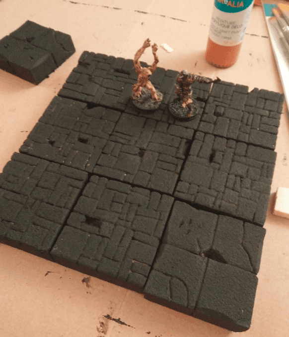
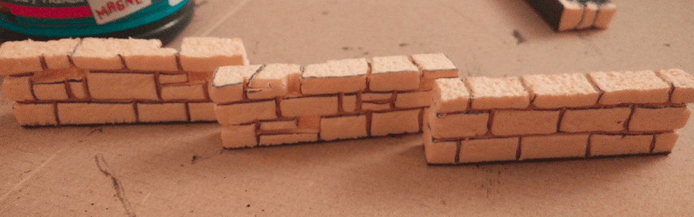

I had a pot of magnetic paint and decided to give it a try on some tiles.

The paint does not really contain any magnet, but it is filled with iron particles, which iron adheres to. It is also black, which make for a great priming/basecoat. Because it's so filled with iron, it also has some weight to it, which make the tiles heavier. It also dries very quickly.

From this initial first test, it seems to be a better alternative to the mod podge/black ink coat suggested by Black Magic Craft.

Even once dried, details are still visible.

I made some walls out of foam, and added magnetic adhesive band below them to see how it would work with the tiles. Turned out it adheres pretty well. At least well enough to prevent the walls from falling when moving the tiles around. Not strong enough to hold the tile when moving the walls, though.