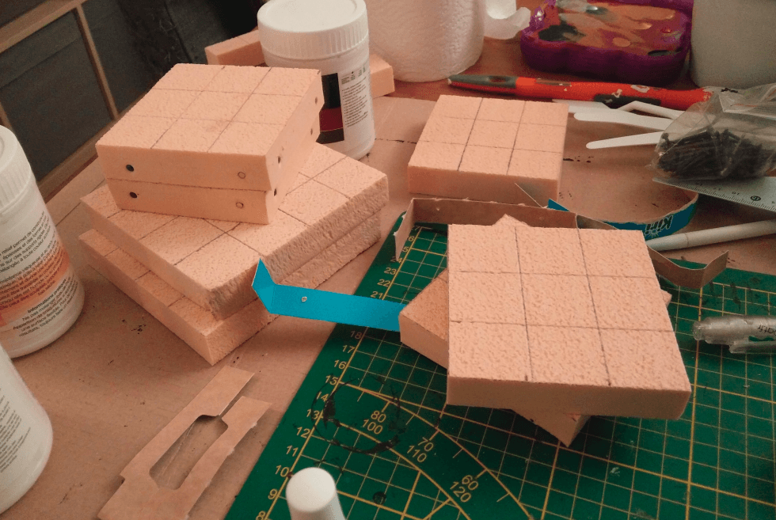
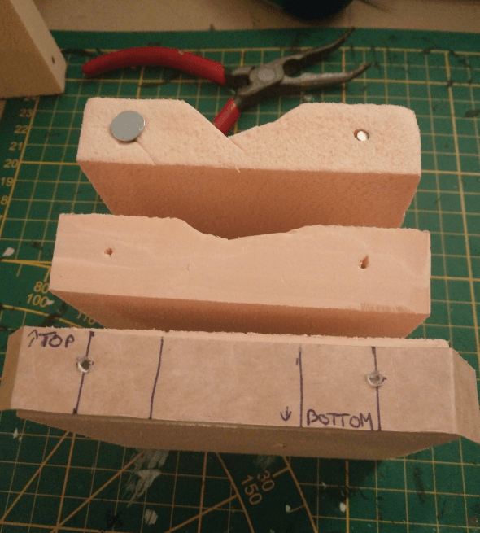
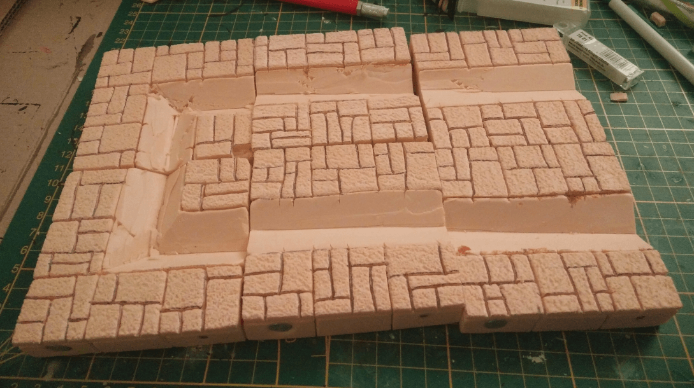
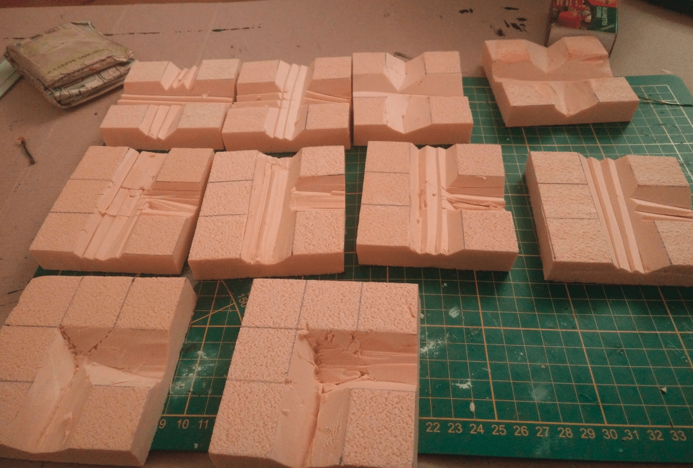
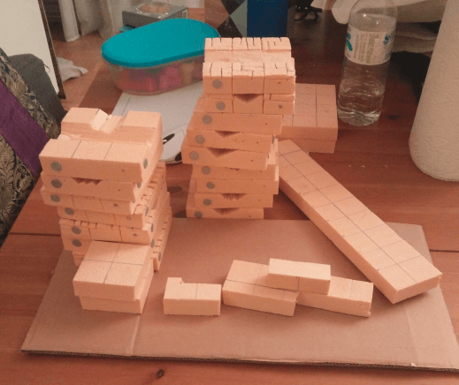
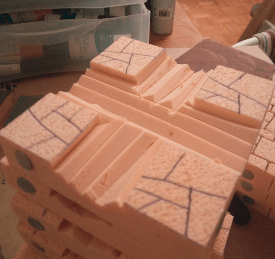

I'm a sucker for magnetic terrain. I'd love my dungeon tiles to automatically *click* to each other when they come near. I haven't found a reliable way to do that yet, but I decided to take the opportunity of crafting sewers tiles to give it another go.

I went with 3x3 tiles, so I could carve the sewer in the middle.

I drilled small holes with and x-acto knife halfway in the width and height of the right and left squares. To make sure I always drilled at the same spot I made a quick cardboard helper. I then added a small neodymium magnet in the right hole and a screw with a large head in the left hole.

By putting the screw always on the left and the magnet always on the right I'm sure that no matter how I organize my tiles, I'll always have a magnet in front of a screw. I could have put magnets everywhere but then I would have had to worry about polarity (to make sure they were attracting, not repulsing each other).

I carved the inside with my utility knife, and carved some stone pattern on the sides.

I tried various ways of carving the inner sewer part. I tried cutting small lines of foam, or larger ones. In the end I went with cutting 4 small lines as it was very fast and I plan to fill the sewer line with modeling paste anyway.

I was out of magnets and my order didn't arrive yet, so I could only add the screws.

I decided to change the flag stone pattern by not using only straight lines and I'm glad I did because I like the way this turned out.