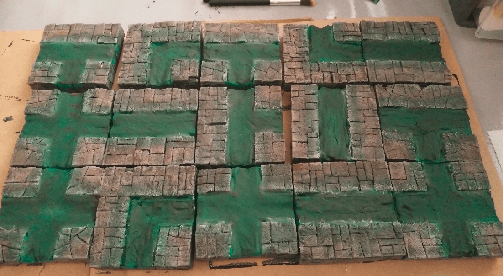

I'm a sucker for magnetic terrain. I'd love my dungeon tiles to automatically *click* to each other when they come near. I haven't found a reliable way to do that yet, but I decided to take the opportunity of crafting sewers tiles to give it another go.

I went with 3x3 tiles, so I could carve the sewer in the middle.

I drilled small holes with an knife halfway in the width and height of the right and left squares. To make sure I always drilled at the same spot I made a quick cardboard helper. I then added a small neodymium magnet in the right hole and a screw with a large head in the left one.

By putting the screw always on the left and the magnet always on the right I'm sure that no matter how I organize my tiles, I'll always have a magnet in front of a screw. I could have put magnets everywhere but then I would have had to worry about polarity (to make sure they were attracting, not repulsing each other).

I tried various ways of carving the inner sewer part. I tried cutting small lines of foam, or larger ones. In the end I went with cutting 4 small lines as it was very fast and I plan to fill the sewer line with modeling paste anyway.

I added some stone pattern on the sidewalks with the usual pen and utility knife technique.

I decided to change the flag stone pattern on some tiles by not using only straight lines and I'm glad I did because I like the way this turned out.

I was out of magnets and my order didn't arrive yet, so I could only add the screws and store those babies on the shelf for a few weeks.

Once my order of magnets arrived, I added them in the holes. I then covered the sides with black-tainted wood glue (two layers) to protect them and keep the magnets in place. Without this protection I was afraid they would get out of the holes I drilled and stay connected to the nails on the other tiles.

Then it was time to fill the canals with filling paste. The paste cracked when drying in a few spots, though.

This is the complete set with painted sidewalks. I used magnetic paint here, as an experiment. It protects the foam from scratches and is already black so this has pretty much the same effect as the usual black wood glue; and I had a can laying around. It is also quite heavy, so this was giving some weight to the tiles, which is always a good thing.

Gray drybrush. I might have overdone this one layer though.

Second, slightly lighter, layer. I really like the irregular stone pattern better than the regular one. It's also much faster to draw.

First coat of green paint, taking care to also paint the edges, so it really looks like there is some depth when looking at them from the side.

The cracks are really showing here. I should have fixed it by applying a second layer of paste before painting.

The overall effect looks great though. Some of my tiles are not perfectly square, and even if they still click together correctly two at a time, when building a whole board like here you can see that they start to not align properly. Magnetic terrain is tricky, I think it only really make sense when you can cut perfect shapes in a consistent way; and as I don't own one of those fancy Proxon wire cutter tables, I guess I won't be able to achieve that level of consistency.

To fix the cracking issues, I added another layer of matte gel on the canals. This had the double benefit of masking the cracks, and adding some undulating effect that might look a bit like ripple (with a great dose of imagination).

I then added a dark green wash on the canals and a bit on the sidewalk. The result is... messy. I was a bit disapointed at this stage, thinking I had ruined everything.

So I applied another dark red was on the inner parts of the sidewalks, and finished with another light drybrush of light gray on top to blend the two.

And here they are, some sewer tiles for when my players want to chase a mutated goblin that escaped from a carnival. All great stories start like this.

Some more shots of the tiles with some minis for scale:

