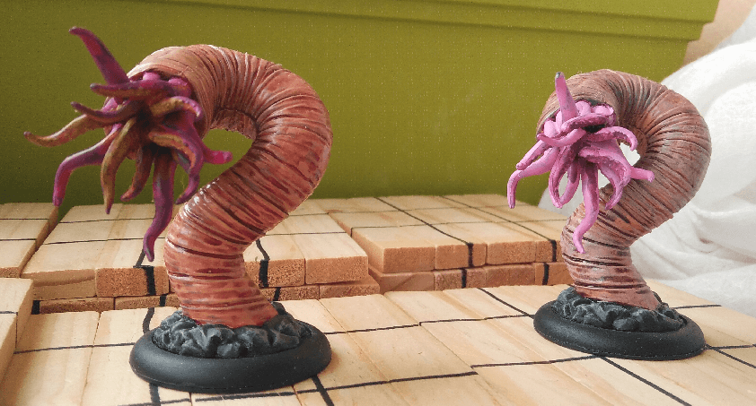

I painted two Chtonians from the Mansions of Madness boardgame. I put them on a regular round base so I can use them in other games as well.

I thought they would be pretty straightforward models to paint but it was way less easy that I anticipated. First, the worm body is full of recesses so I had to be careful for the wash to not pool in weird places. Painting the inside of the tentacles also proved harder than anticipated.

I also realize, seeing the pictures, that I really should have removed the mold lines here.