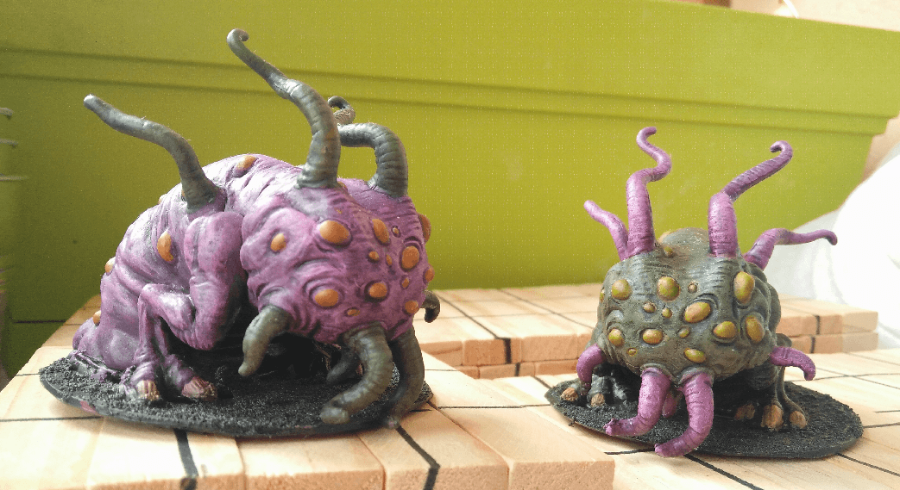
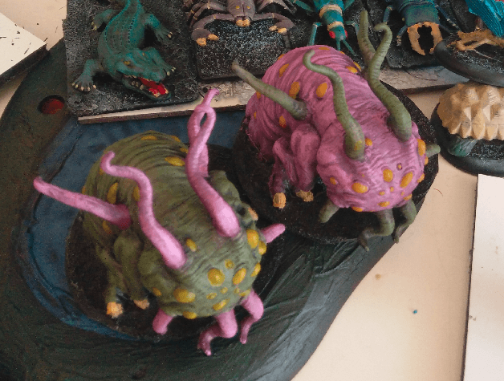

Those mult-eyed beauties are two Shoggoths, from the Mansion of Madness game. I put them on simpler bases (made out of used Häagen-Dasz ice cream pots), so I can use them in other games.

Those were pretty simple to paint and very enjoyable as well. I decided to pick a very weird color scheme of green, pink and yellow. They are creatures of the great beyond after all, they could be any color. I mirrored the color on the two miniatures.

They are mostly painted with dry brushing. The body received two coats, a first very rough of a darker tone, and lighter brushing with a lighter tone later. The tentacles received the same treatment: dark rough first, and lighter one on the tips later. Eyes are painted yellow with a wash matching the body color (in retrospect, the green wash works better than the red one here).

Here they are, two beauties in an aerial view on my desktop. This is right before the wash.