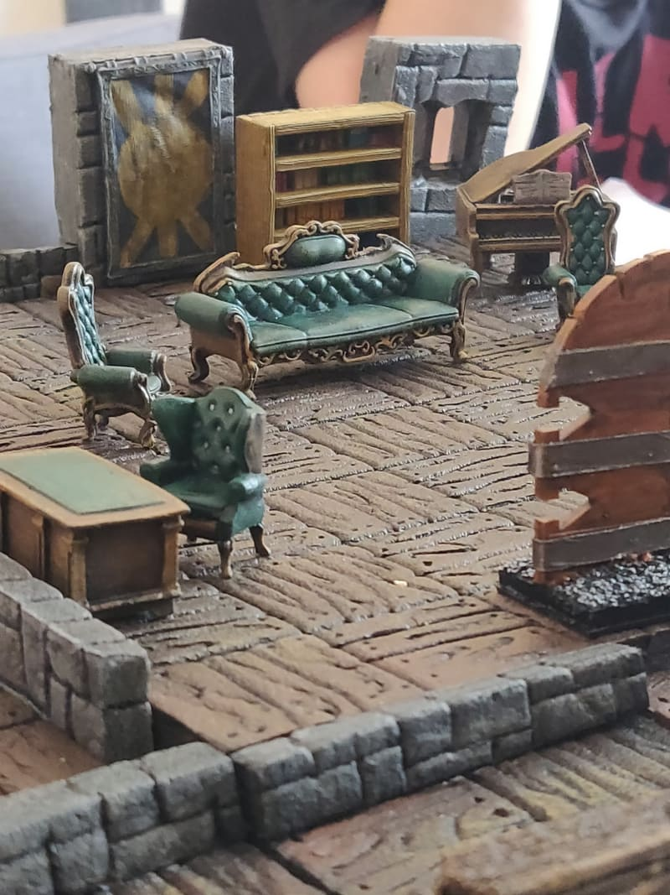
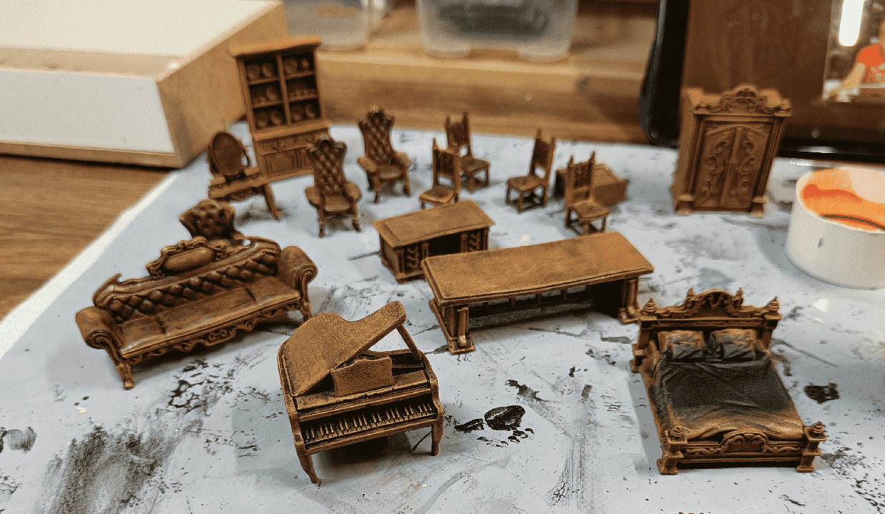
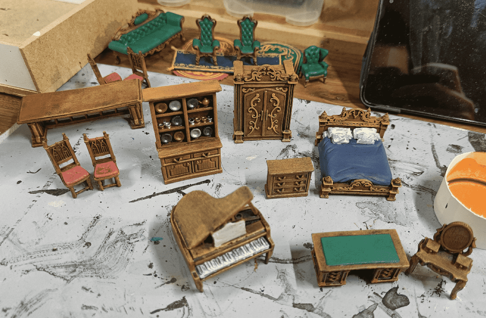
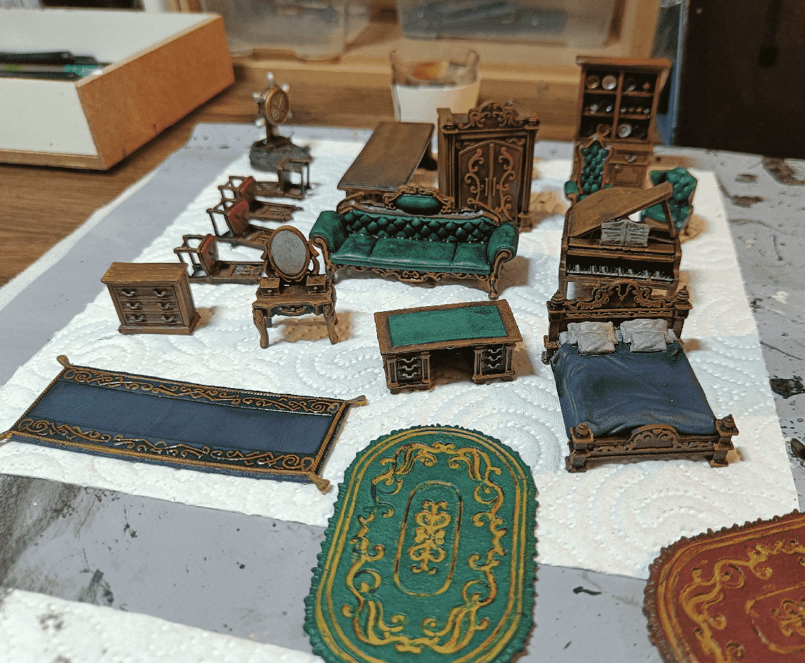
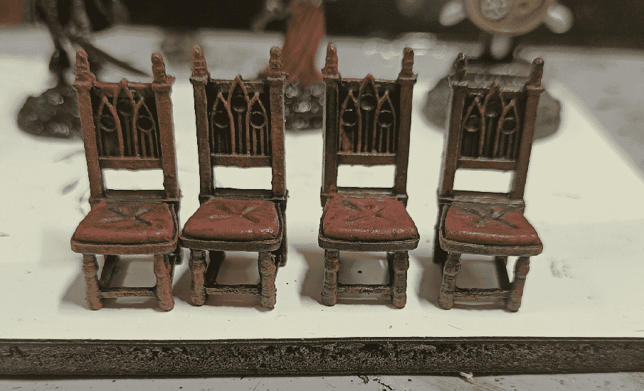
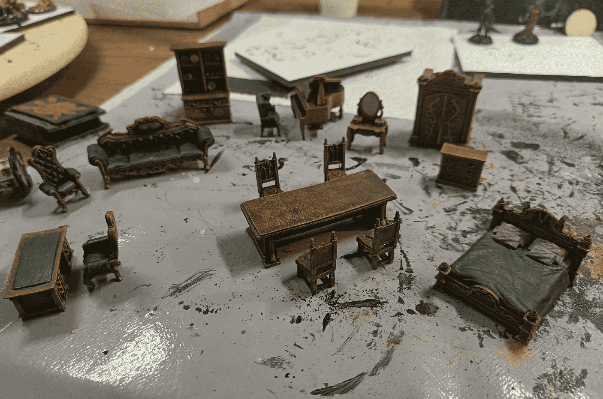

The mansion needed some furniture, to make it look like all posh and classy. Thankfully, I had a few already in stock, from a previous Mantic Crate Kickstarter. I did back their first project, which got me a lot of dark, grimmy and broken dungeon furniture; but their second project was more on the "haunted mansion" side, with much more high classy stuff.

I started with a black priming. I almost always start with black priming now; I find that it makes the job easier in creating shadows with a quick dry brush. It sure works well for terrain and furniture, and I always often do it with miniatures as well now.

Well, after the initial priming, I did a first dry brush of dark brown. I keep always the exact same pattern for anything wooden; it makes my final set looks more homogeneous.

I the picked individual colors. I tried to keep it simple and easy. They are furnitures, and should be used mostly as room dressing, so I need something simple. For example I only painted the chair cushions, or the bed sheets. For the cupboard and wardrobes, I painted the ornaments and that's it.

I the applied a wash on it, which gave them a darker look.

I **think** I added a last drybrush on the back of the chairs after the wash, but I'm not even sure.

And the final set, ready to be used in play.

