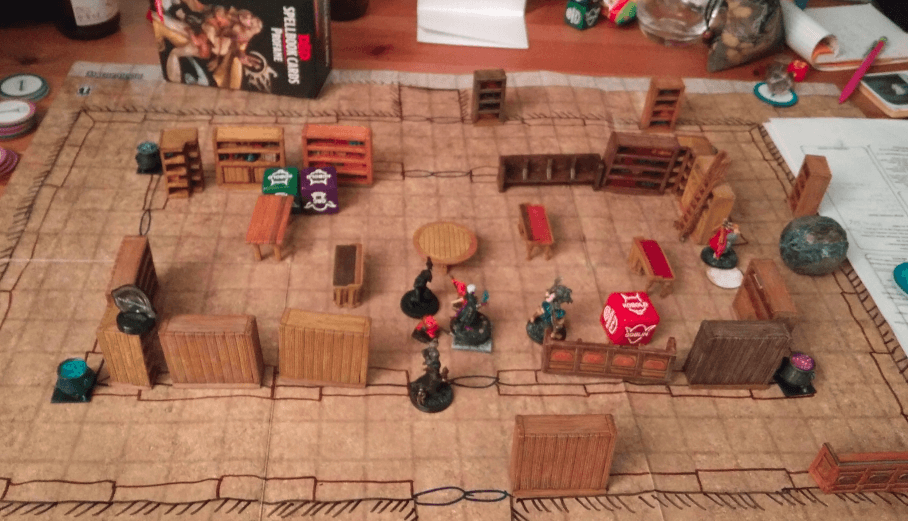
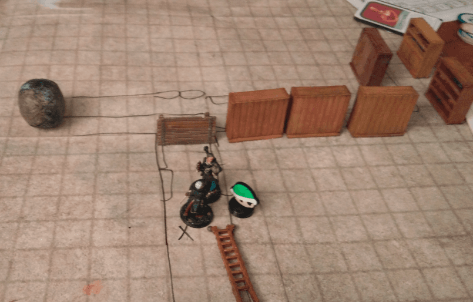
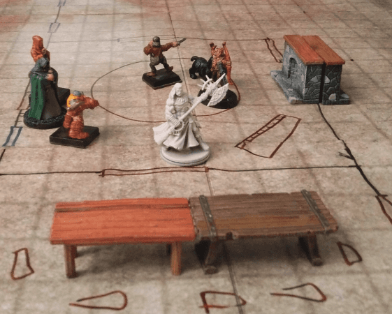
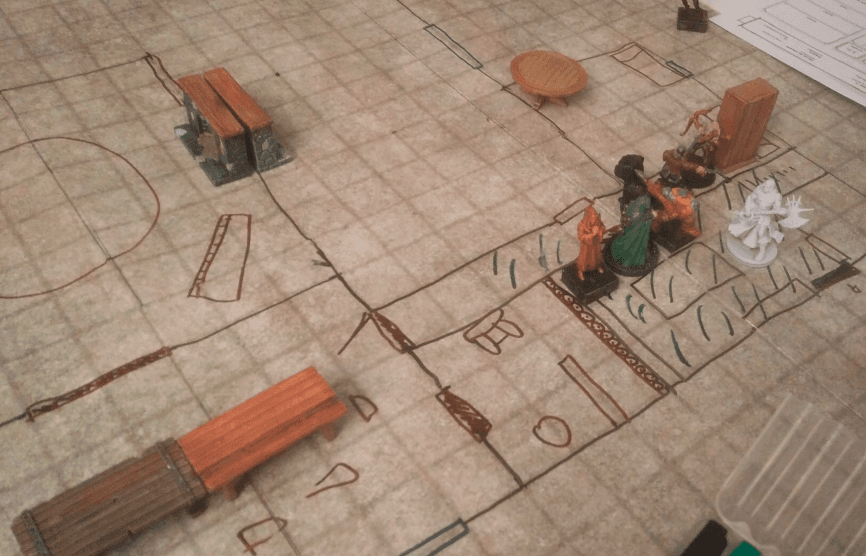

I backed the [Mantic Games Terrain Crate](https://www.manticgames.com/games/terrain-crate/) kickstarter a few years back and received a lot of dungeon furnitures. Chests, debris, tables, chairs, bookshelves, and more. 

Here are a few pictures of them, when used in my games.

This was an old arcane library, forgotten for centuries, and under a permanent silence spell. Some of the furniture were actually mimics, and the big boulder was animated and made regular cycles around the room.

This was on their way to the library, the previous corridor had its gravity reversed. The green shell represents a Kobold follower, IIRC.

In another game. It really gave some depth to a bland flip mat.