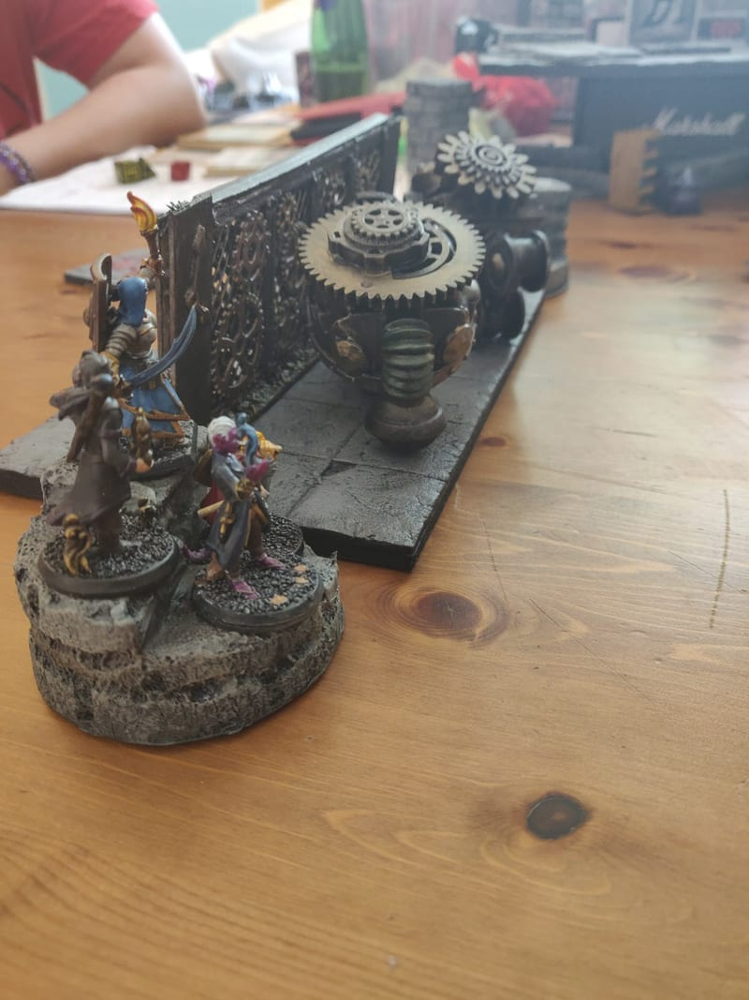
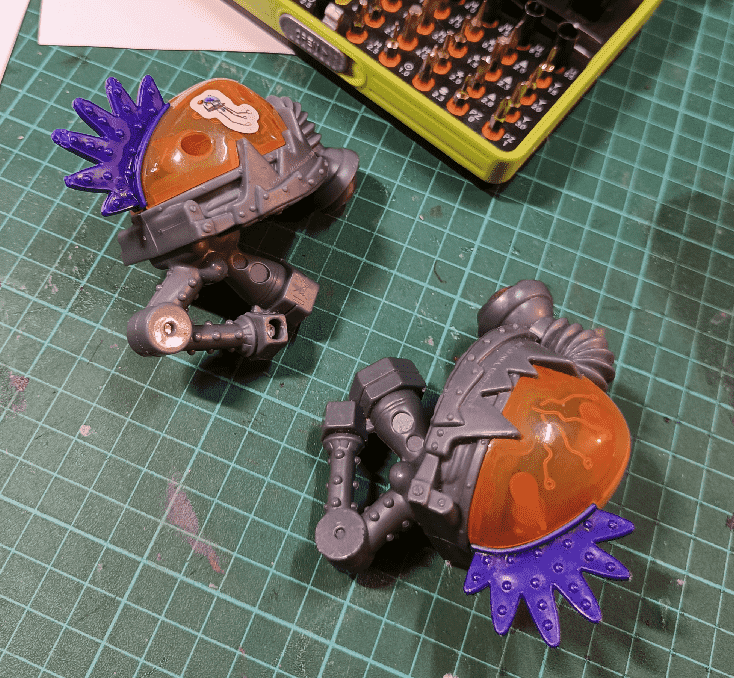
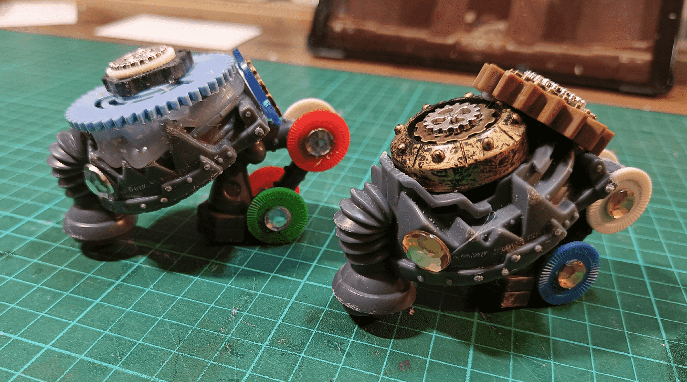
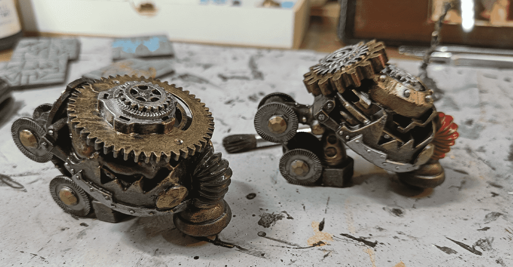

Before reaching the last room of the Time Dungeon, my players had to go through one last trap: a set of gears and pistons moving in an haphazard manner. They had to find the right pattern and jump through. Well, actually some of them just teleported through it.

It all started with those cartoonish looking monsters. I think they come from MacDonalds.

I removed the orange and purple parts, and glued various gears, coming from other toys I had dismantled before, or steam punk jewelry. Also some plastic tokens and jewels.

Black priming, and then a gold drybrush, painting some details silver. Or silver drybrush, and painting details gold. Also adding a bit of color (green and red) on the central nose/pipe thing.