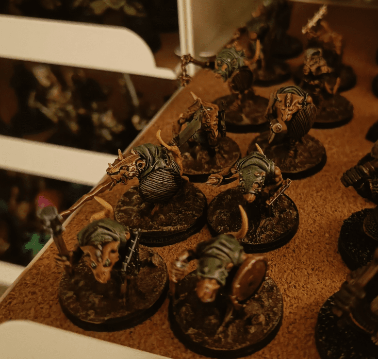
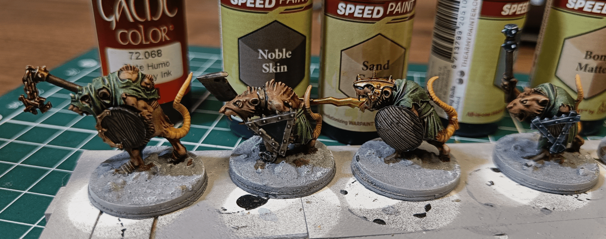
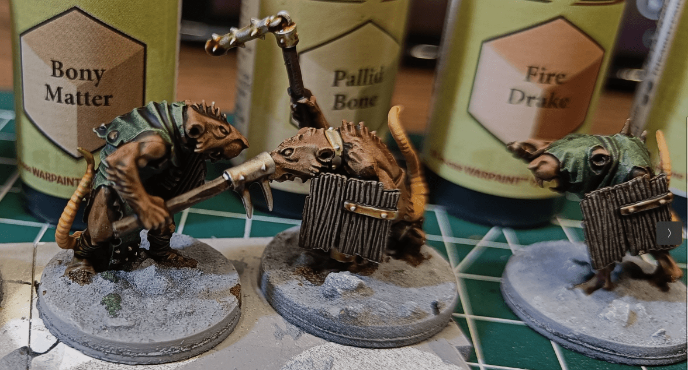
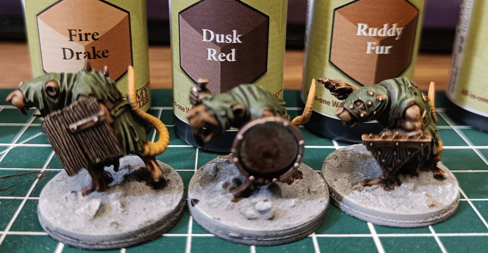

When I painted my Skaven group, I wanted to test the Speed Paint Metallic paints. I wasn't impressed (at all) by the official Metallic paints, but I found that adding regular Speed Paints over a layer of metallic Silver paint could generate interesting effects.

Here for example, I used the Smokey Ink from the Game Color range as an example. It was the first ink I ever used over metallic paint that gave an interesting effect of old rusted iron.

A layer of Noble Skin, work similarly to Nuln Oil. Sand Golem makes it an interesting shade of old gold, while the third one (Tyrian Navy) could make some very thematic cold blue iron weapons.

Bony Matter, Pallid Bone and Fire Drake are very subtle effects that can act as nice alternatives to Nuln Oil.

Dusk Red is very weird, I wouldn't use it. But Ruddy Fur gives a nice rusted effect.

