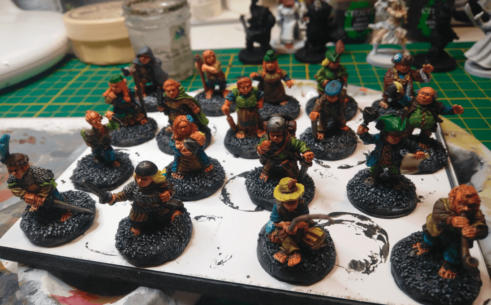

This is a set of Halfling I bought from a Kickstarter, from Midlam Miniatures. I also added one or two other Halfleing I had laying around to the batch.

Nothing too fancy here, I'm right in my comfort zone: neutral brown/green colors with a touch of brighter colors, and then an Agrash Earthsade or Athonian Camoshade wash on top and they look ready.

I bought them at some point when in a previous campaign my PCs started to think about leading a Halfling revolution in Altdorf. This never happened, of course, as many plans in RPG games, but I still bought the miniatures.s