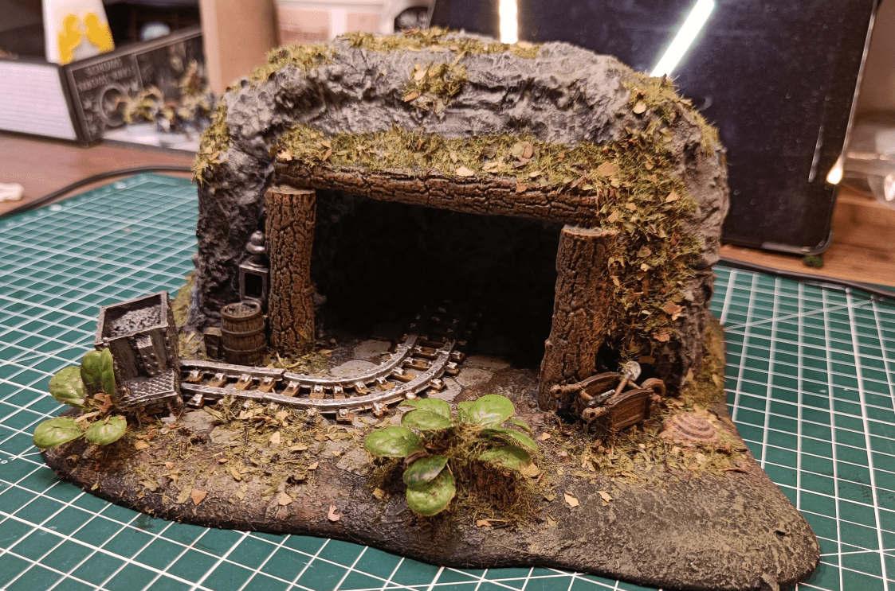
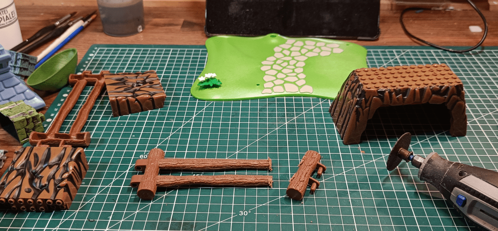
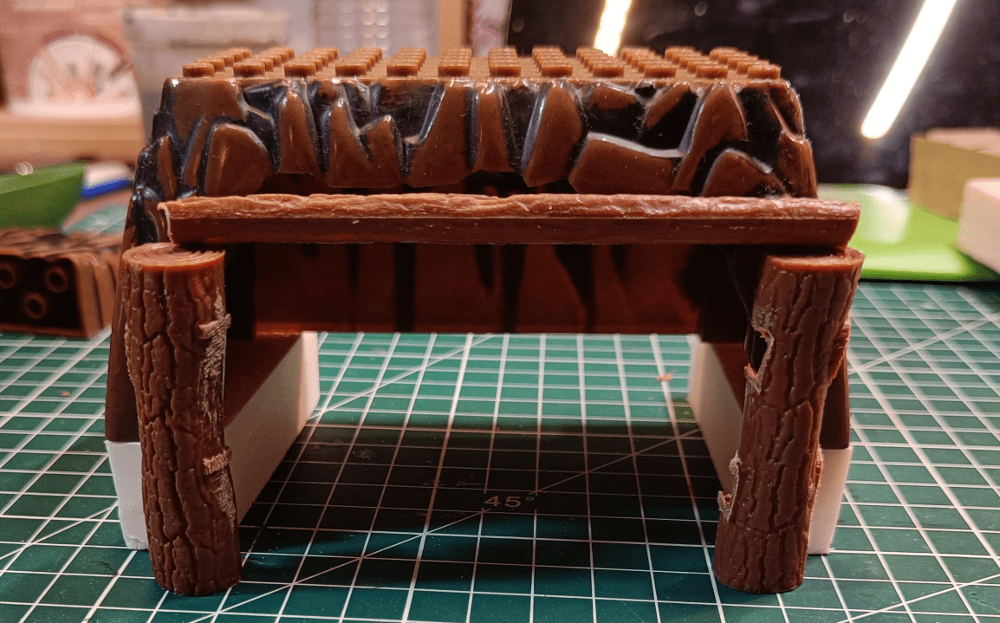
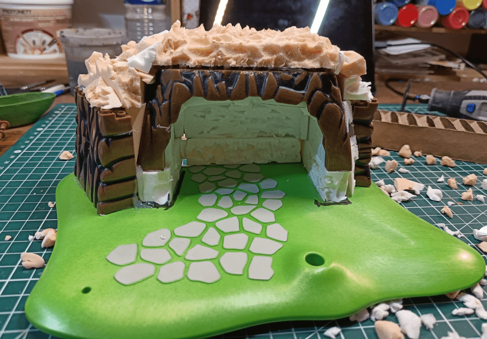
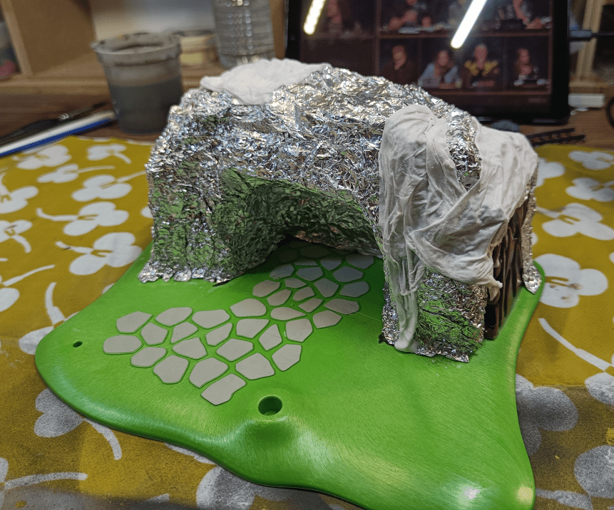
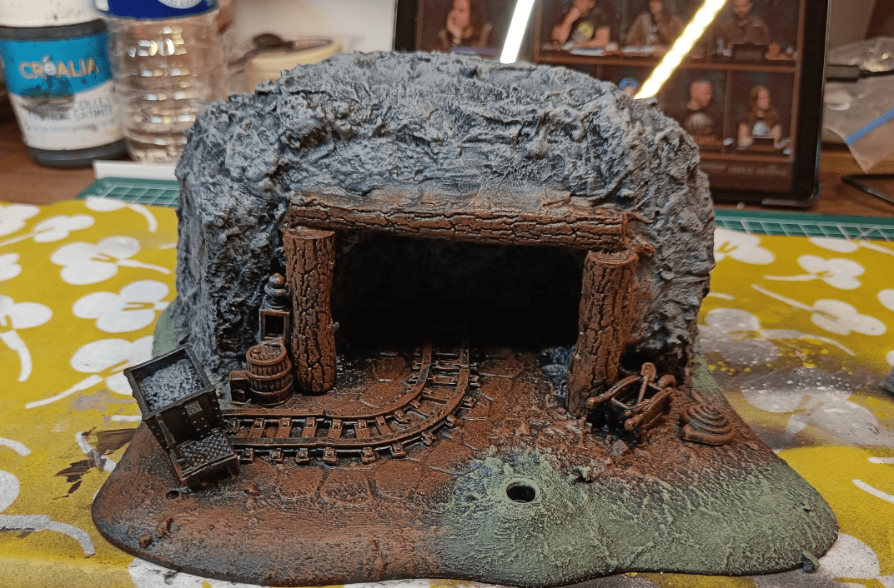
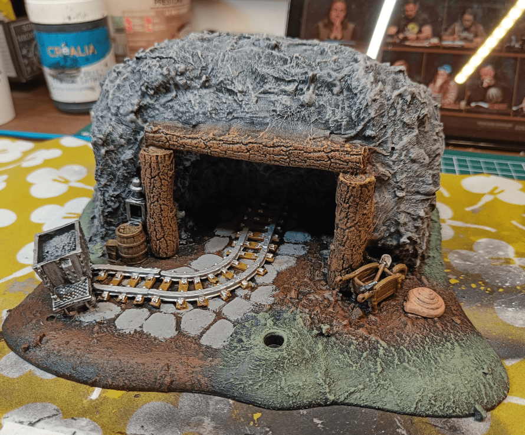
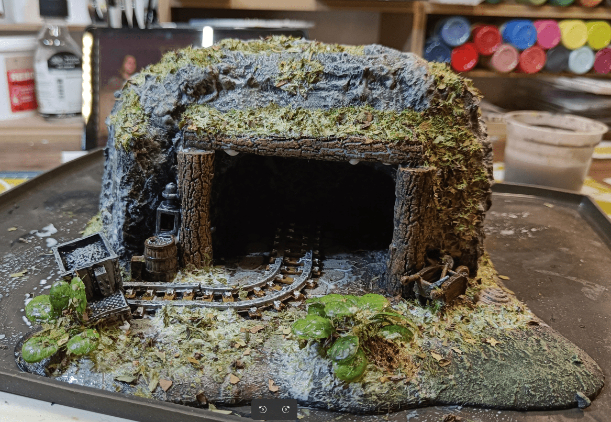

This is a terrain piece I wanted to have for a long time. So many stories start with the players going down into an abandoned mine, and I wanted to have something to represent that. Even if we never use it in play, there is something about it that brings so much memories, from my first foray into the​ Nashkell mines in BG1, to the Mine instance in vanilla WoW.

I started with a Playmobil base as the terrain base. I like those bases because they are very sturdy, and already have an irregular beveled shaped that fits well on a table. In addition, this one already had paved stones carved into it.

I also used some Megablock rock formation for the main structure, and an wooden pallisade I cut in several pieces for the mantel around the entrance.

I did a dry fit of the various pieces before glueing anything. I added some foam under the rock formation, so the height could accomodate my miniatures.

I then glued it in place, and added more and more foam to cover the gaps between the main pieces.

Same on the back. It's very rough at that stage, but I'm going to cover it later, it's just to give the generic shape.

The interior required more precise cuts. In retrospect, I should have done this part before gluing everything.

Using a knife, I then scratched at the foam to make it more rough.

It also removed a lot of the bulk of the piece.

I then covered it all in tinfoil. At that stage I'm not even sure I needed to do the previous step of scratching the foam. It did make the build a little smaller, which I like, but I lost almost all the texture I added in the previous step.

I also tried to cover some areas with paper towel dipped in glue+water. I basically wanted to see if it would be easier to apply that the tinfoil. It was not. It was way more messy, adding water everywhere and took forever to dry. Next time, I'll stick with the tinfoil and not bother with paper towels at all.

I covered everything with modpodge mixed with grey paint. I didn't use black paint this one, to see if I could gain some time on the initial overbrush. Whatever I'll paint later, if I miss a spot, it will be grey instead of black.

I added the leaves and tree as a dry fit, to see how it would look. I didn't really like having the tree here in the end, as it will prevent the placement of minis.

I added more details here and there. I find that it's those little pieces of details that add life to a build. Your mind fills the gaps and imagine why they should or should not be here, and a story develops in your head because of those small details.

I added more spackle around the wooden pieces to make the transition smoother. It wasn't very clean but I didn't care, I knew I would cover it all in flocking at some point.

And my initial idea of using gray in the modpodge didn't really work because I ended up spray painting the whole thing to get even coverage even in the hard to reach areas (like the interior)

So I went back to the base colors: brown where people walking killed the grass, green where it still grows and grey for the stone.

I added some secondary, lighter, drybrushes on the main zones. I also painted some details.

I covered it all in oil washes.

I mostly covered everything in a dark wash, then splotched some brown, ochre and green here and there on the stone, to give some irregularities. It's subtle, but it does break the stone monotony a bit.

Once dried, I added flocking with white glue here and there. And once this glue was dried, I applied another layer of water/glue (50/50 mix) on the flocked areas to really seal the flocking. I also added some aquarium plant decorations to add some volume to the vegetation.

As this is a very messy step, I do that on a foldable silicone plate (the kind you use when cooking in the oven). Silicone is great because it doesn't not stick to anything. You can have all the glue you want dripping on it, once it's dry you can just peel it off and have your silicone mat brand as new. This is my go-to material when doing anything that has a chance of putting glue everywhere.

And the final result is one of my favorite build. It's sturdy because of the Playmobil base. It's simple enough that you can recognize it easily. It's the right scale to put miniatures. It's also full of details so you can tell your on stories. 

It's displayed on my shelf, along with my favorite builds.

