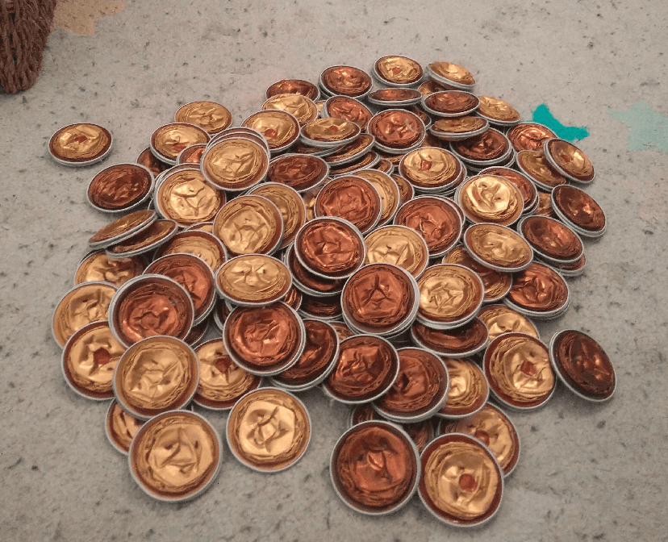
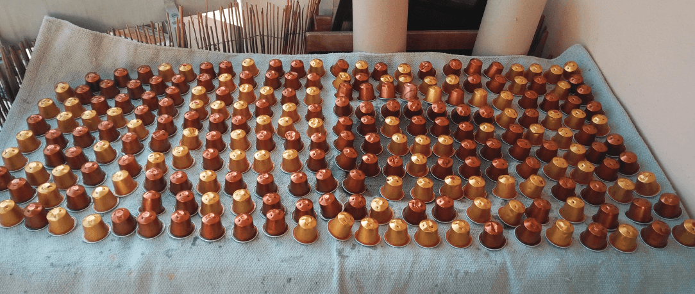

I made fake coins out of used Nespresso Capsules.

I had so many of those capsules to throw away every month I figured I should be able to do something with them.

So I started opening them, throwing away the coffee still inside, cleaning them, drying them, flattening them and gluing them two by two.

My 2yo loves playing with those.

Here they are, cleaned and drying
