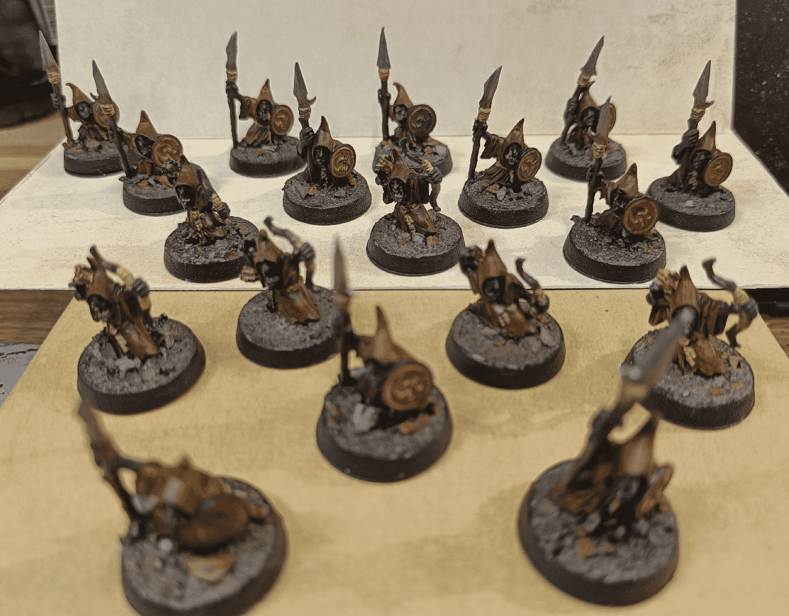

A little break from painting terrain, I wanted to paint some miniatures. I picked those night goblin out of my pile of unpainted minis, mostly because I liked their sculpted more than having any specific use in a game.

I have so many unpainted minis, I'd rather paint what I'm excited about more than what I could need in a game. I realize that I'm more inclined in putting specific monsters in an encounter if I have the right miniature to represent them, so I'd rather paint nice minis so it gives me more opportunities for encounters.

I also decided to apply some of the techniques I learned in crafting terrain to those little guys. Instead of spending a lot of time on minute details that won't be seen, I went with the tricks I know that help giving a nice effect with little effort.

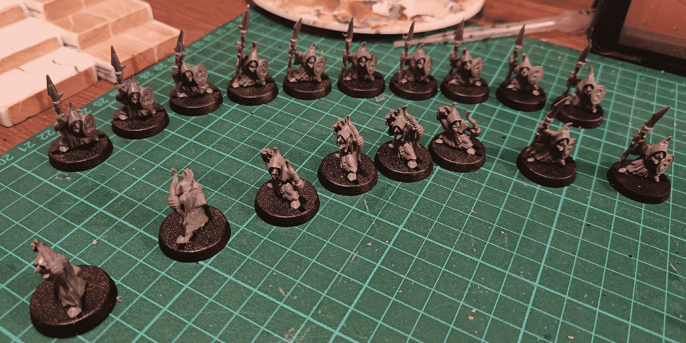

I started by picking a nice group of those guys. Some with lances and some with bows. About 8-10 of each, which is what I think is the maximum I would ever need in a given encounter. I find that painting in batches is where I enjoy painting the most. I also tried to pick a variety of sculpts so they don't all look the same.

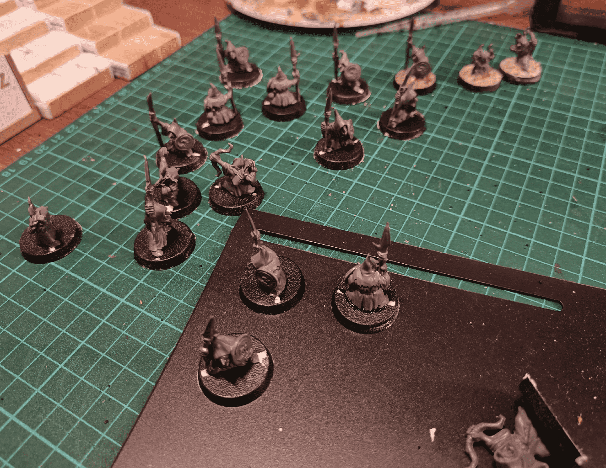

As they are from the era of "plastic-bar-between-the-feet", I needed to fill the gaps of the bases. I used some modelling paste for that. It took some time to dry, but I really took my time on this project, not rushing a phase before going to the next.

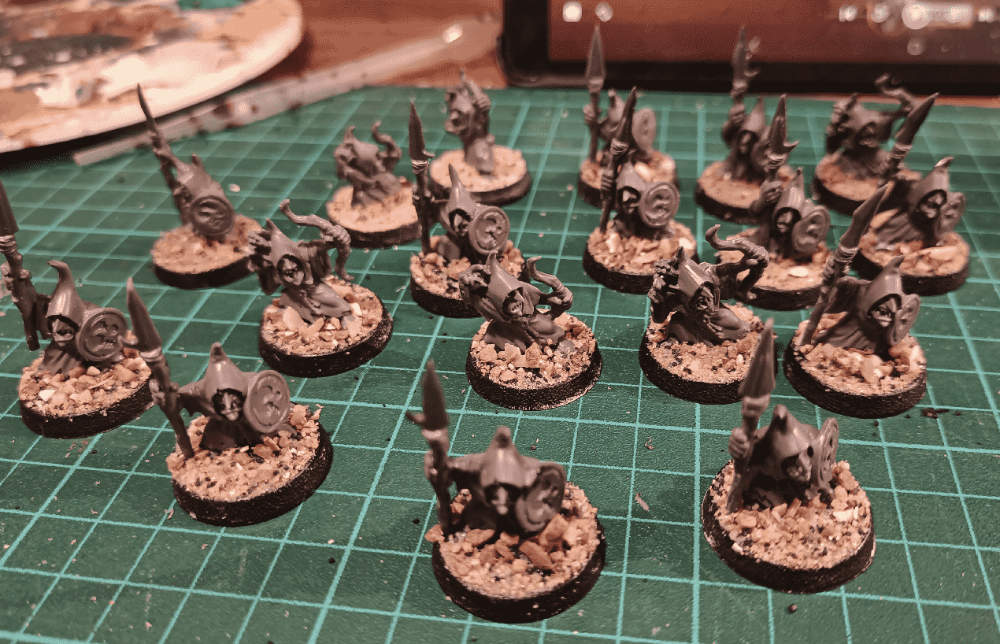

I then based them using a mix of small rocks and sand. I removed any excess from the sides with my fingers.

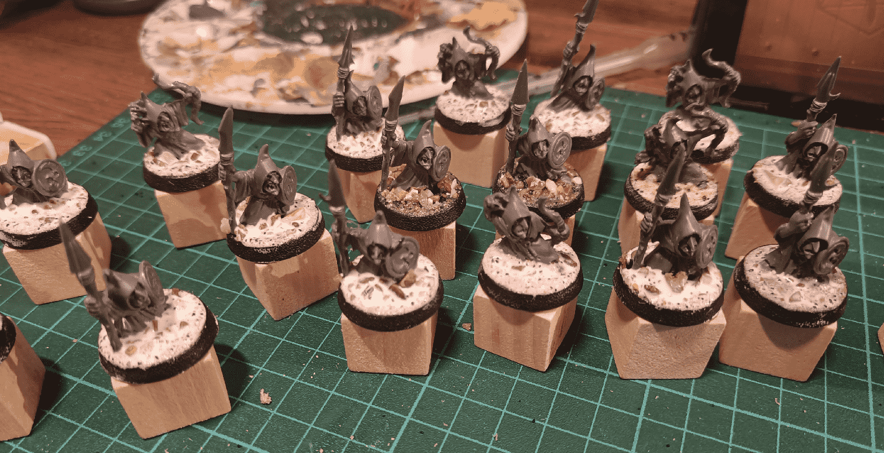

Once dry, I added very diluted PVA glue to the base (a 50/50 mix glue/water) to really soak it up and seal it for good. No more loose pebbles when manipulating them.

All those steps overall took me several days, as I was letting it dry in between each phase during the night. As I was working on other projects at the same time, it allowed me to work on other steps while this was drying.

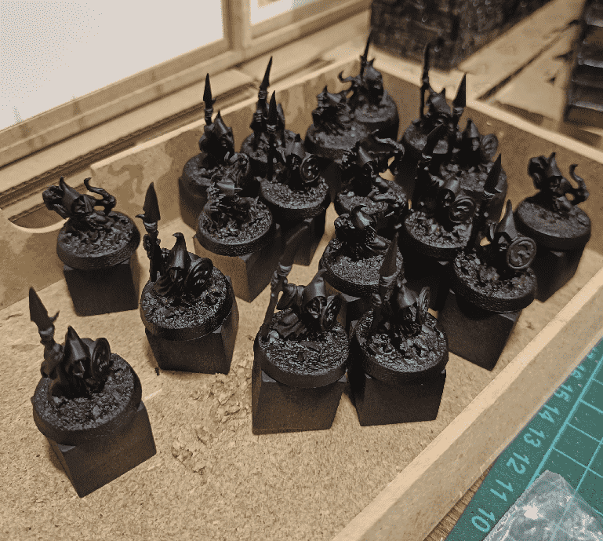

I then spray painted them black because hey, they are night goblins after all.

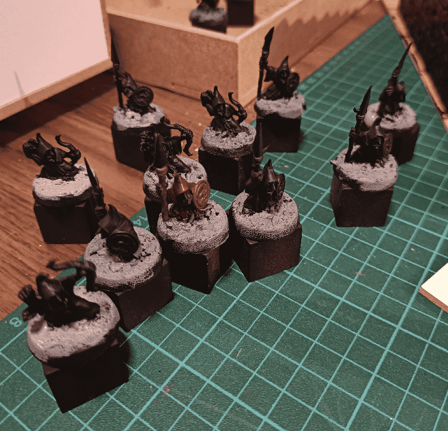

I started with the bases, because I thought I was going to do a heavy and rough drybrush on it and it seemed easier to do it before painting the rest.

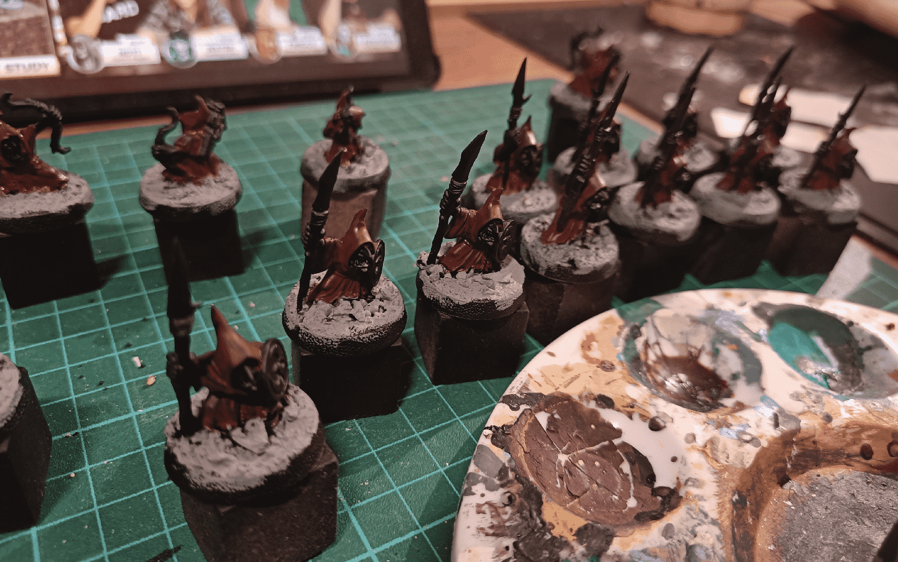

Then the robe, with a brown. 

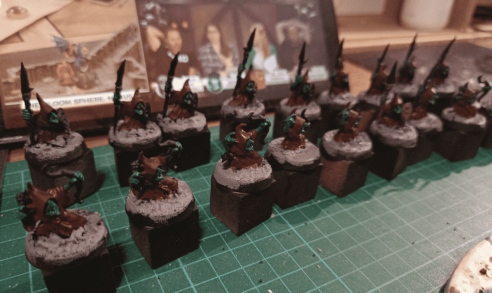

Then the skin in green.

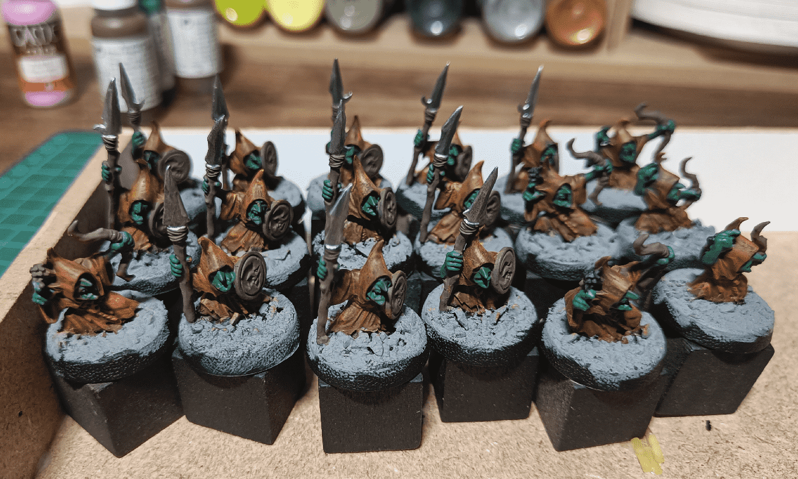

Now that the base tone where applied I continued with the weapons and metal, and applied a drybrush on both the robes and the skin, with a lighter shade of the base color.

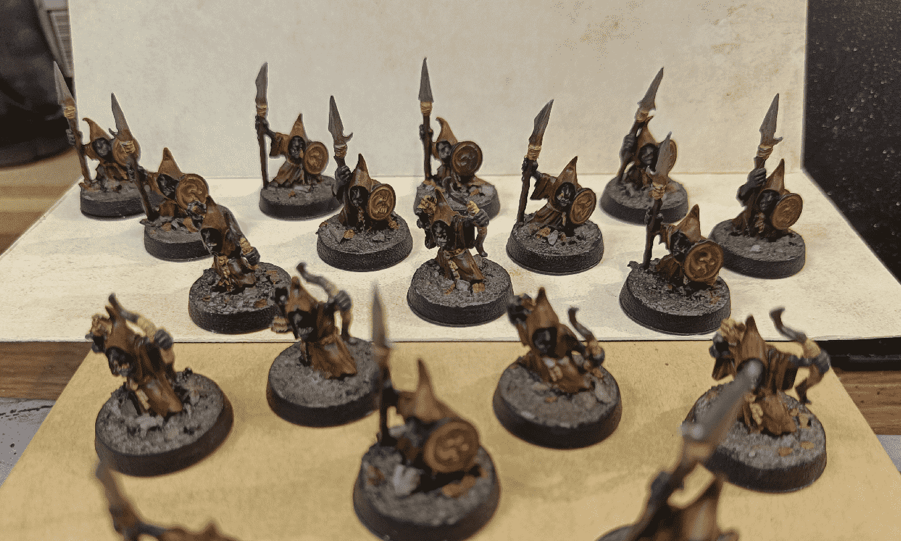

I finished in some details here and there with the same beige color (bow bandages, belts, etc), painted the teeth (black background and white dots) and applied an overall brown wash.

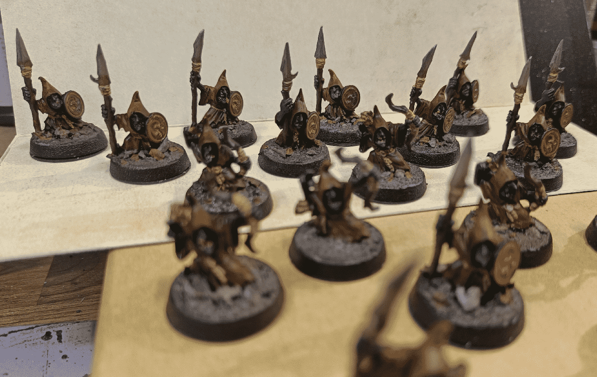

The result is a dark group of night goblins. The black basecoat + dark colors + drybrush + brown wash gives this dark and dirty overall look. It fits well with this unit, but I might need to find ways to paint more brighter colors for other units in the future.