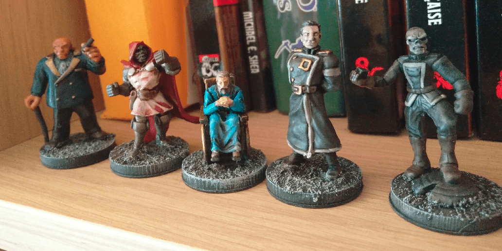
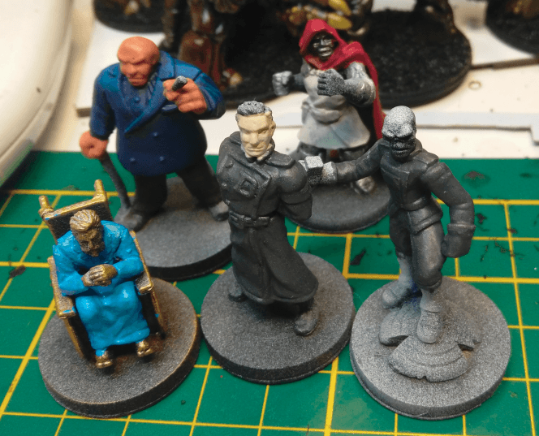

Here are some of the prominent noble NPCs in my current Ptolus-inspired campaign.

Seeing this picture made me realize that I should cleanup the bases a bit, like painting a clear black rim around them, not letting the drybrush show.

I rummaged through my box of HeroClix miniatures to find some specific ones that could represent some of the important NPCs of my current campaign.

My PCs are in a capital city, with intrigues from the major families (inspired by Ptolus).

Wilson Fisk is supposed to represent Drake Scarnetti, the local Kingpin (as fits his mini). 

Doctor Doom is Zander Madlaav, a warrior that seems to never age and apparently was already here when the city was founded.

The guy in a wheelchair is Ethram Waldemar, richest guy in town. His wheelchair should actually be magically flying, but I couldn't find a mini for that.

The black one is Lord Dedric Boroi, head of a family heavily involved with trade with the Shadow plane. The Skeleton one is his alter-ego there.