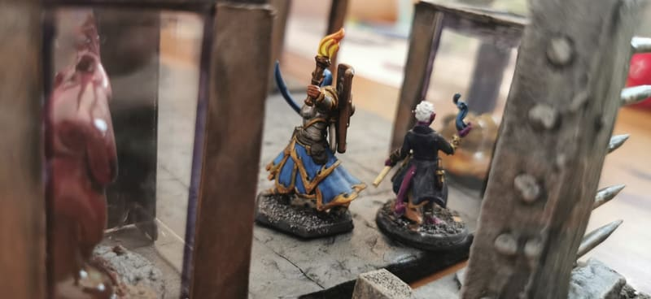
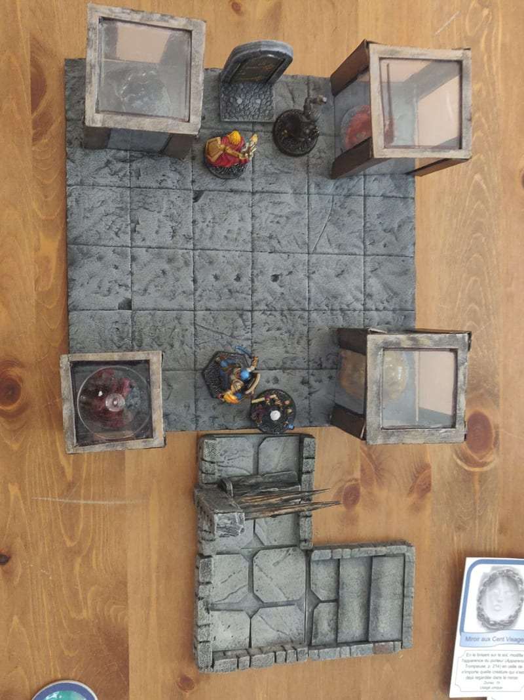
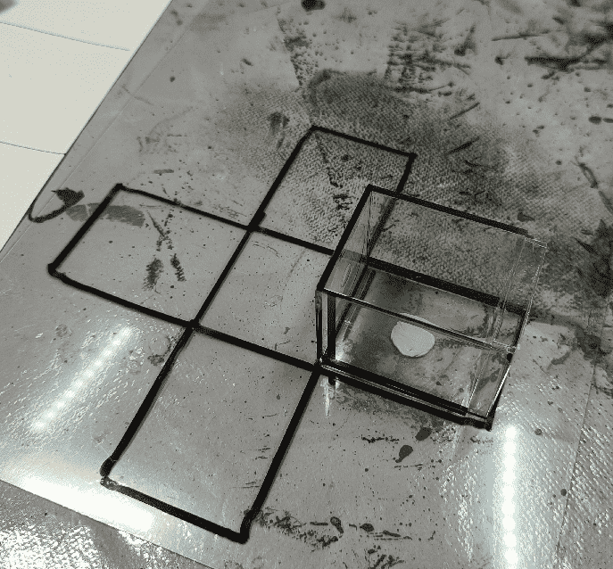
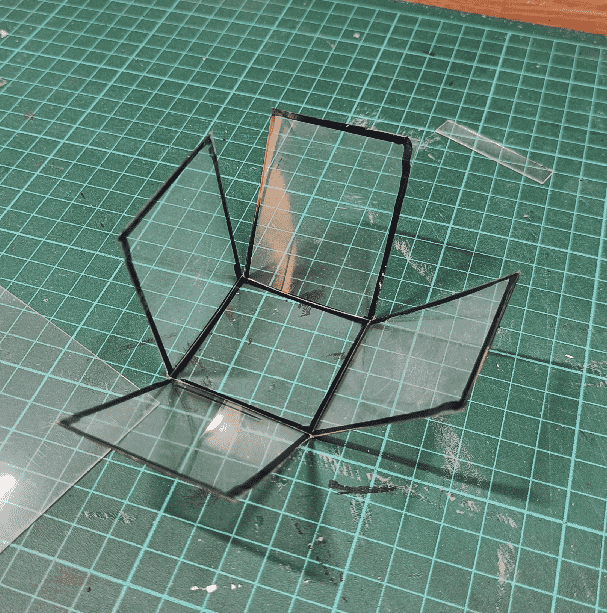
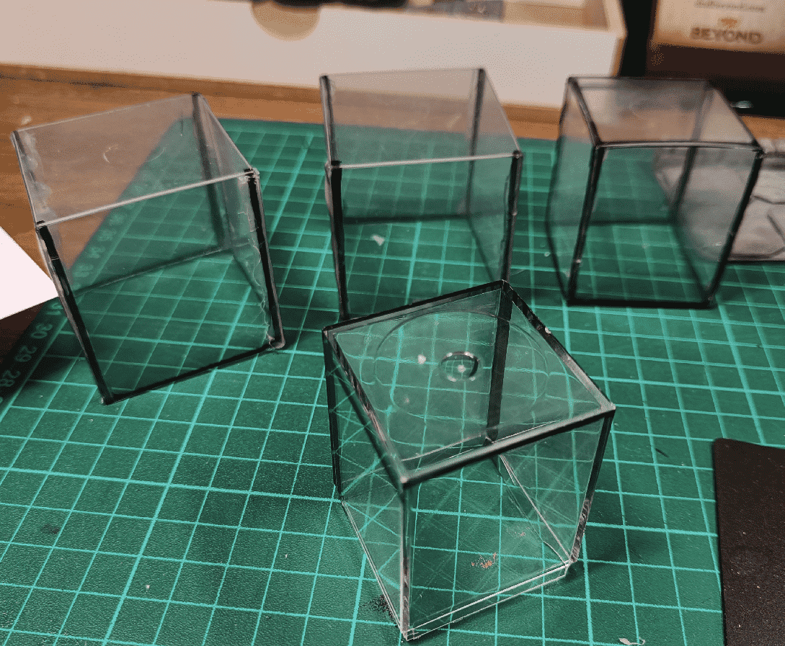
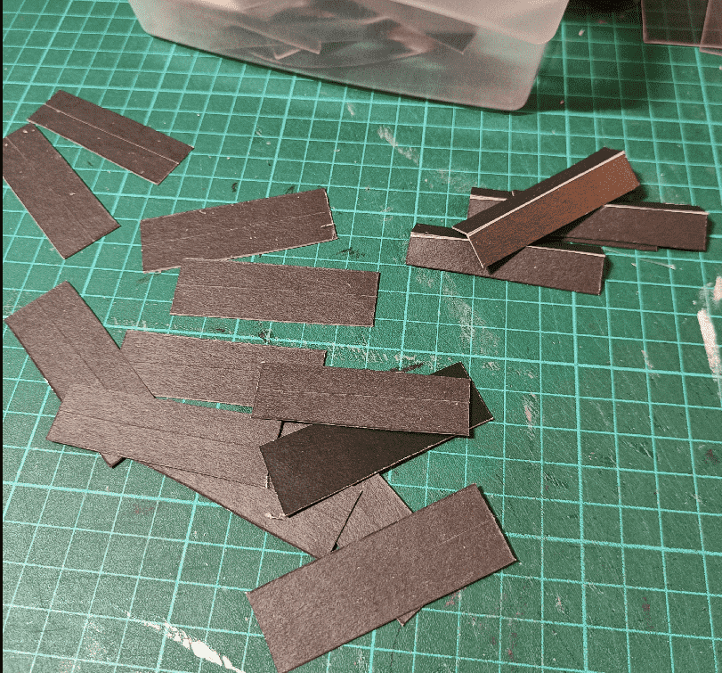
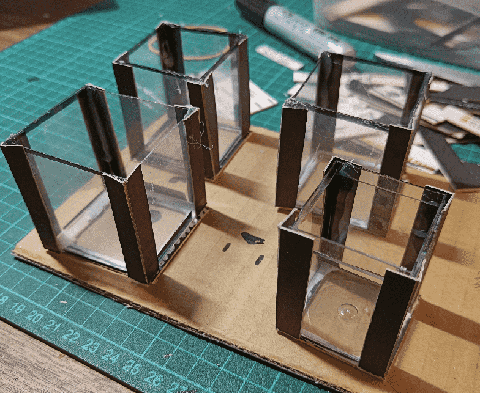
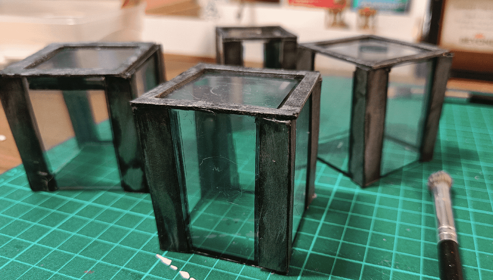
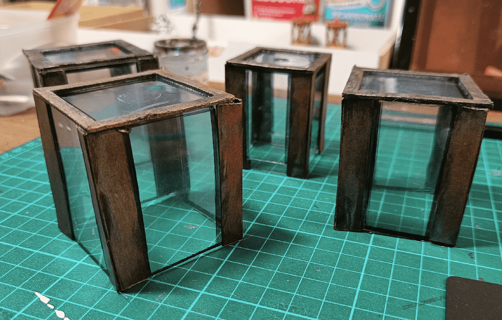

When the heroes explored the dungeon, they entered a room full of glass tubes full of oozes (that they of course had to fight).

From above, you can clearly see that one of the tubes is made of a Chessex dice box.

But because I had only one of those lying around, I traced a cross pattern of another one on a sheet of clear plastic.

I very slightly marked the internal grooves with a knife, to help me fold it in place.

I then glued them, adding hot glue on the interior of the tubes. It wasn't the easiest craft as the hot glue is, well, hot, and I had to put them in place long enough for it to set.

To hide the rough glueing, I cut small strips of black cardboard. I added a groove in the middle to more easily fold them.

And glued them on the sides of the tubes.

I gave them a quick silver drybrush, to make them look like old metal panes.

Added another layer of copper, for a slightly older look.

This is another quick craft, similar to the Deverin Cage one, but it did the job. Each tube was big enough to accommodate a large creature. My goal here was mostly for ease of play, and that it would convey what it is quickly. It worked.