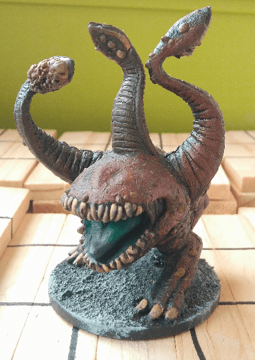

An Otyugh from Wrath of Ashardalon. Great mini to have when your players start exploring some sewers. The ability of the Otyugh to telepathically communicate could lead to some great RP.

As for the mini itself, I like how it turned out. Being a sewer creature, I could be sloppy in my paint job. Very rough drybrush of red and brown, picking up the teeth and details with a bone color, and using a very bright color for the tongue. This is a trick I learned after having painted too many boring miniatures: pick a very bright color for one detail, that will attract the eye.