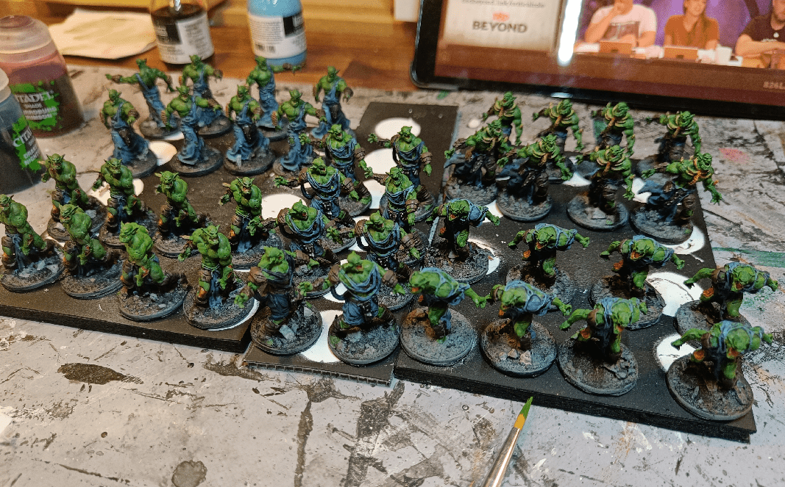
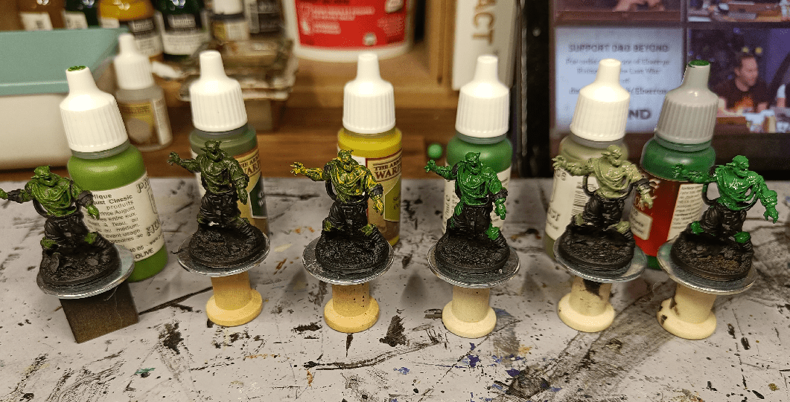
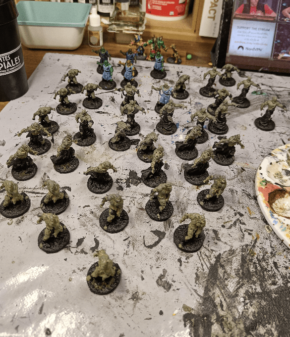
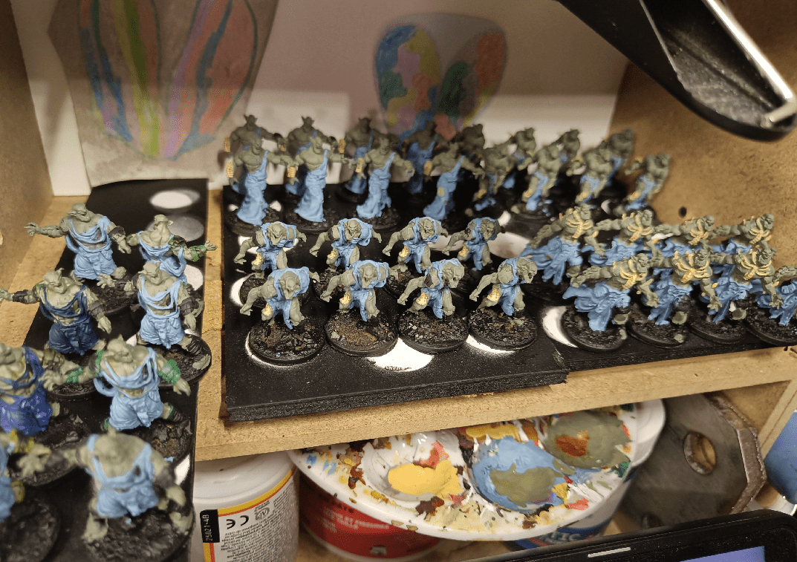
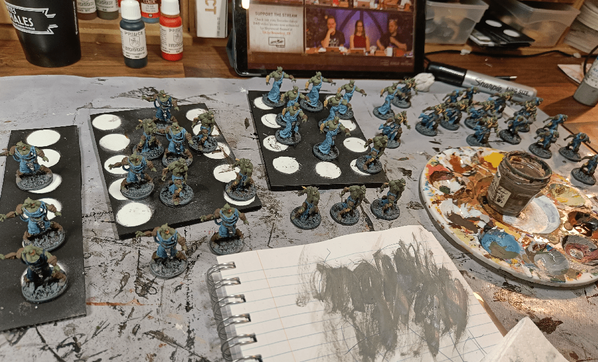
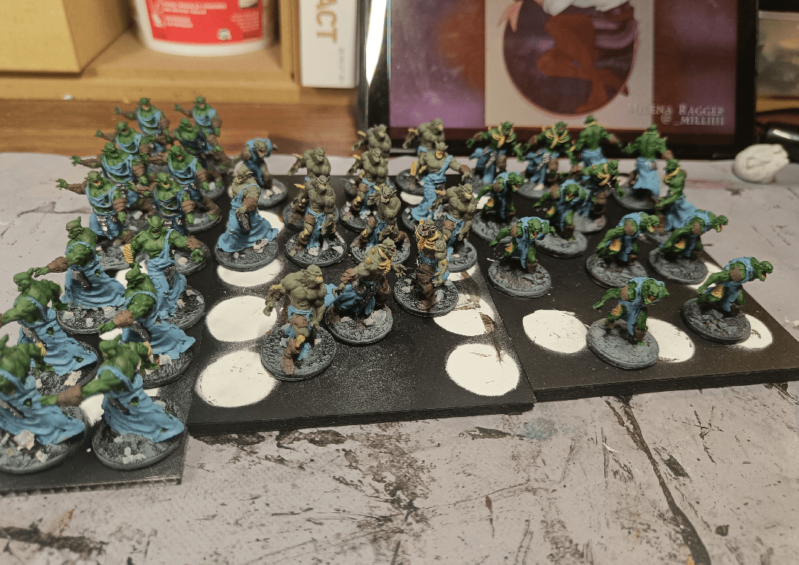
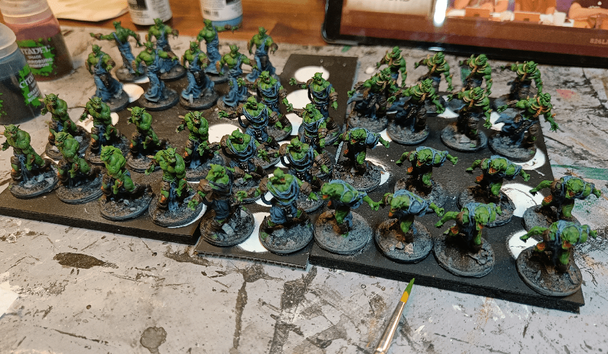

Those Walkers were the last miniatures I needed to paint to complete the Zombicide Horde. It was before I discovered the Army Painter Speed Paint, so I painted them the regular way (meaning: with pain and dedication).

I wasn't sure which green to use, so I did a few tests.

I

I went with a greyish one, as a base, that I'll cover with a green wash later.

Blocking all the main colors. That was long and not very interesting to do.

Still, I like seeing the step-by-step pictures of the progress made.

I then added the wash on top to each of them. In hindsight, I should have started with a greener green from the get go or maybe, I don't know, use the Speed Paint. I'm so glad those paint exists now.

And the horde is ready to overrun our players.

