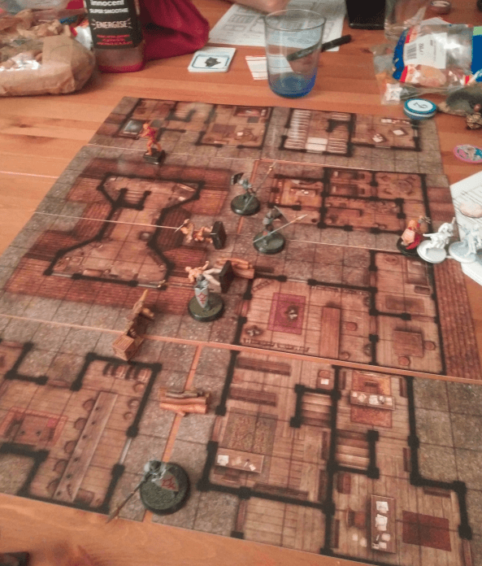

This is not something I build, but something I bought. A set of Pathfinder's Urban tiles.

Lem, our bard, decided to infiltrate the headquarter of a local band of thieves, in the Docks district. He managed to charm the bartender (even if such spells are forbidden in the city) and get information from him.

But when the spell ran off, the bartender sent thugs after him. I had to improvise a back-alley scuffle with the ruffians, and the guards arriving shortly after. 

The tiles proved handy as I could give them to my players and ask them to place them so there was a central alley. They were then in charge of putting the as they wanted. Less work for me, more empowerment to them.