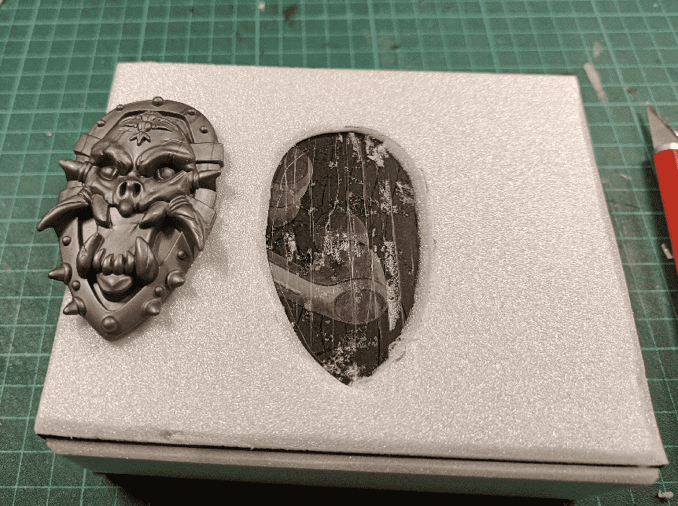

This is the first real-size prop I ever made (as opposed to my usual 28mm miniature sized terrain). It's a pirate chest, made out of a some earbuds packaging I bought. I made it for my 4 years old daughter, as she is in her Pirate phase.

It all started with this box.

It is made of sturdy cardboard, and has a magnetized face, with the lid clipping into place with a satisfying *thud*.

I covered it with thin foam, and carved out space for two plastic bits I had laying around. 

I don't exactly remember where I got there, but most probably bought them in a second-hand shop or at a garage sale, knowing that I would be able to use them in a future project.

This is the one I'll put on the top lid.

And with the plastic key in the front. I carved with a hobby knife the various planks, and used a ballpen to create the wood grain. 3 or 4 rough squiggles on each plank is enough.

I glued my two plastic pieces in the holes I carved previously, and also added more foam bars, to simulate reinforced metal bars.

Covered everything with a mix of black paint and wood glue, to act both as a primer and to make the foam stronger.

I realized I forgot to add rivets on the metal bar, so I glued some decorative plastic square jewels and painted them black. I should have done that before the previous step, but I got carried away.

Did a first layer of dark brown with a large make up brush, to simulate the wood. I didn't care if some went on the metal parts, they will get covered later on.

Used a smaller makeup brush for a lighter brown, to apply on top of the first layer.

I don't have much pictures of the intermediate steps, but I basically added a third layer of an even lighter brown on the wood. I did the same three-step process with a dark, medium and light silver for the metal bars.

I applied gold with a makeup brush on the head and key, then painted with various metallic colors all the details.

I added a special Tiphus Corrosion paint (made by Citadel) around the head to simulate an effect of the wood being burned.

I then applied a dark wash (highly diluted black paint) so it would get into all the deep crevasses and let it dry.

The result on the next day.

And it still opens!

If I were to do it again, I think I would add a handle on the front side. Currently, one need to put a nail on each side of the top flap to open it. Not so easy for a 4 year old.