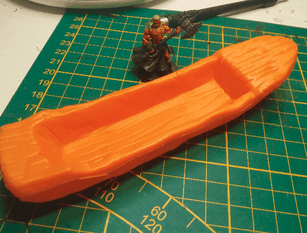
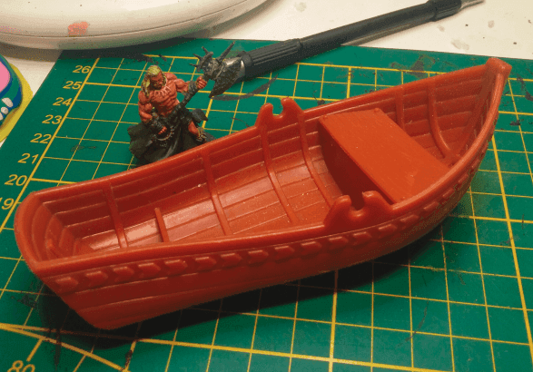
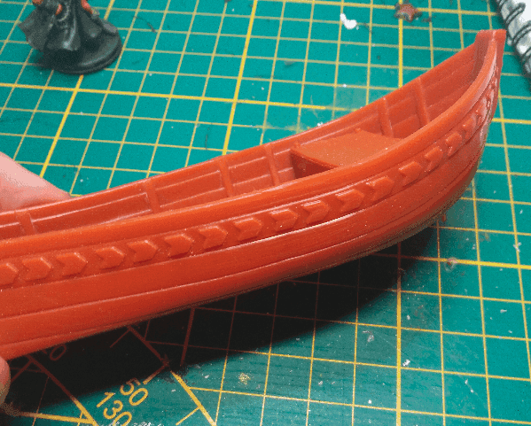
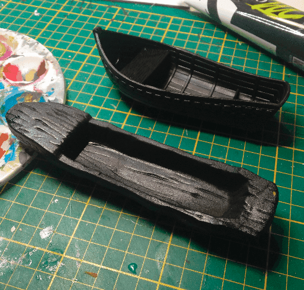
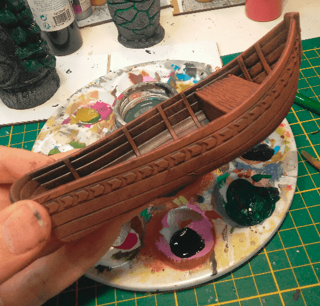
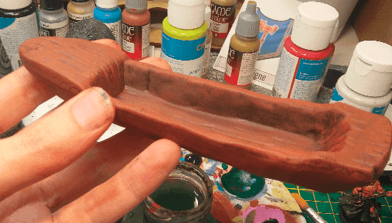

A simple boat carved out of a trunk.

And another slightly more sophisticated.

I really didn't have much in way of preparation, just cutting the small plastic parts used for the oars and that's it.

Priming them black as well.

Quick drybrush of brown and they already look like I could use them!